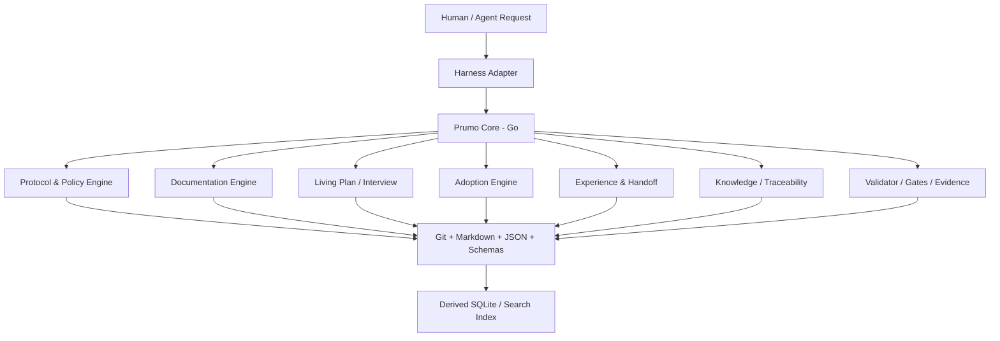

# Prumo — Livro Vivo Unificado: Framework, Harness & Code Agent

> Authority: canonical specification.
> Logical ID: HUB-PART-I
> Source: Notion Living Book (3d59bb7d023f8168a69ac57326eddc85)
> Status: Hub / Sumário estrutural do Livro Vivo.

<aside>
🧭

**Status atual:** **Livro Vivo Unificado do Prumo**, fonte de planejamento, arquitetura e governança do Framework/Platform, Harness, Agent Runtime e domínio Prumo Code Agent. Em 21 de setembro de 2026, o antigo caderno Prumo Code Agent foi incorporado integralmente como Parte II sem perda de suas subpáginas. O nome Project Atlas permanece somente como provenance histórica da fase anterior à renomeação para Prumo.

</aside>

# Visão

O **Prumo** é uma **plataforma de engenharia de projeto assistida por humanos e agentes**: combina protocolo/framework, control plane, Harness/Agent Runtime, Knowledge/Documentation Runtime, Workforce, Quality/Evidence e múltiplas superfícies clientes. O sistema integra planejamento, documentação profunda e viva, execução, governança, memória episódica e experiencial, rastreabilidade, validação, handoff e adaptação entre diferentes harnesses sem entregar a autoridade do projeto a nenhum modelo, provider, agent ou client.

## Decisões fundamentais aprovadas

- **Go será a linguagem oficial do Prumo Core e da CLI no v0.4.**
- **Clean Code é regra permanente de implementação**, aplicada de forma pragmática e sem overengineering.
- Markdown, JSON, JSON Schema e Git permanecem a base canônica e portátil do protocolo.
- SQLite será permitido como índice/runtime derivado, nunca como fonte de verdade.
- TypeScript será usado apenas quando uma integração hospedeira exigir, como no plugin nativo do OpenCode.
- Python deixa de ser dependência de runtime do Prumo; a implementação v0.3 permanece temporariamente como referência/oracle de compatibilidade durante a migração.
- OpenCode será o primeiro harness nativo de nova geração, mas o design será provider/harness-agnostic desde o início.
- O Prumo passa a possuir **Documentation Contracts**, **Documentation Profiles**, **Living Plan / Interview Engine**, **Adoption Engine**, **Engineering Narrative**, **Traceability**, **Experience Layer**, **Handoff Protocol**, **Knowledge Graph derivado**, **Contradiction Detection** e **Connector SDK/Contract**.
- O agente deixa de apenas “lembrar de documentar”: documentação passa a fazer parte do protocolo de execução e dos gates.
- Projetos existentes devem poder ser adotados sem reescrita destrutiva da documentação; o Prumo deve mapear, classificar e migrar incrementalmente.
- Projetos novos devem poder nascer por uma entrevista conversacional incremental no Plan Mode, atualizando documentação canônica conforme decisões são confirmadas.

# Princípios arquiteturais

1. **Repository over conversation memory.** O repositório é a memória durável.
2. **Protocol over harness.** OpenCode, Codex, Claude Code, Gemini CLI, Copilot CLI, Kiro e futuros clientes são adapters.
3. **Canonical state over derived indexes.** SQLite, caches e embeddings são reconstruíveis.
4. **Deterministic rules over prompt-only compliance.** Invariantes críticas devem ser validadas pelo Prumo Core.
5. **Least Context + Least Workforce + Least Ceremony.** A profundidade é proporcional ao risco e à complexidade.
6. **Documentation as engineering artifact.** Documentos possuem contratos de completude e podem bloquear implementação quando faltam decisões críticas.
7. **Conversation as structured design input.** Conversas podem gerar deltas documentais, mas sugestões do agente não viram verdade sem autoridade adequada.
8. **Experience improves the system.** Experiências recorrentes podem propor novos procedimentos, skills e recipes, sempre com validação.
9. **Clean Code by construction.** Boundaries claros, funções pequenas, dependências explícitas, testes determinísticos, baixo acoplamento e nomes semânticos.
10. **Easy install, easy removal.** O Prumo não deve deixar lixo, hooks órfãos, configs globais escondidas ou dependências runtime desnecessárias.

# Macroarquitetura alvo

# Objetivo operacional

Uma pessoa deve poder abrir qualquer harness suportado e pedir algo como **“implemente suporte a shaders customizados”**. O Prumo deve resolver intenção, contexto, Goal/Plan/Task, risco, recipe, workforce, documentação aplicável, implementação, testes, revisão, documentation delta, journal, evidência e estado final sem depender de um megaprompt nem da memória da conversa.

# Estrutura deste livro

As subpáginas deste hub detalham: stack Go e migração, arquitetura v0.4, documentação profunda, UI Documentation Pack, Living Plan, Adoption, histórico e rastreabilidade, Experience Layer inspirada no ai-memory, OpenCode Harness, Connector SDK e roadmap de integrações, instalação/desinstalação, segurança, testes/conformance e plano de entrega.

# Referências de baseline

- Repositório atual: [https://github.com/raillen/project-atlas-framework](https://github.com/raillen/project-atlas-framework)
- Projeto de referência para memória: [https://github.com/akitaonrails/ai-memory](https://github.com/akitaonrails/ai-memory)
- Artigo ai-memory 2.0: [https://akitaonrails.com/2026/09/02/ai-memory-2-0-melhor-sistema-memoria-agentes-e-times/](https://akitaonrails.com/2026/09/02/ai-memory-2-0-melhor-sistema-memoria-agentes-e-times/)
- OpenCode: [https://opencode.ai/docs/](https://opencode.ai/docs/)

<aside>
⚠️

**Regra de transição:** o v0.4 não deve ser implementado em Python para depois ser reescrito. Primeiro deve existir paridade funcional do v0.3 em Go, validada pela suíte de conformance; somente então os novos subsistemas v0.4 entram no core Go.

</aside>

[00 — Princípios, Governança e Regras de Engenharia](framework/specs/ch00.md)

[01 — Stack Go, Clean Code e Migração do Core Python](framework/specs/ch01.md)

[02 — Arquitetura Atlas v0.4 e Boundaries do Core](framework/specs/ch02.md)

[03 — Documentation Contracts, Profiles e Qualidade Documental](framework/specs/ch03.md)

[04 — UI/UX Documentation Pack Completo](framework/specs/ch04.md)

[05 — Living Plan Mode e Interview Engine](framework/specs/ch05.md)

[06 — Adoption Engine para Projetos Existentes](framework/specs/ch06.md)

[07 — Engineering Narrative, Journal, Experimentos e Traceability](framework/specs/ch07.md)

[08 — Experience Layer, Memória e Handoff inspirados no ai-memory](framework/specs/ch08.md)

[09 — OpenCode Native Harness](framework/specs/ch09.md)

[10 — Connector SDK, Capability Contract e Roadmap Multi-Harness](framework/specs/ch10.md)

[11 — Instalação, Atualização, Desinstalação e Distribuição](framework/specs/ch11.md)

[12 — Segurança, Trust, Permissions e Supply Chain](framework/specs/ch12.md)

[13 — Testes, Conformance, Evals e Quality Gates](framework/specs/ch13.md)

[14 — Roadmap de Implementação v0.4](framework/specs/ch14.md)

[15 — Novas Recomendações e Incrementações Futuras](framework/specs/ch15.md)

[16 — Gap Analysis v0.3 → v0.4 e Correções Necessárias](framework/specs/ch16.md)

[17 — Estrutura Canônica de Repositório Alvo](framework/specs/ch17.md)

[18 — Superfície CLI v0.4 e Machine Interface](framework/specs/ch18.md)

[19 — Registro Consolidado de Decisões v0.4](framework/specs/ch19.md)

[20 — Pesquisa de Harnesses e Evidências para o Roadmap (2026-09-08)](framework/specs/ch20.md)

[21 — Skill Package v3, Resolver, Configuração e Evals](framework/specs/ch21.md)

[22 — Cognitive Accessibility, Clean Code e Ambient Skills](framework/specs/ch22.md)

[23 — Segurança Web, SaaS, Vibe Coding: Skills e Workforce Especializado](framework/specs/ch23.md)

[24 — Protocolo DevSecOps e Rotinas de Teste Web/SaaS](framework/specs/ch24.md)

[25 — Playwright como Native Web Test Provider](framework/specs/ch25.md)

[26 — Native Desktop GUI Test Bridge](framework/specs/ch26.md)

[27 — Protocolo de Testes para Linguagens, Compiladores e Tooling](framework/specs/ch27.md)

[28 — Kernel, Drivers, Embedded, Fault Injection e Emulação](framework/specs/ch28.md)

[29 — Engineering Blog e Publishing System](framework/specs/ch29.md)

[30 — Skill Catalog Target: Segurança, Testing, Tooling e Meta-Skills](framework/specs/ch30.md)

[31 — Research Evidence: Security, Web Testing, Compiler e Kernel Verification](framework/specs/ch31.md)

[32 — Test Provider Contract, Quality Orchestrator e Evidence Normalization](framework/specs/ch32.md)

[33 — Game Development Suite: Profiles, Quality Model e Workforce](framework/specs/ch33.md)

[34 — Deterministic Simulation, Replay e Automated Playtesting](framework/specs/ch34.md)

[35 — Game AI: Modelos, Implementação, Observabilidade e Testes](framework/specs/ch35.md)

[36 — Physics, Collision, Character Controllers e Movement Verification](framework/specs/ch36.md)

[37 — Game Feel, Controls, Camera, Feedback e Player Experience](framework/specs/ch37.md)

[38 — GDD, Game Design, Balance, Economy, Progression e Pacing](framework/specs/ch38.md)

[39 — Level Design, Map Design, PCG, Reachability e Spatial Quality](framework/specs/ch39.md)

[40 — Game Performance, Frame Budgets, Memory, Streaming e Optimization Skills](framework/specs/ch40.md)

[41 — Multiplayer, Netcode, Scalability e Network Adversarial Testing](framework/specs/ch41.md)

[42 — Game Tooling, Editors, Asset Pipelines e Content Validation](framework/specs/ch42.md)

[43 — Engine Adapters: Unreal, Unity, Godot e Engine-Agnostic Runtime](framework/specs/ch43.md)

[44 — Game Skill Catalog Target e Bundles Automáticos](framework/specs/ch44.md)

[45 — Visual, Rendering, Animation, Audio e Interaction Verification](framework/specs/ch45.md)

[46 — Game Quality Orchestrator: Rotina de Testes e Agentes Especializados](framework/specs/ch46.md)

[47 — Research Evidence: Game AI, Playtesting, Design, PCG e Player Experience](framework/specs/ch47.md)

[48 — Agent Runtime Control Plane: Arquitetura e Princípios](framework/specs/ch48.md)

[49 — Budget Manager, Cost Governance e Rate Limits](framework/specs/ch49.md)

[50 — Context Compiler, Token Budget, Cache e Compaction](framework/specs/ch50.md)

[51 — Run Engine, Checkpoints, Retry, Resume e Cancellation](framework/specs/ch51.md)

[52 — Tool Gateway, MCP Governance e Lazy Tool Discovery](framework/specs/ch52.md)

[53 — Model Registry, Router, Drift, Fallback e Provider Health](framework/specs/ch53.md)

[54 — Execution Environments, Sandbox e Blast-Radius Control](framework/specs/ch54.md)

[55 — Observability Plane, Run Explainability e Incident Bundles](framework/specs/ch55.md)

[56 — Automation Engine, Event Rules, DLQ e Safety](framework/specs/ch56.md)

[57 — Atlas Package & Runtime Manager, atlas.lock e Provider Isolation](framework/specs/ch57.md)

[58 — Migration Engine, Unified Review Queue e State Evolution](framework/specs/ch58.md)

[59 — Repository Scale, Incremental Indexing, Branches, Monorepos e Concurrency](framework/specs/ch59.md)

[60 — Secrets, Data Classification e Egress Governance](framework/specs/ch60.md)

[61 — Atlas Harness Eval Suite, Canary e Runtime Quality Metrics](framework/specs/ch61.md)

[62 — Repository Change Governance, GitHub Policy e Agent SCM Safety](development/phases/phase-62.md)

[63 — Programa de Implementação v0.4: do Go Core ao Connector SDK](development/phases/phase-63.md)

[79 — Programa de Aprimoramento do Workforce: Agents, Skills, Recipes e Quality Contracts](skills/specs/programa-de-aprimoramento-do-workforce-agents.md)

[80 — Prumo Ask: Headless One-Shot Interface e Machine-Friendly CLI](reference/prumo-ask-headless.md)

[81 — Global Learning Layer: Padrões Cross-Project, Preferências Globais e Filosofias Compartilhadas](runtime/global-learning-layer.md)

[82 — Prumo Native sobre Oxi: Workspace Viewer Agent-Aware, Editor Leve e Plano de Implementação](architecture/prumo-native-workspace-viewer.md)

[83 — Adendo: Decision Intelligence Runtime, System One e Decision Providers](runtime/decision-intelligence-runtime.md)

[84 — Total Assurance Constitution: Gauntlet Loop, Evidence e Anti-False-Green](quality/gauntlet-84.md)

[Parte II — Prumo Code Agent: Agent Runtime, Clients & Product](LIVRO_VIVO_HUB.md)

[85 — Canonical Truth, Authority Graph e Constituição Anti-Invenção](contracts/llm-agent-execution-contract.md)

[86 — Arquitetura Unificada: Framework, Harness, Code Agent e Surface Contracts](architecture/unified-architecture.md)

[87 — Model Portfolio, Roteamento por Custo/Quota e Budget Mensal](runtime/model-portfolio-and-routing.md)

[88 — Arquitetura Documental v2: Canonical Graph, IR, Microcontextos e Promotion](architecture/documentation-architecture-v2.md)

[89 — Programa de Consolidação e Implementação do Prumo Unificado](development/consolidation-program.md)

[90 — Crosswalk de Consolidação: Prumo Framework ↔ Code Agent, Ownership e Supersession](governance/consolidation-crosswalk.md)

[91 — Glossário Canônico, Ontologia Operacional e Termos Proibidos de Confundir](reference/canonical-glossary.md)

[92 — Directive Compiler: Regras Executáveis para LLMs, Agents, Harness e Surfaces](contracts/directive-compiler.md)

[93 — Capability & Skill Gap Register: Lacunas Obrigatórias, Anti-Duplicação e Evals](harness/capability-skill-gap-register.md)