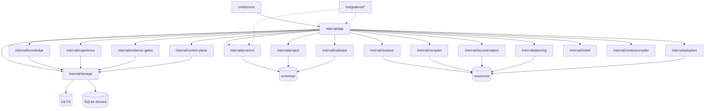

# Prumo Dependency Rules

## Package Dependency Graph



## Hard Rules

### 1. Domain Isolation
```
internal/protocol     → NO imports from: cmd, internal/app, internal/*storage*, integrations
internal/project      → NO imports from: cmd, internal/app, integrations
internal/resolver     → NO imports from: cmd, internal/app, integrations
internal/validator    → NO imports from: cmd, internal/app, integrations
```

### 2. Application Services Layer
```
internal/app          → MAY import: internal/protocol, internal/project, internal/resolver,
                       internal/compiler, internal/validator, internal/documentation,
                       internal/planning, internal/adoption, internal/knowledge,
                       internal/experience, internal/evidence-gates, internal/control-plane,
                       internal/install, internal/storage, internal/contextcompiler
```

### 3. CLI Layer
```
cmd/prumo             → MAY import: internal/app, internal/protocol
                       → MUST NOT import: any internal/* besides app + protocol
```

### 4. Integrations
```
integrations/*        → MAY import: internal/protocol (types only), internal/app (via CLI JSON)
                       → MUST NOT import: internal/* implementation packages
```

### 5. Storage
```
internal/storage/git  → Implements: internal/storage.Repository port
internal/storage/sqlite → Implements: internal/storage.DerivedIndex port
                       → MUST NOT import: internal/protocol, internal/app, etc.
```

### 6. Control Plane
```
internal/control-plane/* → MAY import: internal/protocol, internal/storage (ports only)
                         → MUST NOT import: internal/app, cmd, integrations
```

## Circular Dependency Prevention

**Tooling check** (run in CI):
```bash
# Verify no cycles
go mod graph | grep -E "internal/.*internal/" | sort -u
```

## Interface Placement

| Interface | Defined In | Implemented By |
|-----------|------------|----------------|
| `Repository` | `internal/storage` | `internal/storage/git` |
| `DerivedIndex` | `internal/storage` | `internal/storage/sqlite` |
| `EventSink` | `internal/control-plane/events` | `internal/control-plane/events/file`, `otel` |
| `HarnessTransport` | `integrations/transport` | `integrations/opencode`, `codex`, etc. |
| `Clock` | `internal/testutil` | `internal/testutil/fake_clock` |
| `EmbeddingProvider` | `internal/knowledge` | (future) |

## Import Hygiene

- **No `utils`, `common`, `helpers` packages** — every package has domain semantics
- **No package-per-file** — start consolidated, split when responsibility justifies
- **`internal` protects premature API** — nothing in `internal` is public SDK
- **Interfaces defined at consumer boundary** — not in shared package

## Allowed Standard Library Imports Everywhere

`context`, `errors`, `fmt`, `io`, `os`, `path`, `strings`, `time`, `encoding/json`, `sync`, `testing`

## Versioned Imports

External dependencies (when added) must be:
- Pinned in `go.mod`
- Vendored or checksum-verified in CI
- Justified by anti-overengineering guardrail questions

### First external dependency — the TUI stack

Until the H10 terminal client, this module had no third-party dependency: every
package was standard library only. The terminal stack introduced the first
direct ones, and the rules above apply to them.

**Where they live moved.** ADR 013 took the client out of this module entirely:
the stack is required by `prumo-agent tui`, and this module is standard-library only
again — which is what makes the rule below a property of the repository rather
than a convention someone remembers.

| Aspect | Position |
|--------|----------|
| What | `charm.land/bubbletea/v2`, `charm.land/lipgloss/v2` and the rest of the Charm v2 tree (Stack H, accepted in `docs/product/tui-spike-h10.md`) |
| Where | Only in the `prumo-agent tui` module. This module's `internal/` stays standard-library-only, and `prumo-agent tui/boundary_test.go` fails the build if the client ever imports `github.com/raillen/prumo/internal/...` |
| Pinned | Exact module versions in `prumo-agent tui/go.mod`; the transitive set and its hashes in `prumo-agent tui/go.sum` |
| Verified | `go mod verify` runs in the workflow's client job, so a mismatch fails the build |
| Exit path | The renderer is behind `prumo-agent tui/internal/tui/styles` and the transport behind `prumo-agent tui/internal/runtime`, which is the only package in the client that knows the protocol exists; the protocol, the daemon and the SDK depend on neither framework |
| Guardrail | The framework renders; it decides nothing. Folding a run's events, summing what it spent and resolving an icon set all live in framework-free files, which is also what makes them testable without a terminal |

## OPEN QUESTIONS

- [ ] Exact package split for `internal/documentation` (contracts vs profiles vs readiness vs delta)
- [ ] Whether `internal/evidence-gates` stays separate or merges into `internal/quality`
- [ ] Whether `internal/control-plane` uses sub-packages per service or flat structure initially