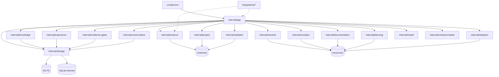

# Regras de Dependência do Prumo

## Grafo de Dependências entre Pacotes


```mermaid
flowchart TD
    CLI[cmd/prumo] --> APP[internal/app]
    APP --> PROTO[internal/protocol]
    APP --> PROJECT[internal/project]
    APP --> RESOLVER[internal/resolver]
    APP --> COMPILER[internal/compiler]
    APP --> VALIDATOR[internal/validator]
    APP --> DOCS[internal/documentation]
    APP --> PLANNING[internal/planning]
    APP --> ADOPTION[internal/adoption]
    APP --> KNOWLEDGE[internal/knowledge]
    APP --> EXPERIENCE[internal/experience]
    APP --> GATES[internal/evidence-gates]
    APP --> CONTROL[internal/control-plane]
    APP --> INSTALL[internal/install]
    APP --> STORAGE[internal/storage]
    APP --> CONTEXT[internal/contextcompiler]

    PROTO --> SCHEMAS[(schemas/)]
    PROJECT --> SCHEMAS
    VALIDATOR --> SCHEMAS
    RESOLVER --> RESOURCES[(resources/)]
    COMPILER --> RESOURCES
    DOCS --> RESOURCES
    PLANNING --> RESOURCES
    ADOPTION --> RESOURCES
    KNOWLEDGE --> STORAGE
    EXPERIENCE --> STORAGE
    GATES --> STORAGE
    CONTROL --> STORAGE

    STORAGE --> GIT[(Git FS)]
    STORAGE --> SQLITE[(SQLite derived)]

    INTEGRATIONS[integrations/*] -.-> APP
    INTEGRATIONS -.-> PROTO
```

## Regras Rígidas

### 1. Isolamento de Domínio
```
internal/protocol     → NO imports from: cmd, internal/app, internal/*storage*, integrations
internal/project      → NO imports from: cmd, internal/app, integrations
internal/resolver     → NO imports from: cmd, internal/app, integrations
internal/validator    → NO imports from: cmd, internal/app, integrations
```

### 2. Camada de Serviços de Aplicação
```
internal/app          → MAY import: internal/protocol, internal/project, internal/resolver,
                       internal/compiler, internal/validator, internal/documentation,
                       internal/planning, internal/adoption, internal/knowledge,
                       internal/experience, internal/evidence-gates, internal/control-plane,
                       internal/install, internal/storage, internal/contextcompiler
```

### 3. Camada de CLI
```
cmd/prumo             → MAY import: internal/app, internal/protocol
                       → MUST NOT import: any internal/* besides app + protocol
```

### 4. Integrações
```
integrations/*        → MAY import: internal/protocol (types only), internal/app (via CLI JSON)
                       → MUST NOT import: internal/* implementation packages
```

### 5. Storage
```
internal/storage/git  → Implements: internal/storage.Repository port
internal/storage/sqlite → Implements: internal/storage.DerivedIndex port
                       → MUST NOT import: internal/protocol, internal/app, etc.
```

### 6. Control Plane
```
internal/control-plane/* → MAY import: internal/protocol, internal/storage (ports only)
                         → MUST NOT import: internal/app, cmd, integrations
```

## Prevenção de Dependências Circulares

**Verificação por ferramenta** (executada no CI):
```bash
# Verifica que não há ciclos
go mod graph | grep -E "internal/.*internal/" | sort -u
```

## Posicionamento de Interfaces

| Interface | Definida em | Implementada por |
|-----------|-------------|------------------|
| `Repository` | `internal/storage` | `internal/storage/git` |
| `DerivedIndex` | `internal/storage` | `internal/storage/sqlite` |
| `EventSink` | `internal/control-plane/events` | `internal/control-plane/events/file`, `otel` |
| `HarnessTransport` | `integrations/transport` | `integrations/opencode`, `codex`, etc. |
| `Clock` | `internal/testutil` | `internal/testutil/fake_clock` |
| `EmbeddingProvider` | `internal/knowledge` | (futuro) |

## Higiene de Imports

- **Nada de pacotes `utils`, `common`, `helpers`** — todo pacote tem semântica de domínio
- **Nada de um pacote por arquivo** — comece consolidado e divida quando a responsabilidade justificar
- **`internal` protege APIs prematuras** — nada em `internal` é SDK público
- **Interfaces definidas na fronteira do consumidor** — não em um pacote compartilhado

## Imports da Biblioteca Padrão Permitidos em Qualquer Lugar

`context`, `errors`, `fmt`, `io`, `os`, `path`, `strings`, `time`, `encoding/json`, `sync`, `testing`

## Imports Versionados

Dependências externas (quando adicionadas) devem ser:
- Fixadas (pinned) no `go.mod`
- Vendorizadas ou verificadas por checksum no CI
- Justificadas pelas perguntas de guardrail contra overengineering

### Primeira dependência externa — a stack de TUI

Até o cliente de terminal H10, este módulo não tinha nenhuma dependência de terceiros: todo
pacote usava apenas a biblioteca padrão. A stack de terminal introduziu as primeiras
dependências diretas, e as regras acima se aplicam a elas.

**O lugar onde elas vivem mudou.** A ADR 013 tirou o cliente deste módulo por completo:
a stack é exigida pelo `prumo-agent tui`, e este módulo voltou a usar apenas a biblioteca padrão
— o que faz da regra abaixo uma propriedade do repositório, e não
uma convenção de que alguém precise se lembrar.

| Aspecto | Posição |
|---------|---------|
| O quê | `charm.land/bubbletea/v2`, `charm.land/lipgloss/v2` e o restante da árvore Charm v2 (Stack H, aceita em `docs/product/tui-spike-h10.md`) |
| Onde | Somente no módulo `prumo-agent tui`. O `internal/` deste módulo continua usando apenas a biblioteca padrão, e o `prumo-agent tui/boundary_test.go` quebra o build se o cliente algum dia importar `github.com/raillen/prumo/internal/...` |
| Fixada | Versões exatas dos módulos em `prumo-agent tui/go.mod`; o conjunto transitivo e seus hashes em `prumo-agent tui/go.sum` |
| Verificada | `go mod verify` roda no job do cliente no workflow, então uma divergência quebra o build |
| Rota de saída | O renderer fica atrás de `prumo-agent tui/internal/tui/styles` e o transporte atrás de `prumo-agent tui/internal/runtime`, o único pacote do cliente que sabe que o protocolo existe; o protocolo, o daemon e o SDK não dependem de nenhum dos dois frameworks |
| Guardrail | O framework renderiza; não decide nada. Dobrar os eventos de uma execução, somar o que ela gastou e resolver um conjunto de ícones vivem em arquivos sem framework, o que também os torna testáveis sem um terminal |

## QUESTÕES EM ABERTO

- [ ] Divisão exata de pacotes para `internal/documentation` (contratos vs profiles vs readiness vs delta)
- [ ] Se `internal/evidence-gates` continua separado ou é incorporado a `internal/quality`
- [ ] Se `internal/control-plane` usa subpacotes por serviço ou uma estrutura plana inicialmente
