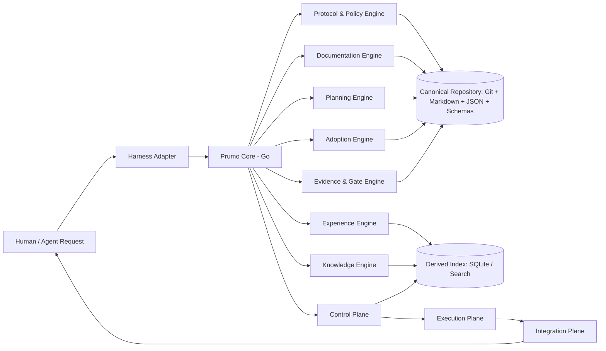
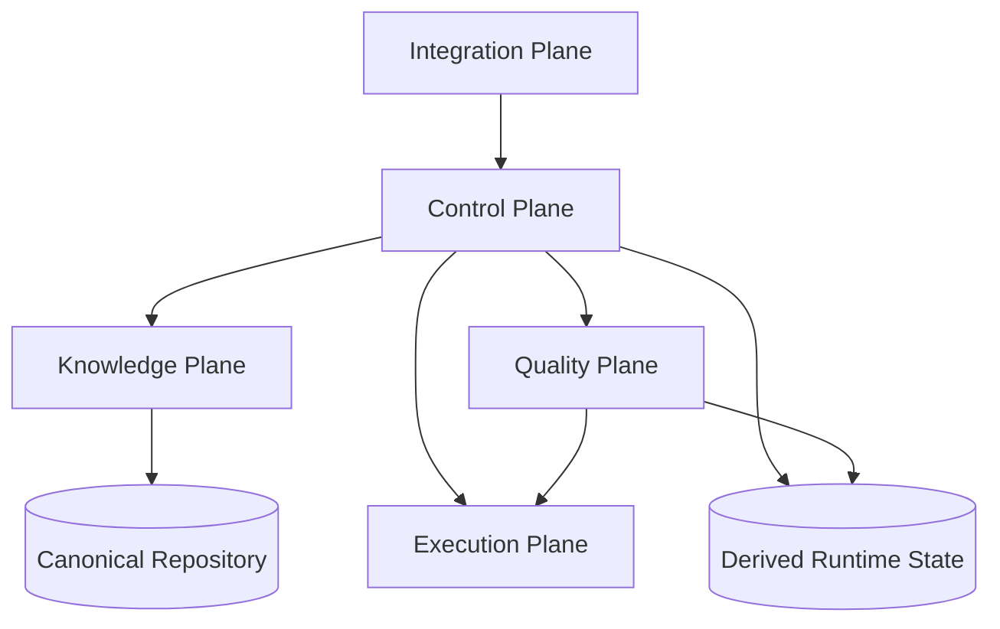

# Visão Geral da Arquitetura do Prumo

## Topologia de Alto Nível



## Planos e Fronteiras

### Principais Componentes

Os principais componentes são Protocol Domain, Project Service, Resolution Service, Documentation Engine, Planning Engine, Adoption Engine, Knowledge Engine, Experience Engine, Evidence/Gate Engine, Control Plane, Execution Plane e Integration Plane.

### Control Plane (Infraestrutura Horizontal)
| Serviço | Responsabilidade |
|---------|------------------|
| `RunService` | Ciclo de vida de execuções (run), checkpoints, retry, resume, cancelamento, detecção de livelock |
| `BudgetService` | Envelopes de orçamento hierárquicos, governança de custo, rate limits |
| `ContextService` | Pipeline do Context Compiler, orçamentos de tokens, consciência de cache, compactação |
| `ModelRoutingService` | Model Registry, roteador guiado por evals, detecção de drift, fallback |
| `ToolGateway` | Descritores de ferramentas, descoberta lazy, journal de efeitos colaterais, governança de MCP |
| `EnvironmentService` | Contrato de sandbox, requisitos de isolamento, ambientes de execução |
| `AutomationService` | Regras orientadas a eventos, DLQ, idempotência, chaves de concorrência |
| `ObservabilityService` | Telemetria estruturada, explicabilidade, incident bundles |
| `PackageRuntimeService` | `prumo.lock`, isolamento de providers, verificação da cadeia de suprimentos (supply chain) |

### Knowledge Plane (Estado Canônico)
| Engine | Responsabilidade |
|--------|------------------|
| Goals | Ciclo de vida, locks, emendas, transições de estado |
| Documentation | Contratos, profiles, readiness, delta, contradições |
| Planning | Entrevista, decisões, questões em aberto, confiança |
| Adoption | Scanner, mapeamento semântico, detecção de lacunas, migração |
| Experience | Eventos de sessão, resumos, handoffs, propostas |
| Traceability | Arestas tipadas: req↔dec↔code↔test↔doc↔evidence |

### Quality Plane (Verificação)
| Componente | Responsabilidade |
|------------|------------------|
| Test Providers | Baseados em contrato: Playwright, ZAP, CodeQL, fuzzers, sanitizers, UIA/AX/AT-SPI, KUnit, syzkaller |
| Quality Orchestrator | Plano determinístico a partir de impacto da mudança + risco + capacidades |
| Evidence Normalization | Schema comum para execuções, achados, artefatos, fingerprint do ambiente |
| Security Verifier | Verificação independente para risco alto/crítico |

### Execution Plane (Providers Externos)
Modelos, ferramentas/MCPs, sandboxes/runtimes, providers externos. **Nunca importam regras canônicas.**

### Integration Plane (Adapters)
OpenCode, Codex, Claude Code, Gemini CLI, Copilot CLI, Kiro, Generic. **Apenas adapters finos — nenhuma lógica canônica.**

## Direção das Dependências



**Regras:**
- Domain/Protocol nunca importa a CLI, storage concreto ou o harness
- A CLI depende dos Application Services
- O storage implementa as ports definidas pelos consumidores
- As integrações chamam o Prumo Core via JSON/stdio estável da CLI ou API versionada
- SQLite nunca é necessário para interpretar o estado canônico
- Um harness externo nunca controla os invariantes

## Fronteiras de Interface

Interfaces existem **somente** em fronteiras reais com múltiplas implementações:
- `Repository` (filesystem Git)
- `EventSink` (arquivo local, OTLP, in-memory)
- `DerivedIndex` (SQLite, in-memory, futuro)
- `HarnessTransport` (stdio, HTTP, MCP)
- `Clock` (testes)
- `EmbeddingProvider` (futuro)

**Evite interfaces prematuras** durante a migração para Go.

## API Interna de Máquina

Comandos versionados e estáveis para plugins/adapters:
```
prumo internal project-status --json
prumo internal resolve --json
prumo internal validate-tool --json
prumo internal docs-impact --json
prumo internal context --json
prumo internal handoff --json
```

## Negociação de Versão do Protocolo

Todo adapter declara:
- id/versão do conector
- versão do protocolo Prumo suportada
- capacidades
- hooks de ciclo de vida
- suporte a bloqueio de escrita
- primitivas de agent/skill

O Prumo recusa o enforcement "strict" quando o harness não tem primitivas suficientes.

## Princípio de Design

> **Invariantes são fixados no código; políticas são configuradas; heurísticas são avaliadas.**
>
> - Invariantes: lock de Goal, validação de schema, exigências de evidência
> - Políticas: verificador independente para risco crítico, limites de orçamento
> - Heurísticas: tamanho da workforce, roteamento de modelos, empacotamento de contexto (sujeito a evals)
