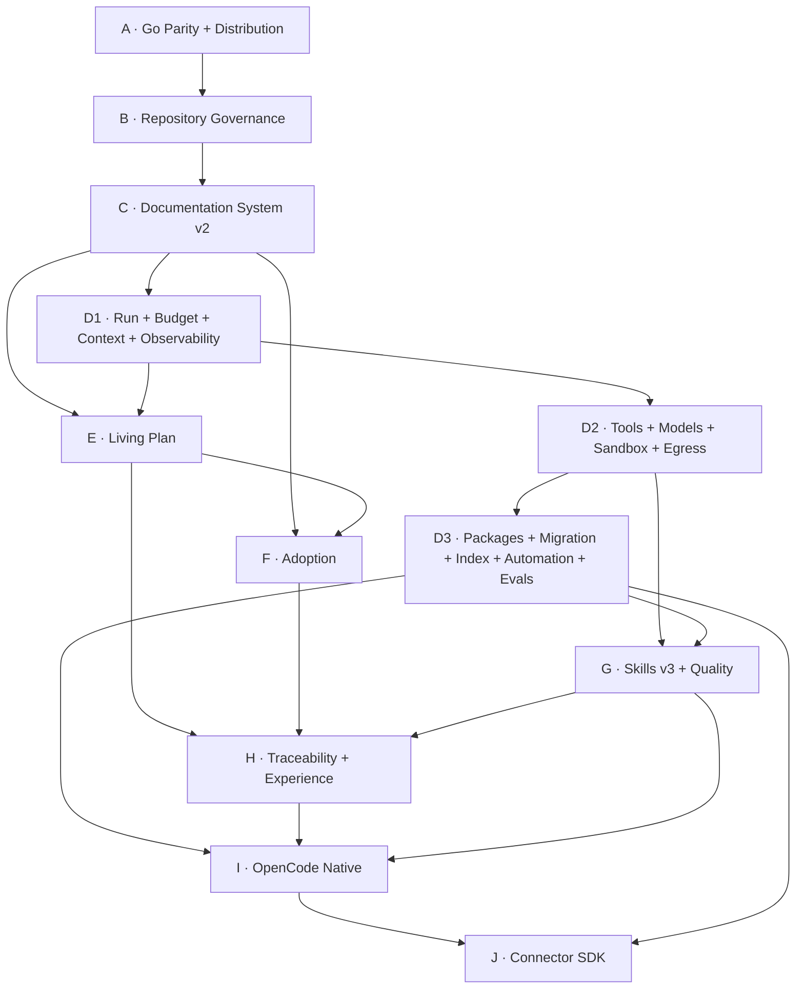

# 63 — Programa de Implementação v0.4: do Go Core ao Connector SDK

> Authority: canonical specification.
> Logical ID: PHASE-63
> Source: Notion Living Book (3d69bb7d023f81e2aa5bf37409eb3533)
> Status: Fase/Gate de implementação (63 — Programa de Implementação v0 4 do Go Core ao).

<aside>
🧭

Este documento reorganiza o restante da implementação do Project Atlas v0.4 em um programa executável. Ele não substitui as páginas arquiteturais existentes; funciona como camada de implementação: dependências, ordem, Gates, Goals, testes, dogfooding e critérios de saída até o Connector SDK.

</aside>

## Objetivo

Transformar o conjunto atual de decisões do Livro Vivo em uma sequência implementável, reduzindo rework e impedindo que agents avancem para subsistemas cujo enforcement ainda não existe.

A meta de encerramento deste programa é chegar a um Atlas capaz de planejar, executar, observar, verificar, documentar, aprender e integrar-se de forma nativa a múltiplos harnesses, mantendo Git/Markdown/JSON/JSON Schema como base canônica e Go como Core/CLI.

## Autoridade e fontes

Este programa deve ser lido junto com:

- [00 — Princípios, Governança e Regras de Engenharia](../../framework/specs/ch00.md)
- [01 — Stack Go, Clean Code e Migração do Core Python](../../framework/specs/ch01.md)
- [02 — Arquitetura Atlas v0.4 e Boundaries do Core](../../framework/specs/ch02.md)
- [14 — Roadmap de Implementação v0.4](../../framework/specs/ch14.md)
- [19 — Registro Consolidado de Decisões v0.4](../../framework/specs/ch19.md)
- [48 — Agent Runtime Control Plane: Arquitetura e Princípios](../../framework/specs/ch48.md)

Se houver conflito entre este programa e uma decisão canônica posterior no repositório, a decisão canônica do repositório prevalece. No Livro Vivo, qualquer mudança relevante deve produzir amendment explícito.

## Princípios permanentes de implementação

1. **Repository over conversation memory.** Conversa auxilia design; Git preserva estado canônico.
2. **Protocol over harness.** OpenCode, Codex, Claude e outros hosts não definem semântica do Atlas.
3. **Hard-code invariants; configure policies; evaluate heuristics.** Invariantes não podem depender de prompt.
4. **Least Context + Least Workforce + Least Ceremony.** Mais contexto, agents e burocracia somente quando risco/complexidade justificarem.
5. **Go Core primeiro.** Python não recebe grandes features v0.4.
6. **SQLite é derivado.** Nunca supera a verdade canônica em Git/arquivos.
7. **Read-only before mutation.** Check/explain/plan antes de apply/mutate.
8. **Clean Code pragmático.** Boundaries de domínio reais; evitar packages vazios, utils genéricos e interfaces prematuras.
9. **Evidence before green.** Nenhum Gate crítico passa somente porque um agent afirmou sucesso.
10. **Dogfood incremental.** Atlas deve gerenciar progressivamente seu próprio desenvolvimento.
11. **Session/model/harness independence.** A Run pertence ao Atlas; executor sessions são temporárias. Nenhuma Run ativa pode exigir chat history privado para continuar. [77 — Portable Continuation Protocol: Continuidade Agnóstica de Session, Model e Harness](phase-77.md)
12. **Continuous execution is explicit.** Autonomia contínua nunca é inferida. `manual` permanece default; `goal`, `phase` e `program` são scopes opt-in governados pelo Program Runner. [78 — Continuous Execution Mode: Program Runner, Worker Loop e Autonomia Opt-in](phase-78.md)

## Nova sequência de implementação

A ordem recomendada passa a ser:

1. **Fase A — Go Core Parity & Distribution Closure.** Encerrar objetivamente M2–M4, remover dependência operacional de Python e validar distribuição real.
2. **Fase B — Repository Governance.** M4.75: governar branch, commit, push, Issue, PR, review, merge, tags/releases e agents SCM.
3. **Fase C — Documentation System v2.** M5: contracts, profiles, coverage/readiness, impact/delta, staleness e contradictions.
4. **Fase D1 — Runtime Foundation I.** Run Engine, `Run != ExecutorSession`, Portable Continuation/`atlas continue`, Event/Checkpoint, Budget/Cost, Context Compiler e Observability básica.
5. **Fase D2 — Runtime Foundation II.** Tool Gateway/MCP, Model Registry/Router, Execution Environments/Sandbox e Secrets/Egress.
6. **Fase D3 — Runtime Infrastructure.** Package/Runtime Manager, atlas.lock, Migration Engine, incremental indexing/concurrency, Automation foundation, **Continuous Execution Program Runner** e Harness Eval Suite.
7. **Fase E — Living Plan.** Interview, decisões, open questions, authority/confidence e readiness-directed planning.
8. **Fase F — Adoption Engine.** Brownfield discovery, mapping, confidence ledger e migration proposals.
9. **Fase G — Skills v3 + Quality Platform.** Skill Package v3, resolver/evals, Test Provider Contract, Quality Orchestrator e reference providers.
10. **Fase H — Traceability + Experience.** Journal, typed trace, handoff, summaries e Experience proposals.
11. **Fase I — OpenCode Native Harness.** Primeiro connector Level 4 de referência.
12. **Fase J — Connector SDK.** Capability negotiation, test kit, lifecycle, install/cleanup e multi-harness.

## Dependency DAG

A execução pode paralelizar tarefas independentes dentro de uma fase, mas não deve atravessar um Gate de dependência.

## Contrato universal de fase

Toda fase deve possuir antes da implementação:

- objective e rationale;
- dependencies verificáveis;
- scope e non-goals;
- arquitetura/boundaries afetados;
- schemas/contracts novos ou alterados;
- packages e direção de dependência;
- CLI/machine interface;
- Goals e Task DAG;
- migration/compatibility impact;
- security/trust impact;
- tests, conformance e evals;
- evidence esperada;
- documentation delta;
- dogfood scenario;
- acceptance criteria;
- rollback/recovery strategy;
- exit gate.

## Política de Goals

Um Goal de implementação deve ser pequeno o bastante para:

- possuir uma intenção principal;
- ser revisável como PR coerente;
- produzir evidence própria;
- ter rollback compreensível;
- não atravessar mais de um boundary arquitetural principal sem justificativa.

Evitar Goals como “implementar Control Plane inteiro”. Preferir “Run lifecycle + persistence contract”, “Context Manifest + deterministic packing” etc.

## Gates transversais obrigatórios

### Gate de arquitetura

- dependency direction preservada;
- nenhuma duplicação de authority entre Core/connector/provider;
- persistência canônica e derivada corretamente separadas.

### Gate de qualidade

- gofmt;
- go vet;
- go test ./...;
- conformance aplicável;
- tests/evals específicos da feature;
- race tests em código concorrente quando relevante.

### Gate de segurança

- permission/side-effect model preservado;
- nenhum secret persistido indevidamente;
- egress explícito;
- untrusted content nunca se torna authority.

### Gate documental

- Documentation Delta calculado;
- canonical docs atualizadas quando afetadas;
- contradictions/staleness registradas;
- user/reference docs atualizadas para superfícies públicas.

### Gate de governança

- branch válida;
- PR obrigatória para main;
- checks requeridos verdes;
- risk/review policy satisfeita;
- merge policy respeitada.

## Estratégia de dogfooding

O dogfooding aumenta em cinco níveis:

1. **Level 0 — External orchestration:** humanos/OpenCode seguem docs do Atlas, mas Atlas não governa o ciclo completo.
2. **Level 1 — Self-inspection:** Atlas executa validate/docs/repo policy/explain sobre seu próprio repositório.
3. **Level 2 — Self-run:** Run Engine, Portable Continuation, Context, Budget, Tools, Evidence e Gates gerenciam Goals reais do próprio Atlas; uma Run deve sobreviver a troca de session/model/harness.
4. **Level 3 — Native harness:** OpenCode connector executa o ciclo completo usando o Atlas Core.
5. **Level 4 — Multi-harness proof:** um segundo connector e o generic fallback executam os mesmos canonical Goals/contracts sem forks semânticos no Core.

Nunca saltar diretamente para autonomia completa sem os níveis anteriores provados.

## Política de release

Progressão recomendada:

- `0.4.0-alpha.N`: contracts e runtime ainda evoluem; migrations explícitas.
- `0.4.0-beta.N`: superfícies principais fechadas; dogfood real; connector nativo funcional.
- `0.4.0-rc.N`: compatibilidade congelada salvo blockers; release/install/rollback completos.
- `0.4.0`: Core v0.4 estável.

O Connector SDK pode marcar a fronteira entre v0.4 completo e a preparação do v1, desde que o Contract e o Test Kit estejam estáveis.

## Definition of Program Complete

O programa até Connector SDK é considerado completo somente quando:

- Go é o runtime canônico do Atlas e Python deixou de ser dependência operacional;
- instalação/distribuição e rollback são verificáveis;
- Repository Governance é aplicada ao próprio Atlas;
- Documentation System mede readiness real;
- Runs são resumíveis, canceláveis, budgeted e observáveis, com `Run != ExecutorSession` e Portable Continuation funcional sem connector nativo;
- Context Compiler produz Context Manifest explicável;
- Tools/MCP e models passam por gateways/routing governados;
- sandbox/egress/secrets possuem enforcement explícito;
- packages/providers possuem lifecycle e lock reprodutível;
- Continuous Execution é opt-in, bounded e consegue avançar Goal→tests→repair→gate→próximo Goal sem novos prompts humanos quando o harness oferece enforcement suficiente;
- Living Plan e Adoption funcionam em greenfield e brownfield;
- Skills v3 e Test Provider Contract possuem reference implementations + evals;
- qualquer mudança relevante pode ser rastreada Goal → decisão → code → test → doc → evidence;
- continuidade entre agents/sessões/models/harnesses não depende de memória de conversa; Handoff enriquece, mas não é requisito do baseline;
- OpenCode funciona como primeiro connector nativo completo;
- Connector SDK permite implementar um segundo connector sem alterar o Core.

## O que fica fora deste programa

Game Development Suite completa, dezenas de providers especializados, Publishing/Blog, distributed team runtime, cloud control plane, universal embeddings/vector DB e grandes catálogos especializados permanecem expansões posteriores. Eles não bloqueiam o Atlas Core completo.

## Regra de detalhamento progressivo

Esta documentação é completa em arquitetura e gates até Connector SDK, porém cada fase deve ser revalidada contra o estado real do repositório antes do primeiro commit da fase. Não congelar detalhes de implementação que dependem de APIs/hosts ainda mutáveis; congelar contracts e invariants.

[64 — Fase A: Go Core Parity & Distribution Closure](phase-64.md)

[65 — Fase B: Repository Governance Foundation (M4.75)](phase-65.md)

[66 — Fase C: Documentation System v2 (M5)](66%20%E2%80%94%20Fase%20C%20Documentation%20System%20v2%20(M5)%203d69bb7d023f8106a544fd0fd1dbb7cb.md)

[67 — Fase D1: Runtime Foundation I — Run, Budget, Context e Observability](phase-67.md)

[68 — Fase D2: Runtime Foundation II — Tools, Models, Sandbox e Egress](phase-68.md)

[69 — Fase D3: Runtime Infrastructure — Packages, Migration, Indexing, Automation e Harness Evals](phase-69.md)

[70 — Fase E: Living Plan & Interview Engine (M6)](70%20%E2%80%94%20Fase%20E%20Living%20Plan%20&%20Interview%20Engine%20(M6)%203d69bb7d023f813f8eceeddd3d38b079.md)

[71 — Fase F: Adoption Engine para Projetos Existentes (M7)](phase-71.md)

[72 — Fase G: Skill System v3 + Quality Platform](phase-72.md)

[73 — Fase H: Engineering Traceability, Experience & Handoff](phase-73.md)

[74 — Fase I: OpenCode Native Harness (M10)](74%20%E2%80%94%20Fase%20I%20OpenCode%20Native%20Harness%20(M10)%203d69bb7d023f812b8514d801c1ead108.md)

[75 — Fase J: Connector SDK, Capability Contract e Multi-Harness (M11)](phase-75.md)

[76 — Gates Transversais: CI/CD, Schemas, Release, Security e Self-Dogfooding](phase-76.md)

[77 — Portable Continuation Protocol: Continuidade Agnóstica de Session, Model e Harness](phase-77.md)

[78 — Continuous Execution Mode: Program Runner, Worker Loop e Autonomia Opt-in](phase-78.md)

# Amendment 2026-09-21 — Gate transversal 84

[84 — Total Assurance Constitution: Gauntlet Loop, Evidence e Anti-False-Green](../../quality/gauntlet-84.md) torna-se dependência transversal do programa. Toda fase deve produzir Surface/Contract inventory proporcional ao domínio, evidence plan, oracle classification, failure/recovery model, NFR/resource budgets quando aplicáveis e fresh-state proof final. Definition of Program Complete não pode ser derivada de médias: todo hard gate required precisa PASS e todo required acceptance criterion precisa evidence não stale.