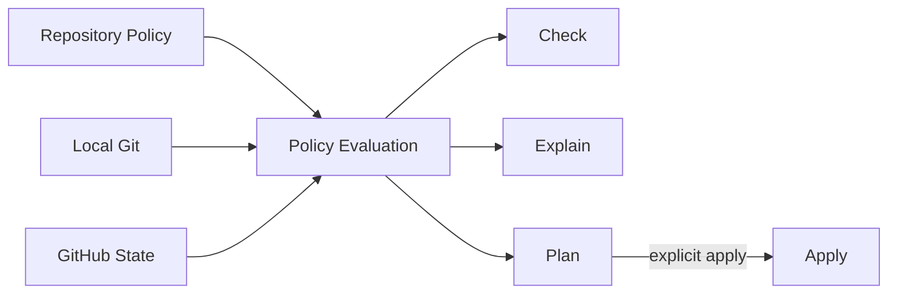

# 65 — Fase B: Repository Governance Foundation (M4.75)

> Authority: canonical specification.
> Logical ID: PHASE-65
> Source: Notion Living Book (3d69bb7d023f81ffb72adf2e5d39a5e8)
> Status: Fase/Gate de implementação (65 — Fase B Repository Governance Foundation (M4 7).

## Papel no programa

Tornar mudanças em Git/SCM governadas antes de permitir que Documentation System, agents e harnesses alterem estado canônico de forma cada vez mais autônoma.

## Fonte principal

[62 — Repository Change Governance, GitHub Policy e Agent SCM Safety](phase-62.md)

Esta página define **como implementar a fase**. A página 62 permanece autoridade semântica detalhada das policies.

## Objetivo

Implementar Repository Change Governance provider-agnostic com GitHub como primeiro adapter, e dogfoodar a política no próprio repositório Atlas.

## Dependencies

- Fase A suficientemente estável para que CLI/schema/Go quality gates sejam confiáveis;
- GitHub repository acessível;
- CI existente.

## Non-goals

- GitLab adapter;
- distributed merge queue;
- autonomous unrestricted merge/release;
- universal signing obrigatório;
- Git Flow com `develop` permanente.

## Domain model

`RepositoryPolicy` deve compor semanticamente:

- Repository;
- Branch;
- Commit;
- Push;
- Issue;
- Pull Request;
- Review;
- Merge;
- Release/Tag;
- Agent SCM permissions;
- Emergency bypass.

GitHub payloads/API não pertencem ao domínio.

## Fluxo

`check`, `explain` e `plan` são read-only. `apply` é explícito e idempotente onde possível.

## Políticas Atlas de referência

### Branching

Trunk-based leve; `main` protegida. Prefixos preferidos: `feat/`, `fix/`, `docs/`, `refactor/`, `test/`, `chore/`, `release/`, `hotfix/`.

### Commits

Conventional Commits simplificado; commits atomicamente lógicos.

### Push

Agent pode push de work branch quando policy permite; direct push/force push em main negado por padrão.

### Issues

Intake/proposal; não são fonte canônica de arquitetura.

### PR

Unidade de integração. Deve registrar why, what, scope, non-goals, Goal/Issue/Run, risk, validation, evidence, docs delta, migration e rollback.

### Review

Risk-aware. Solo profile não exige reviewer humano externo em toda PR, mas exige PR + CI + conversations resolved + decisão humana de merge enquanto autonomia plena não estiver habilitada.

### Merge

Squash como padrão para Atlas; feature branch descartável depois de merge.

### Tags/releases

Sem movimentar/deletar release tags silenciosamente.

## GitHub implementation

Entregáveis do próprio repo:

- `CONTRIBUTING.md`;
- `.github/CODEOWNERS`;
- `.github/PULL_REQUEST_TEMPLATE.md`;
- Issue Forms;
- Dependabot quando adequado;
- governance CI;
- main ruleset;
- release tag ruleset/protection quando suportado;
- merge settings reconciliados.

## CLI

Target:

- `atlas repo policy check`;
- `atlas repo policy explain`;
- `atlas repo policy plan`;
- `atlas repo policy apply`;
- `--json` e `--dry-run` seguindo convenções Atlas.

## Provider boundary

Mínimo real:

- local Git inspector;
- repository governance service;
- host/provider adapter;
- GitHub REST adapter.

Não criar um SCM SDK gigante.

## Side-effect classification

- status/log/diff: read-only;
- local branch/commit: reversible;
- push work branch/Issue/PR: side-effecting;
- remote branch deletion/force push: destructive;
- merge/main ruleset/release: privileged;
- force push main e rewrite release tag: deny por default.

## Goal decomposition recomendado

- B-G01: RepositoryPolicy schema + domain validation.
- B-G02: branch/commit/push permission evaluation.
- B-G03: PR/review/merge/release policies.
- B-G04: local Git inspector.
- B-G05: GitHub adapter read/check.
- B-G06: deterministic plan + safe apply.
- B-G07: GitHub templates/CI/rulesets dogfood.
- B-G08: documentation + conformance.

## Tests

- schema/enum/version;
- branch/commit validation;
- permission matrix;
- desired vs actual state;
- no side effects in check/plan;
- dry-run;
- idempotent apply;
- stale remote state/TOCTOU;
- permission denied/rate limit/provider unavailable;
- GitHub adapter via HTTP test server/fixtures;
- conformance outputs determinísticos.

## Security

- token nunca persistido em Git/config/evidence;
- least GitHub Actions permissions;
- untrusted PR code não recebe privileged workflow context;
- nenhum `--ignore-policy` genérico;
- ruleset modifications são privileged.

## Dogfood

O repositório Atlas deve passar `atlas repo policy check`. Qualquer gap remoto deve aparecer como non-compliant/unsupported, nunca ser mascarado.

## Exit Gate — M4.75 READY

- RepositoryPolicy versionado;
- policy check/explain/plan/apply funcionando;
- GitHub adapter testado;
- main protegida conforme profile atual;
- PR/Issue/CODEOWNERS/contribution docs ativos;
- agent SCM matrix deterministicamente enforceable;
- release/tag invariants documentados/enforced conforme capability;
- CI e conformance verdes;
- M5 pode produzir Documentation Deltas sem bypass de governança.