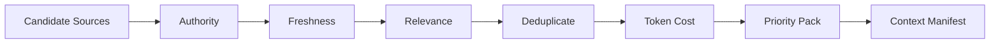

# 67 — Fase D1: Runtime Foundation I — Run, Budget, Context e Observability

> Authority: canonical specification.
> Logical ID: PHASE-67
> Source: Notion Living Book (3d69bb7d023f8140a9c9fc2298958de6)
> Status: Fase/Gate de implementação (67 — Fase D1 Runtime Foundation I — Run, Budget, C).


## Papel no programa

Esta fase cria o primeiro Runtime Control Plane operacional do Atlas. Até aqui o Atlas conhece protocolo, documentação e governança; após D1 ele passa a executar trabalho como **Run** resumível, limitado por orçamento, alimentado por contexto compilado e explicado por telemetry estruturada.

## Fontes

- [48 — Agent Runtime Control Plane: Arquitetura e Princípios](../../framework/specs/ch48.md)
- [49 — Budget Manager, Cost Governance e Rate Limits](../../framework/specs/ch49.md)
- [50 — Context Compiler, Token Budget, Cache e Compaction](../../framework/specs/ch50.md)
- [51 — Run Engine, Checkpoints, Retry, Resume e Cancellation](../../framework/specs/ch51.md)
- [55 — Observability Plane, Run Explainability e Incident Bundles](../../framework/specs/ch55.md)

## Objetivo

Entregar cinco capabilities inseparáveis:

1. **Run Engine** — lifecycle, checkpoints, resume, retry, cancellation e failure taxonomy;
2. **Portable Continuation baseline** — `Run != ExecutorSession`, `ContinuationRecord v1` e `atlas continue` para troca de model/session/harness sem depender de chat history;
3. **Budget/Cost** — envelopes hierárquicos de recursos e rate limits;
4. **Context Compiler** — seleção e empacotamento explicável de contexto, recompilado para o executor atual;
5. **Observability baseline** — telemetry estruturada e explainability sem chain-of-thought.

Especificação detalhada: [77 — Portable Continuation Protocol: Continuidade Agnóstica de Session, Model e Harness](phase-77.md).

## Dependency

- Fase C concluída para permitir readiness/documentation gates;
- Evidence/Gates/Event primitives do Core disponíveis;
- Repository Governance ativa para mudanças canônicas.

## Non-goals

- Tool/MCP execution completa — D2;
- Model Router completo — D2;
- sandbox multi-provider — D2;
- automação recorrente/event-driven completa — D3;
- shared/distributed scheduler;
- transcript ou chain-of-thought logging.

# 1. Run Engine

## Run como unidade operacional

`Run` representa uma execução concreta de trabalho ligada, quando aplicável, a Goal/Task. Não substitui Goal: Goal registra intenção/estado de engenharia; Run registra processo operacional.

**Invariant:** `Run != ExecutorSession`. Model, harness e agent são executores temporários associados por `ExecutorSession`; trocar de sessão/model/harness não cria uma nova Run por si só. Nenhuma Run ativa pode depender de memória privada ou histórico de chat para continuar.

## Lifecycle canônico

Modelo mínimo:

```
created
  → planning
  → ready
  → running
      ↘ waiting_approval
      ↘ waiting_resource
      ↘ retrying
      ↘ verifying
      ↘ blocked
  → completed | failed | cancelled
```

Transições devem ser explícitas, validadas e testáveis. Reentrada/retry não pode mascarar o histórico.

## Run identity

Campos conceituais mínimos:

- id/version;
- Goal/Task refs quando existirem;
- status/phase;
- created/started/finished timestamps;
- workspace/revision ref;
- active/last `ExecutorSession` refs; harness/model/provider metadata pertence à sessão executora, não à identidade durável da Run;
- budget envelope ref/snapshot;
- latest checkpoint;
- evidence refs;
- failure/blocked reason;
- cancellation state.

Persisted protocol objects recebem JSON Schema seguindo convenções Atlas.

# 2. Checkpoint

Checkpoint é estado necessário para **reconstruir a execução após interrupção**. Não é Handoff narrativo entre agents.

D1 também introduz `ContinuationRecord v1`: uma projeção portátil derivada de Run + Checkpoint + Git/working state + decisions/evidence para um executor fresco continuar a mesma Run. Checkpoint responde recuperação do processo; Continuation responde reidratação portátil entre executores; Handoff em H adiciona síntese/Experience/claim sem ser requisito do baseline.

Deve registrar, quando aplicável:

- Run/Task;
- phase;
- workspace hash/ref;
- completed/pending steps;
- evidence pointers;
- pending/uncertain side effects;
- budget snapshot;
- context/source refs suficientes para recompile;
- logical resume token/version.

Não persistir modelo interno oculto ou CoT.

## Resume

`atlas run resume <id>` deve reconstruir a partir de:

1. canonical state;
2. Run record;
3. latest valid checkpoint;
4. side-effect journal;
5. current policy/capability compatibility.

Nunca depender de memória privada do model/harness.

Antes de resume:

- verificar revision/workspace drift;
- verificar provider/tool compatibility quando relevante;
- identificar side effects `unknown`;
- recalcular budgets disponíveis;
- produzir diagnóstico se unsafe.

# 3. Failure taxonomy

Definir classes estáveis, por exemplo:

- validation/policy;
- user/approval blocked;
- dependency/resource unavailable;
- rate-limited;
- provider transient;
- provider permanent;
- tool failure;
- timeout;
- budget exhausted;
- context overflow/compaction failure;
- side-effect uncertainty;
- verification failure;
- internal invariant failure;
- cancelled.

Taxonomy deve orientar retry/stop/report, não apenas logar strings.

## Retry

Retry só para classes retryable. Deve possuir:

- bounded attempts;
- backoff/jitter quando externo;
- idempotency/side-effect check;
- budget reservation;
- history preservada.

Nunca replay de operação side-effecting cujo resultado é desconhecido sem reconciliação.

## Cancellation

Cancellation é first-class:

- request propagada;
- novos side effects bloqueados;
- operação em andamento termina/cancela conforme contract;
- cleanup obrigatório quando aplicável;
- checkpoint/final event gravado;
- estado final `cancelled` não é `failed`.

## Livelock detection

Detectar padrões como repetição da mesma failure/retry/plan sem progresso material. Encerrar como blocked/failed conforme policy, com evidence.

# 4. Side-effect journal baseline

Mesmo antes do Tool Gateway completo, Run Engine precisa distinguir:

- read-only;
- idempotent/reversible;
- side-effecting;
- destructive/privileged;
- unknown side effect.

Journal deve permitir saber se uma etapa pode ser replayed no resume. D2 enriquece o modelo com Tool Descriptor.

# 5. Budget Envelope

Token budget isolado é insuficiente. Envelope deve poder limitar:

- input tokens;
- output tokens;
- effective context tokens;
- tool-output tokens;
- LLM calls;
- tool calls;
- estimated/actual monetary cost;
- wall-clock time;
- concurrency;
- network bytes quando mensurável;
- external-source count quando relevante.

## Hierarquia

Scopes conceituais:

```
user
→ workspace
→ project
→ Goal
→ Run
→ agent
→ step
→ tool/model call
```

O budget efetivo é a interseção/derivação das camadas aplicáveis.

## Reservation

Subagent/step/tool deve reservar parcela antes de iniciar trabalho caro. Reservation impede múltiplos workers de presumirem o mesmo orçamento residual.

## Limits

- soft: warning/adaptation;
- hard: checkpoint + safe stop/block;
- no overrun silencioso.

## Cost Manager

Separar pricing metadata de model identity. Pricing é versionado/data-driven e pode ficar `unknown` sem impedir execução quando policy permite. Custo estimado e realizado devem ser distinguíveis.

## Rate Limit Manager

- interpretar Retry-After/headers disponíveis;
- bounded backoff + jitter;
- per-provider/model/tool buckets quando necessário;
- circuit breaker após falhas repetidas;
- rate limit consome wall time/budget explicitamente.

## CLI

- `atlas budget show [--run|--goal]`;
- `atlas budget explain ...`;
- `atlas cost estimate ...`;
- `atlas cost report ...`.

# 6. Context Compiler

Context é artefato compilado, não concatenação de tudo que existe.

## Três janelas

- **Physical Context Window:** limite declarado pelo model/provider;
- **Effective Context Window:** capacidade realmente útil/calibrada;
- **Task Context Budget:** limite apropriado à tarefa atual.

Nunca assumir physical window inteira como budget recomendado.

## Pipeline



## Candidate sources

Podem incluir:

- Goal/Task;
- canonical docs/contracts;
- ADRs/decisions;
- relevant code/schema/tests;
- repo policy;
- recent structured run state;
- `ContinuationRecord`/ExecutorSession state desde D1;
- handoff/experience enriquecidos depois de H;
- external knowledge quando explicitamente permitido.

## Ranking constraints

Authority é separada de relevance. Um source relevante mas não confiável não suplanta canonical truth. Freshness não significa authority.

## Context Manifest

Artefato explicável com, por source:

- stable source ref/hash/version;
- role/authority/trust;
- freshness;
- token estimate;
- included/excluded;
- inclusion reason;
- compression/summary pointer se aplicável.

Não incluir chain-of-thought.

## Tool/output context control

Outputs grandes devem suportar:

- cap;
- structured summary;
- pointer/reference;
- continuation/chunking;
- explicit truncation diagnostic.

Nunca despejar output arbitrário ilimitado no model context.

## Context pressure states

Modelo simples:

- `healthy`;
- `pressure`;
- `compact`;
- `critical`.

Thresholds são calibráveis por model/evals; os estados e semantics são estáveis.

## Compaction

Compaction deve preservar:

- Goal/intent;
- accepted decisions/constraints;
- open blockers;
- evidence refs;
- side-effect status;
- next executable state.

Perda de informação crítica precisa ser detectável em evals.

## Cache-aware layout

Quando provider/harness suporta prompt caching:

- prefixos estáveis antes de conteúdo volátil;
- deterministic source ordering;
- append-only history quando economicamente útil;
- não sacrificar correctness para maximizar cache hit.

## Retrieval progression

Default:

1. exact/structural lookup;
2. Git/path/index metadata;
3. FTS;
4. typed graph quando disponível;
5. embeddings somente se benchmark demonstrar benefício.

Embeddings não entram nesta fase por default.

# 7. Observability baseline

## Telemetry

Eventos estruturados, local-first, cobrindo:

- Run lifecycle;
- budgets/cost;
- context compilation;
- retries/failures;
- checkpoints/resume;
- approvals/blocks;
- verification results.

Nunca registrar CoT, secrets ou raw sensitive payload por default.

## Explainability

Target:

- `atlas run show <id>`;
- `atlas explain context <id>`;
- `atlas explain workforce <id>`;
- `atlas explain model <id>` quando D2 existir;
- `atlas explain tools <id>` quando D2 existir.

Explain responde **quais regras/dados produziram uma decisão**, não reasoning privado do model.

## Storage

- canonical project state em Git/arquivos;
- SQLite/derived local index permitido para runs/telemetry/query, reconstruível onde aplicável;
- logs/cache sob runtime state, não canonical;
- OTLP/export futuro opcional, não dependência.

## Incident bundle

`atlas debug bundle <run>` deve produzir bundle sanitizado com versions, hashes, policy/config refs, events relevantes, failures, evidence pointers e environment summary. Secrets/raw sensitive content removidos.

# 8. Schemas/contracts

Persisted/interchange candidates:

- Run;
- Checkpoint;
- Failure/Diagnostic extension;
- BudgetEnvelope;
- BudgetUsage/Reservation;
- ContextManifest;
- RuntimeEvent/Telemetry envelope;
- SideEffectJournal entry;
- ExecutorSession;
- ContinuationRecord v1.

Não schemaficar detalhes internos não persistidos.

# 9. Package boundaries

Conceitualmente:

- `internal/run` ou `internal/runtime/run`;
- `internal/budget`;
- `internal/context`;
- `internal/observability`;
- storage adapters separados das domain rules.

A estrutura real deve respeitar o repositório. Não criar umbrella `runtime` se isso piorar coesão.

# 10. Goal decomposition recomendado

- D1-G01: Run lifecycle + `ExecutorSession` separation/invariants.
- D1-G02: Checkpoint persistence + recovery contract.
- D1-G03: `ContinuationRecord v1` + Git/working-state projection.
- D1-G04: `atlas continue` human/JSON/`--prompt` + fresh context rehydration.
- D1-G05: failure taxonomy + retry/cancel/livelock.
- D1-G06: side-effect journal baseline.
- D1-G07: BudgetEnvelope + hierarchical accounting/reservations.
- D1-G08: Cost + rate-limit manager.
- D1-G09: ContextManifest + deterministic source pack + recompile across executor change.
- D1-G10: pressure/compaction/tool-output budgets.
- D1-G11: Observability + explain/run/session show.
- D1-G12: crash-recovery + cross-agent/generic-continuation Atlas dogfood.

# 11. Test strategy

## Run

- legal/illegal transitions;
- crash after each lifecycle phase;
- resume from checkpoint;
- same Run continued by a fresh `ExecutorSession` with no prior chat history;
- generic `atlas continue` path without native connector;
- model/context-window change recompiles Context Manifest instead of replaying prior prompt;
- changed workspace/revision;
- cancellation during pending work;
- bounded retries;
- retry on side-effect uncertainty denied;
- livelock detection.

## Budget

- nested limits;
- reservation race/overcommit prevention;
- hard exhaustion → checkpoint + safe stop;
- soft warning;
- unknown price;
- rate limit headers/circuit breaker.

## Context

- deterministic ordering;
- authority beats conflicting low-authority source;
- relevant unrelated exclusion;
- dedupe;
- stale source handling;
- token budget exact boundary;
- compaction preserves critical facts;
- tool-output cap/truncation.

## Observability

- no secrets in bundle fixture;
- event ordering/stable IDs;
- explain references actual inputs;
- corrupted derived index recovery.

## Harness eval seeds

- 100K LOC repo context selection;
- compaction after long run;
- budget exhaustion;
- process kill + resume;
- provider throttling simulation.

# 12. Dogfood threshold

Após D1, o Atlas deve começar a gerenciar **seus próprios Goals de implementação como Runs reais**.

Dogfood mínimo:

1. criar Goal real e Run;
2. abrir `ExecutorSession A` em um harness/model;
3. compilar Context Manifest e reservar budget;
4. executar apenas parte do Goal;
5. checkpoint + encerrar/simular fim da Session A por quota/timeout;
6. abrir `ExecutorSession B` em outro agent sem histórico de chat — pelo menos um cenário sem connector nativo;
7. executar `atlas continue`, validar branch/dirty state/side effects e recompilar Context Manifest para B;
8. continuar **a mesma Run** sem repetir trabalho concluído;
9. concluir com Evidence/Gate e inspecionar `atlas run show`/session history.

Ainda não é autonomia completa; ferramentas/models externos podem ser invocados pelo harness fora do Tool Gateway até D2, mas o Run/Context/Budget state pertence ao Atlas.

# 13. Evidence

- state-machine tests;
- crash/recovery matrix;
- context manifest fixtures;
- budget exhaustion report;
- compaction eval baseline;
- sanitized incident bundle;
- self-run journal.

# 14. Rollback/recovery

Schemas versionados e migrations explícitas. Corrupt derived runtime state deve poder ser descartado/reconstruído sem apagar canonical project state. Checkpoint incompatible deve bloquear resume com diagnóstico, não adivinhar conversão.

# Exit Gate — RUNTIME FOUNDATION I READY

Passa quando:

- Run é persistido, resumível, cancelável e retry-safe;
- failure taxonomy governa retry/stop;
- budgets hierárquicos impedem overrun hard;
- Context Compiler gera manifest determinístico/explicável;
- compaction possui baseline eval;
- telemetry/explainability funciona sem CoT/secrets;
- process-kill dogfood resume funciona;
- Atlas consegue gerenciar ao menos um Goal próprio como Run.