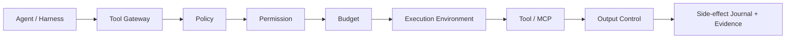

# 68 — Fase D2: Runtime Foundation II — Tools, Models, Sandbox e Egress

> Authority: canonical specification.
> Logical ID: PHASE-68
> Source: Notion Living Book (3d69bb7d023f81cb8456f72fec41e144)
> Status: Fase/Gate de implementação (68 — Fase D2 Runtime Foundation II — Tools, Models).

## Papel no programa

D2 coloca todas as capacidades externas sensíveis atrás de boundaries explícitos. O Atlas deixa de confiar diretamente em tool/model/harness behavior e passa a mediar permissions, budgets, side effects, sandbox e egress.

## Fontes

- [52 — Tool Gateway, MCP Governance e Lazy Tool Discovery](../../framework/specs/ch52.md)
- [53 — Model Registry, Router, Drift, Fallback e Provider Health](../../framework/specs/ch53.md)
- [54 — Execution Environments, Sandbox e Blast-Radius Control](../../framework/specs/ch54.md)
- [60 — Secrets, Data Classification e Egress Governance](../../framework/specs/ch60.md)
- [50 — Context Compiler, Token Budget, Cache e Compaction](../../framework/specs/ch50.md)

## Objetivo

Implementar:

- Tool Descriptor + Tool Gateway;
- MCP governance/lazy discovery;
- Model Registry + routing/fallback/health;
- Execution Environment Contract + local/worktree sandbox baseline;
- data classification, egress policy e SecretProvider baseline.

## Dependencies

- D1 Run/Budget/Context/Observability estável;
- Repository Governance side-effect semantics disponíveis;
- Evidence/Gates ativos.

## Non-goals

- remote cloud sandbox obrigatório;
- full VM orchestration;
- universal secret-manager integrations;
- every model/provider adapter;
- autonomous browser/workflow automation;
- advanced scheduler.

# 1. Tool Gateway

Canonical flow:

Nenhum connector Level 4 deve bypassar esse boundary quando a capability está disponível.

## Tool Descriptor

Campos conceituais mínimos:

- id/version;
- source/provider;
- description/capabilities;
- input/output schema refs;
- side-effect class;
- reversibility/idempotency;
- filesystem scope;
- network/egress requirements;
- credential requirements/scope;
- timeout/resource limits;
- expected output size/class;
- trust level;
- environment requirements;
- install/runtime package ref quando aplicável.

## Side-effect classes

No mínimo:

- read-only;
- idempotent/reversible;
- side-effecting;
- destructive/privileged;
- unknown.

`unknown` recebe postura conservadora e nunca é silently replayed.

## Tool execution protocol

Antes:

1. descriptor valid;
2. permission effective;
3. budget reservation;
4. environment selected;
5. egress/secret check;
6. side-effect journal intent.

Depois:

1. normalized result;
2. bounded output/context reference;
3. actual usage;
4. side-effect outcome known/unknown;
5. evidence/event.

# 2. Lazy Tool Discovery

Context não deve carregar schemas de centenas de tools. Strategy:

- metadata/index primeiro;
- discover/search/select;
- carregar full schema/instructions apenas para candidates reais;
- registrar qual discovery levou à seleção.

Eval metrics: wrong-tool rate, unnecessary-tool calls, discovery overhead, token cost.

# 3. MCP Governance

Todo MCP server/source deve possuir identidade e trust metadata:

- id/origin/version;
- provenance/install owner;
- server transport/location;
- exposed tools/resources;
- requested filesystem roots;
- network egress;
- secret/credential requirements;
- permission policy;
- trust tier;
- compatibility version.

Untrusted MCP output é data, nunca authority.

MCP server novo não recebe automaticamente todas as roots/secrets porque foi configurado por um harness.

# 4. Output control

Tool output pode ser muito maior que Task Context Budget. Gateway deve suportar:

- hard output byte/token cap;
- structured parser/normalization;
- artifact/reference pointer;
- summary;
- continuation;
- redaction;
- truncation diagnostic.

Context Compiler decide o que entra no model; Tool Gateway controla o que a tool pode produzir/persistir.

# 5. Model Registry

Model identity é structured metadata, não string solta.

Campos conceituais:

- provider/model ID + aliases;
- registry version;
- context window declarada/calibrada;
- modalities;
- tool/function support;
- structured output support;
- latency/cost class;
- privacy/data handling constraints;
- region/local capability quando relevante;
- eval scores por task class;
- health status;
- deprecation/drift metadata.

Pricing permanece Cost Manager data, não parte imutável da identidade.

# 6. Model Router

Inputs:

- task class;
- complexity;
- risk;
- required capabilities/tools/modalities;
- Task Context Budget;
- latency/cost budgets;
- privacy/egress constraints;
- provider health;
- eval evidence;
- independent verification policy.

Output:

- selected model/provider;
- fallbacks ordered;
- reason codes/data inputs;
- expected budget/cost;
- verifier route quando necessário.

Não usar “smartest model always”.

## Eval-driven routing

Routing heuristic só é promovida se eval baseline mostrar melhoria relevante em task success/cost/latency/violations.

# 7. Drift, fallback e provider health

## Drift

Alias/provider behavior pode mudar. Registrar model fingerprint/version quando disponível. Shadow/canary eval antes de promover alias novo para critical task classes.

## Fallback

Fallback após model/provider failure:

- respeita capability/privacy/budget;
- não replay side effects automaticamente;
- recompila context se windows/capabilities mudarem;
- registra route transition.

## Circuit breaker

Falhas repetidas por provider/model reduzem rotas disponíveis temporariamente. Health não altera invariants.

# 8. Independent verifier

Risk profiles podem exigir model/agent diferente do implementador. Verifier recebe evidence mínima suficiente, não hidden reasoning.

# 9. Execution Environment Contract

Campos:

- provider/id/version;
- filesystem policy/root;
- network policy;
- CPU/memory/process/time limits;
- env vars;
- secret injection capability;
- device access;
- privilege level;
- cleanup strategy;
- artifact export;
- persistence/isolation model.

Providers iniciais:

- `local`;
- `git-worktree`.

Futuros/optional:

- container;
- VM;
- remote sandbox;
- hardware-test.

## Risk-based selection

Low-risk read tasks podem usar local. Mudanças de código/side effects preferem worktree quando practical. Higher-risk/untrusted execution pode exigir container/VM quando provider instalado.

Worktree é o primeiro isolamento barato e deve ser excelente antes de cloud sandbox.

# 10. Blast-radius control

Environment + Tool permissions limitam:

- writable paths;
- executable commands/tools;
- network destinations/classes;
- credentials;
- process lifetime;
- devices;
- child processes quando aplicável.

Falha no agent não deve implicar acesso irrestrito ao host.

# 11. Data Classification

Classes mínimas:

- `public`;
- `internal`;
- `confidential`;
- `restricted`.

Classificação pode vir de source/policy/path/explicit config. Model inference sozinha não rebaixa classificação.

# 12. Egress Policy

Antes de enviar data a model/tool/network provider, verificar:

- classification;
- target/provider trust;
- purpose/task;
- allowed scope;
- secret presence;
- user/org policy.

External content não pode elevar permissões/egress por instrução textual.

# 13. SecretProvider baseline

Core trabalha com **references**, não valores persistidos em config canonical.

Provider interface pequena para resolve/inject/redact metadata conforme necessidade. Backends iniciais podem ser environment/keyring quando safe. 1Password/Vault/cloud secrets são futuros adapters.

Nunca escrever secret value em:

- project config;
- logs;
- Context Manifest;
- Run events;
- Evidence;
- incident bundle;
- Experience.

# 14. Redaction

Redaction acontece antes de persistence/export. Preserve type/placeholder suficiente para diagnóstico sem revelar valor.

# 15. CLI alvo

- `atlas tools list|show|explain` ou superfície coerente existente;
- `atlas model list|show|route|explain`;
- `atlas environment list|show`;
- `atlas permissions explain` quando já houver surface;
- `atlas explain tools|model|environment <run>`.

Não criar comandos decorativos sem use case real.

# 16. Schemas/contracts

- ToolDescriptor;
- ToolExecutionRequest/Result se protocol persisted/interchange;
- MCPServerDescriptor;
- ModelDescriptor;
- ModelRoute/RouteDecision;
- EnvironmentContract;
- DataClassification/EgressPolicy config;
- SecretReference;
- permission/side-effect entries quando ainda não cobertas por contracts existentes.

# 17. Package boundaries

Conceitualmente:

- tool gateway/domain;
- model registry/router;
- execution environment;
- security/egress/secrets;
- provider adapters fora do Core domain.

Interfaces são justificadas aqui porque existem boundaries reais com hosts/providers.

# 18. Goal decomposition

- D2-G01: ToolDescriptor + side-effect/permission evaluation.
- D2-G02: Tool Gateway execution protocol + output control.
- D2-G03: MCP descriptor/governance/lazy discovery.
- D2-G04: ModelDescriptor + registry.
- D2-G05: router/fallback/health/drift baseline.
- D2-G06: EnvironmentContract + local/worktree providers.
- D2-G07: data classification + egress evaluation.
- D2-G08: SecretProvider refs + redaction.
- D2-G09: integrated tool/model/environment Run dogfood.

# 19. Tests/Evals

## Tools

- denied path/network/secret;
- correct side-effect class;
- output cap;
- unknown_side_effect;
- lazy discovery precision;
- permission escalation attempt from tool output.

## Models

- route satisfies required capability;
- budget/privacy exclude provider;
- provider 429/timeout/5xx;
- circuit breaker;
- drift alias canary;
- fallback does not replay side effect;
- context recompiles for fallback model.

## Environments

- worktree isolation;
- writable path escape denied;
- cleanup on cancel/failure;
- network policy fixture;
- resource/time limits where supported.

## Egress/secrets

- secret never appears in logs/events/context/bundle;
- restricted data blocked from external provider;
- redaction tests;
- malicious README/tool output cannot request broader access.

# 20. Dogfood

Executar uma mudança real do Atlas em git-worktree onde:

- model route é registrado;
- relevant tools são lazy-discovered;
- permissions/budget aprovam cada call;
- source write fica limitado ao worktree;
- secret/egress policy é aplicada;
- fallback simulated provider failure não duplica side effect;
- Run termina com Evidence.

# Exit Gate — RUNTIME FOUNDATION II READY

- Tool Gateway medeia tools/MCP em flows suportados;
- tool outputs são bounded;
- Model Router é explainable/eval-aware;
- fallback/health/drift possuem semantics seguras;
- local/worktree environment funciona com cleanup;
- data classification/egress/SecretReference são enforceable;
- secret leakage tests passam;
- integrated dogfood prova blast-radius control.