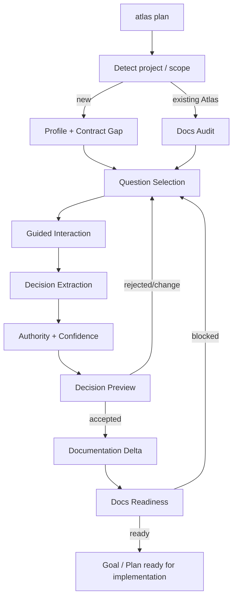

# 70 — Fase E: Living Plan & Interview Engine (M6)

> Authority: canonical specification.
> Logical ID: PHASE-70
> Source: Notion Living Book (3d69bb7d023f813f8eceeddd3d38b079)
> Status: Fase/Gate de implementação (70 — Fase E Living Plan & Interview Engine (M6)).


## Papel no programa

Living Plan transforma conversa de design em estado de projeto estruturado sem converter conversa em fonte de verdade. Ele usa Documentation System para descobrir gaps e Runtime Foundation para executar/resumir o processo de planejamento com budget/context/evidence.

## Fontes

- [05 — Living Plan Mode e Interview Engine](../../framework/specs/ch05.md)
- [03 — Documentation Contracts, Profiles e Qualidade Documental](../../framework/specs/ch03.md)
- [18 — Superfície CLI v0.4 e Machine Interface](../../framework/specs/ch18.md)

## Objetivo

Permitir que um projeto novo ou um Goal específico avance de intenção vaga para estado **implementation-ready**, por conversa incremental, com decisões, blockers, open questions e Documentation Deltas estruturados.

## Dependencies

- M5 Documentation System v2;
- D1 Run/Context/Budget/Observability;
- Repository Governance;
- Evidence/Gates.

D2/D3 enriquecem segurança/runtime, mas o núcleo do planner não deve depender de provider/harness específico.

## Non-goals

- full brownfield discovery — Fase F;
- autonomous architecture invention;
- raw transcript como canonical memory;
- model-specific conversation format;
- implementar code como parte de `atlas plan`;
- substituir Goal/Task protocol.

# 1. Pipeline



Para repo brownfield não-Atlas, `atlas plan` pode encaminhar para Adoption em Fase F; não deve duplicar scanner brownfield.

# 2. Planning scopes

Modos mínimos:

- `atlas plan` — project-level/general;
- `atlas plan --goal <id>` — foco em Goal existente;
- `atlas plan --docs` — fechar gaps documentais;
- `atlas plan --resume <session/run>` ou `atlas plan --resume` conforme CLI final.

Harness conversacional pode expor UI nativa; Core opera por structured requests/events.

# 3. Question priority

Perguntas são ordenadas por impacto, não curiosidade do model:

1. blockers de implementação;
2. decisões irreversíveis/high-cost;
3. high-risk architecture/security/data;
4. user behavior/product semantics;
5. detalhes importantes;
6. nice-to-have.

O planner deve parar de perguntar quando readiness do scope atual está suficiente. **Least Ceremony** é requisito.

# 4. Question object

Campos conceituais:

- id/version;
- contract/knowledge item ou decision topic relacionado;
- scope (project/Goal/component);
- priority/class;
- reason/blocking impact;
- suggested answer forms/options se aplicável;
- status;
- source/evidence pointers;
- asked/resolved metadata.

Question pode existir sem ter sido enviada ao usuário ainda.

# 5. Answer classification

Conteúdo do usuário/model deve ser classificado como uma destas categorias ou equivalente estável:

- explicit decision;
- preference;
- constraint;
- requirement;
- non-goal;
- unresolved/open question;
- hypothesis;
- agent suggestion.

**Agent suggestion nunca é promovida a user decision automaticamente.**

# 6. Decision model

Decision record/proposal precisa distinguir:

- statement;
- class;
- scope;
- actor/source;
- authority;
- confidence;
- status (proposed/accepted/rejected/superseded etc. conforme model comum);
- affected contracts/docs;
- rationale summary quando explicitamente disponível;
- alternatives/rejected candidates quando úteis;
- evidence/refs.

Não persistir hidden chain-of-thought como rationale.

# 7. Authority model

Exemplo de ordem semântica:

1. locked canonical invariant/spec/ADR;
2. explicit current user decision dentro de authority permitida;
3. accepted project decision;
4. documented constraint/evidence;
5. inferred existing state;
6. agent suggestion;
7. external/untrusted content.

Authority é contextual: um user preference não pode sobrescrever policy non-disableable sem amendment/authorization apropriado.

# 8. Confidence

Confidence é usada para inferências, não para decisões explicitamente aceitas. Deve ser explainable por evidence pointers, não número misterioso de LLM.

Faixas simples possíveis: high/medium/low/unknown ou score + reason codes. Evitar precisão falsa.

# 9. Open Questions Registry

Registro canônico/estruturado de perguntas ainda relevantes. Deve suportar:

- blocker vs non-blocker;
- linked contract/Goal;
- owner/eligible answer source;
- status;
- created/resolved/superseded;
- evidence/decision ref após resolução.

Pergunta resolvida não é deletada silenciosamente; permanece traceável.

# 10. Decision Preview

Antes de aplicar uma Documentation Delta ampla ou alterar decisão canônica, apresentar preview:

- decisões extraídas;
- classificação;
- docs/contracts afetados;
- contradictions/supersessions;
- blockers que serão resolvidos;
- open questions que permanecem.

Preview é especialmente obrigatório em operações high-impact/ambiguous.

# 11. Documentation integration

Living Plan não escreve docs arbitrariamente. Fluxo:

```
accepted decision
→ Documentation Impact
→ Documentation Delta
→ governance/review policy
→ canonical docs
→ readiness recompute
```

M5 continua autoridade de applicability/coverage/readiness.

# 12. Goal/Plan integration

Quando um scope se torna ready, Living Plan pode produzir/propor:

- Goal intent/acceptance criteria;
- Plan/Task DAG quando pedido/adequado;
- implementation constraints;
- test/evidence expectations;
- Documentation Delta.

Não inflar task decomposition quando Goal simples não precisa.

# 13. Context Compiler integration

Cada planning turn/session recebe apenas:

- scope/Goal;
- relevant contracts/gaps;
- accepted decisions;
- relevant canonical docs;
- open questions;
- last structured planning state.

Não reintroduzir transcript completo a cada turn.

# 14. Resume

Planning session usa Run/checkpoint ou compatible structured state. Resume recompila contexto a partir de canonical decisions + open questions + last checkpoint.

# 15. Schemas/contracts

Persisted/interchange candidates:

- PlanningSession/PlanInterviewState quando necessário;
- OpenQuestion;
- Decision/DecisionProposal (reusar model existente se já houver);
- AnswerClassification;
- DecisionPreview/PlanDelta se externalizado;
- authority/confidence metadata.

Não duplicar DocumentationDelta/Goal/Plan schemas.

# 16. CLI

Target:

- `atlas plan`;
- `atlas plan status`;
- `atlas plan questions`;
- `atlas plan decisions`;
- `atlas plan --goal <id>`;
- `atlas plan --docs`;
- `atlas plan --resume`.

Non-interactive/machine mode deve aceitar/responder structured input quando harness necessita; CLI puro pode apontar para next question/JSON rather than tentar virar TUI complexo.

# 17. Goal decomposition

- E-G01: Question/OpenQuestion schemas + priority resolver.
- E-G02: answer classification + Decision proposal model.
- E-G03: authority/confidence resolver.
- E-G04: decision preview + contradiction handling.
- E-G05: Documentation Delta/readiness feedback loop.
- E-G06: Goal/Plan output integration.
- E-G07: resume/checkpoint + context compilation.
- E-G08: CLI/harness-neutral interaction protocol.
- E-G09: zero-to-ready Atlas sample/dogfood.

# 18. Tests/Evals

## Deterministic

- blocker sorted before nice-to-have;
- explicit decision > inference;
- agent suggestion not auto-accepted;
- locked decision conflict produces finding;
- resolved question updates registry;
- unrelated docs gaps ignored for Goal readiness;
- resume preserves accepted decisions without transcript.

## Conversation evals

Fixtures/model-provider fake or recorded structured outputs:

- ambiguous answer;
- user changes decision;
- contradictory answers across turns;
- too-many-question avoidance;
- question relevance;
- decision extraction precision/recall;
- blocker resolution rate;
- tokens/context per resolved decision.

Live model eval pode existir em Harness Eval Suite, nunca como unit test requirement.

# 19. Security/privacy

- raw conversation não canonical por default;
- secrets/sensitive data redacted and excluded;
- external repository text cannot answer user-authority question;
- planning cannot grant Tool/Egress permissions by prose;
- destructive/privileged proposals require normal approval policy.

# 20. Dogfood

Usar Living Plan para detalhar um próximo Goal real do Atlas:

1. `atlas docs readiness --goal` mostra blocker;
2. `atlas plan --goal` gera perguntas mínimas;
3. respostas são classificadas/previewed;
4. accepted decisions geram docs delta;
5. repository governance integra patch;
6. readiness passa;
7. Goal recebe acceptance/test plan.

# Exit Gate — LIVING PLAN READY

- projeto novo pode sair de intenção inicial para implementation-ready sem manual megaprompt;
- Goal-specific planning fecha apenas gaps relevantes;
- decisions/open questions têm authority e provenance;
- resume não depende de transcript;
- docs/readiness/governance feedback loop funciona;
- question/decision evals atingem baseline aprovado;
- nenhuma agent suggestion é silently promoted.