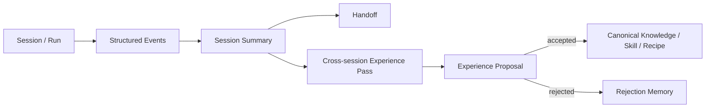

# 73 — Fase H: Engineering Traceability, Experience & Handoff

> Authority: canonical specification.
> Logical ID: PHASE-73
> Source: Notion Living Book (3d69bb7d023f816da304d08263438d01)
> Status: Fase/Gate de implementação (73 — Fase H Engineering Traceability, Experience &).


## Papel no programa

Esta fase dá continuidade e memória governada ao desenvolvimento. O Atlas passa a explicar **por que uma mudança existe, o que a verificou, o que foi tentado e como outro agent/session continua o trabalho**, sem gravar chain-of-thought ou transformar conversa bruta em memória eterna.

## Fontes

- [07 — Engineering Narrative, Journal, Experimentos e Traceability](../../framework/specs/ch07.md)
- [08 — Experience Layer, Memória e Handoff inspirados no ai-memory](../../framework/specs/ch08.md)
- [58 — Migration Engine, Unified Review Queue e State Evolution](../../framework/specs/ch58.md)
- [59 — Repository Scale, Incremental Indexing, Branches, Monorepos e Concurrency](../../framework/specs/ch59.md)
- [60 — Secrets, Data Classification e Egress Governance](../../framework/specs/ch60.md)

## Objetivo

Implementar:

- Engineering Narrative/Implementation Journal;
- Experiment/Rejection/Debt/Migration/Release records;
- typed traceability edges e `atlas trace`;
- structured session summaries;
- Handoff Protocol;
- Experience Provider Contract;
- Experience Proposals e review/promotion;
- retention/curation baseline.

## Dependencies

- M5 Documentation System;
- Living Plan + Adoption;
- D1–D3 Runtime + Review Queue;
- Skills/Quality + normalized Evidence;
- Repository branch awareness/SCM governance.

## Non-goals

- raw transcript archive obrigatório;
- chain-of-thought capture;
- embeddings como pré-requisito;
- automatic semantic self-modification;
- centralized team memory server;
- ai-memory como hard dependency;
- blog/publishing.

# 1. Engineering Narrative

O objetivo é preservar decisões e evidências úteis, não gerar diário prolixo de cada comando.

## Implementation Journal por Goal

Campos conceituais:

- date/sequence;
- Goal/Run/Task refs;
- intent;
- relevant starting context;
- changes made;
- why/decision refs;
- discoveries;
- rejected/failed approaches resumidos;
- evidence/tests;
- debt introduced/resolved;
- docs affected;
- migration/compatibility notes;
- next state/next step.

Journal deve ser synthesis; não transcript.

# 2. Specialized engineering records

## Rejected Approaches

Guardar somente rejeições com future value: approach, context, why rejected, evidence, conditions under which it might become valid.

## Experiment Log

Hypothesis → method → result → evidence → conclusion → decision impact. Reproduzível quando possível.

## Technical Debt

Debt é explícito, linked a Goal/component, severity/risk, reason, remediation trigger/plan. Não usar TODO solto como único ledger.

## Migration History

Version/state migrations aplicadas, evidence e rollback outcome.

## Release Narrative

Mudanças relevantes por release com links a Goals/decisions/evidence/migrations, não marketing text obrigatório.

# 3. Traceability graph

Typed edges aceitas:

- `implements`;
- `tests`;
- `documents`;
- `depends_on`;
- `supersedes`;
- `contradicts`;
- `refines`;
- `motivated_by`;
- `caused_by`;
- `fixes`;
- `evidenced_by`;
- `derived_from`.

Nodes podem referenciar Goal, Decision, Spec/Contract, Code artifact, Test, Evidence, Doc, Run, Issue/PR, Release, Migration, Experience etc.

## Graph storage

Canonical edges podem viver em structured files/metadata Git-native; SQLite derived index acelera query. Não criar graph DB obrigatório.

## Stable refs

Preferir stable IDs/hash/path+revision adequados. Line numbers são úteis como evidence pontual, mas não identidade durável de um concept.

# 4. Trace CLI

Target:

- `atlas trace <ref>`;
- `atlas trace <ref> --direction upstream|downstream|both` se necessário;
- `atlas trace --goal <id>`;
- machine JSON.

Human output deve mostrar caminhos úteis, por exemplo:

```
Goal G042
  implements → internal/context/compiler.go
  tests → TestContextManifestDeterministic
  documents → docs/runtime/context-compiler.md
  evidenced_by → EV-...
```

# 5. Trace Matrix

Derived views úteis:

- Spec → Code → Tests → Docs → Evidence;
- Goal → Decision → PR → Release;
- Risk → Mitigation → Test/Evidence.

Matrix é derivada, não duplicação canonical manual.

# 6. Provenance

Todo derived relationship registra suficiente provenance para explicar origem. Model-inferred edge sem deterministic/evidence confirmation recebe confidence/status e não vira canonical typed relation silenciosamente.

# 7. Experience taxonomy

Quatro classes:

1. **Canonical:** specs/ADRs/contracts/Goals/accepted knowledge → Git canonical.
2. **Historical:** journals/releases/migrations/rejections → Git historical record.
3. **Episodic:** Run/session events/summaries → runtime retention/GC.
4. **Experiential:** reusable patterns/gotchas/procedures → Proposal antes de durable promotion.

Não chamar tudo de memory.

# 8. Experience pipeline



# 9. Capture policy

Default **não** captura integralmente:

- raw prompts/responses;
- shell output completo;
- hidden reasoning;
- secrets;
- arbitrary file contents.

Capturar structured events relevantes:

- session.started/ended;
- conversation.decision;
- question_opened/question_resolved;
- documentation.proposed/updated;
- approach_started/rejected;
- experience.proposed/accepted/rejected;
- handoff.created/claimed/expired;
- run/evidence/gate refs quando necessário.

Reusar generic Event protocol quando possível.

# 10. Session Summary

Resumo estruturado de uma unidade de trabalho:

- scope/Goal/Run;
- completed state;
- decisions accepted;
- open questions/blockers;
- files/components touched;
- evidence;
- failed/rejected approaches úteis;
- current risks/debt;
- next recommended steps.

Summary deve ser regenerável/traceable a events/canonical refs e sanitizado.

# 11. Handoff Protocol

Handoff é pacote explícito para outro agent/session continuar trabalho.

Handoff **não inaugura** a continuidade entre sessões. O baseline portátil já existe desde D1 através de `ExecutorSession`, `ContinuationRecord v1` e `atlas continue`. Nesta fase H, Handoff enriquece esse baseline com síntese histórica, rejected approaches, context source pointers mais ricos, claim/lease/expiry, Experience e branch-aware promotion.

Regra: um harness sem connector nativo deve continuar conseguindo executar a mesma Run usando o Portable Continuation Protocol; Handoff melhora qualidade/coordenação, mas não cria dependência de Experience para resumability básica.

Referência: [77 — Portable Continuation Protocol: Continuidade Agnóstica de Session, Model e Harness](phase-77.md).

Campos mínimos:

- id/version;
- Goal/Task/Run;
- current state/status;
- concise summary;
- working branch/worktree/revision;
- relevant files/components;
- accepted decisions/constraints;
- failed/rejected approaches úteis;
- open questions/blockers;
- pending side effects;
- next executable steps;
- evidence/checkpoint refs;
- context source pointers;
- created/expiry/claim metadata.

Checkpoint ≠ Handoff: checkpoint recupera processo; handoff comunica trabalho entre actors.

# 12. Claim/expiry

Handoff claim deve ser idempotent/lease-aware quando coordination exige. Expired handoff não é automaticamente deleted; retention policy define history/GC.

Antes de claim/resume, recompilar current canonical context e detectar branch/revision drift.

# 13. Experience Pass

Após Goal/session, analyzer busca reusable candidate knowledge, por exemplo:

- gotcha recorrente;
- verified procedure;
- important concept clarification;
- durable rule candidate;
- tool/provider workaround;
- decision pattern.

Ele produz Proposal, não auto-edita skill/docs.

# 14. Experience Proposal

Campos:

- id/version;
- candidate type (gotcha/procedure/rule/concept/etc.);
- statement/content summary;
- supporting runs/evidence;
- scope/applicability;
- confidence;
- duplication/conflict candidates;
- proposed target (canonical doc/skill/recipe/etc.);
- risk/permissions if relevant;
- review status.

Unified Review Queue governa accept/reject.

# 15. Promotion

Accepted Experience Proposal pode virar:

- canonical documentation/ADR;
- Skill Proposal/update;
- Recipe/procedure;
- project-specific rule;
- known gotcha.

Promotion passa Documentation Delta/Skill lifecycle/Repository Governance conforme target.

# 16. Rejection memory

Se proposal foi rejeitada, guardar reason/evidence suficiente para não repropor imediatamente o mesmo candidate. Não bloquear reconsideração quando context/evidence muda.

# 17. Experience Provider Contract

Boundary methods/capabilities conceituais:

- capture(events);
- query(scope/query);
- briefing(context need);
- consolidate;
- handoff_create;
- handoff_claim;
- experience_review/proposal operations.

Backends:

- `AtlasLocal` obrigatório/reference;
- ai-memory provider opcional/experimental;
- futuros team/cloud providers.

Provider externo nunca define canonical truth sozinho.

# 18. Retrieval

Começar com exact/structured/FTS/typed graph. Embeddings locais só se Harness Eval comprovar ganho. Medir retrieval precision/recall e token value.

# 19. Editable slots

Se implementados, bounded slots úteis:

- project_context;
- user_preferences não sensíveis e explicitamente relevantes;
- current_focus;
- pending_items.

Slots possuem ownership, size/retention e não substituem canonical decisions.

# 20. Curator

Inicialmente report-only/proposal-only:

- duplicate experiences;
- stale procedures;
- conflicting knowledge;
- consolidation candidates;
- unreferenced/expired episodic data;
- repeated rejected proposal.

Pinned/canonical content protegido; semantic auto-delete proibido.

# 21. Branch awareness

Session/experience em feature branch carrega revision/branch scope. Não promover statement sobre branch experimental como mainline truth antes do merge.

Após merge, trace/provenance pode rebasear refs para merged revision quando deterministicamente possível.

# 22. Security/privacy

- secrets/redacted classes nunca entram em Experience;
- confidential/restricted data respeita retention/egress;
- external Experience Provider recebe somente data permitida;
- incident/debug raw artifacts não entram automaticamente em memory;
- user privacy settings/policies governam retention/export.

# 23. Schemas/contracts

Candidates:

- JournalEntry;
- ExperimentRecord;
- RejectedApproach;
- DebtRecord;
- TraceEdge/TraceRecord;
- SessionSummary;
- Handoff;
- ExperienceProposal;
- ExperienceProvider manifest/config;
- RetentionPolicy.

Evitar dezenas de schemas separados se generic typed record cobre consistentemente sem perder validation.

# 24. CLI

- `atlas trace ...`;
- `atlas journal show|list [--goal]`;
- `atlas handoff create|show|claim`;
- `atlas experience list|review|proposals`;
- `atlas review` continua common proposal surface;
- `atlas memory` nome genérico deve ser evitado se confundir taxonomy.

# 25. Goal decomposition

- H-G01: Journal + specialized record model.
- H-G02: typed trace edges + stable refs/index.
- H-G03: trace CLI/matrices/provenance.
- H-G04: structured session summary.
- H-G05: Handoff enrichment sobre ContinuationRecord + create/claim/expiry/drift.
- H-G06: Experience taxonomy + capture/query AtlasLocal.
- H-G07: Experience Pass + Proposal + Review Queue.
- H-G08: retention/curator baseline.
- H-G09: branch-aware promotion + security/redaction.
- H-G10: cross-agent/session dogfood.

# 26. Tests/Evals

- trace edge type validation/cycles where disallowed;
- derived index rebuild;
- Goal→Code→Test→Doc→Evidence query;
- summary excludes secrets/raw transcript;
- Handoff claim/resume from fresh session;
- branch drift detection;
- rejected approach retained;
- Experience duplicate/conflict proposal;
- no auto-promotion;
- retention/GC preserves canonical/historical;
- retrieval precision/recall baseline.

# 27. Dogfood

Usar dois agents/sessions diferentes no próprio Atlas:

1. agent A executa Goal parcial na mesma Run e produz checkpoint/ContinuationRecord + Handoff enriquecido;
2. nova sessão sem chat history — preferencialmente em outro harness/model — reivindica Handoff ou usa `atlas continue` generic path;
3. Context Compiler usa canonical state + Continuation/Handoff + checkpoint/evidence e recompila contexto para o executor atual;
4. agent B continua a mesma Run sem repetir decisões/trabalho concluído;
5. Goal termina;
6. trace mostra Goal→decision→code→test→doc→evidence;
7. Experience Pass gera pelo menos uma proposal synthetic/real, que exige review.

# Exit Gate — TRACEABILITY & EXPERIENCE READY

- mudanças importantes são traceáveis a Goal/decision/evidence;
- Journal preserva engineering narrative sem CoT;
- Handoff enriquece o Portable Continuation baseline sem criar dependência de conversation memory;
- Experience taxonomy/promotion impede memory virar authority indevida;
- AtlasLocal provider funciona e provider contract é testável;
- secrets/branch boundaries são respeitados;
- dogfood cross-session conclui sem repetir contexto essencial.