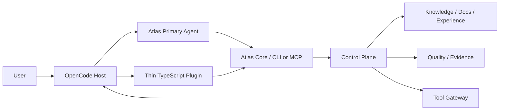

# 74 — Fase I: OpenCode Native Harness (M10)

> Authority: canonical specification.
> Logical ID: PHASE-74
> Source: Notion Living Book (3d69bb7d023f812b8514d801c1ead108)
> Status: Fase/Gate de implementação (74 — Fase I OpenCode Native Harness (M10)).


## Papel no programa

OpenCode é o primeiro harness nativo de referência do Atlas. Esta fase prova que o Control Plane, Skills, Quality, Documentation, Experience e Governance conseguem ser projetados sobre primitives reais de um host sem duplicar o Atlas Core.

## Fontes

- [09 — OpenCode Native Harness](../../framework/specs/ch09.md)
- [10 — Connector SDK, Capability Contract e Roadmap Multi-Harness](../../framework/specs/ch10.md)
- [48 — Agent Runtime Control Plane: Arquitetura e Princípios](../../framework/specs/ch48.md)
- [21 — Skill Package v3, Resolver, Configuração e Evals](../../framework/specs/ch21.md)

## Objetivo

`atlas connector install opencode` deve produzir uma integração native/high-enforcement onde OpenCode funciona como UI/execution host e Atlas permanece autoridade de:

- protocol/project state;
- Goals/Plans/Tasks;
- docs/readiness;
- context/budget;
- skills/resolution;
- permissions/tool policy;
- evidence/gates;
- runs/checkpoints/handoff;
- experience proposals.

## Dependencies

- D1–D3 Runtime Foundation completo;
- M5 Documentation;
- Living Plan/Adoption;
- Skills/Quality;
- Traceability/Experience;
- Package/Runtime Manager e Connector package primitives.

## Non-goals

- fork do OpenCode;
- mover Atlas Core para TypeScript;
- reimplementar Goal/Resolver/Context em plugin;
- depender de API beta sem compatibility declaration;
- supportar todos harnesses nesta fase;
- cloud service obrigatório.

# 1. Architecture



TypeScript existe apenas porque host exige JS/TS plugin surface. Business/domain logic permanece Go.

# 2. Generated integration layout

Target conceitual:

```
.opencode/
├── agents/
│   ├── atlas.md
│   └── <generated specialized agents>.md
├── skills/
│   └── <compiled skill views>
├── commands/
│   └── <atlas commands>
├── plugins/
│   └── atlas.ts
└── opencode.jsonc
```

Adaptar ao formato atual do OpenCode version suportada. Generated artifacts possuem ownership markers/cleanup manifest e não sobrescrevem user config indevidamente.

# 3. Compile/install

Surfaces esperadas:

- `atlas compile --target opencode`;
- `atlas connector inspect opencode`;
- `atlas connector install opencode`;
- `atlas connector doctor opencode`;
- `atlas connector uninstall opencode`.

Compile é deterministic e project-local; install registra managed fragments/compatibility.

# 4. Atlas Primary Agent

Primary agent é router/orchestrator de intenção para Atlas workflows. Responsabilidades:

- identificar Goal/scope;
- consultar docs readiness;
- iniciar/resumir Run;
- pedir Context Manifest;
- resolver skills/workforce;
- respeitar Tool Gateway/permissions;
- solicitar/registrar Evidence;
- criar Handoff quando contexto/session termina;
- usar `atlas explain` quando decisão de routing/policy precisa ser compreendida.

Não mantém shadow project state em Markdown próprio.

# 5. Specialized agents/subagents

Atlas compila agents relevantes do workforce para OpenCode primitives. Selection deve seguir Least Workforce. Subagent receives:

- scoped Task;
- minimal context;
- budget reservation;
- allowed tools/permissions;
- output/evidence contract;
- Handoff/return protocol.

Não passar full repo/full chat automaticamente.

# 6. Skill compilation

Skill v3 permanece canonical package Atlas. Connector compila view apropriada ao OpenCode:

- metadata/activation hooks;
- instructions/progressive disclosure;
- host tool mappings;
- checks/workflows pointers.

OpenCode copy é generated artifact, não nova canonical Skill.

# 7. Commands

Commands native podem expor flows comuns:

- plan/status;
- goal/run;
- docs readiness;
- validate/test;
- handoff;
- explain.

Não duplicar CLI inteira sem benefício UX. Native command chama Core/service.

# 8. Thin TypeScript Plugin

Responsabilidades permitidas:

- session lifecycle capture;
- dynamic context injection usando manifest/capsule do Core;
- pre/post tool guard;
- structured tool/result forwarding;
- Evidence hooks;
- compaction/continuation coordination;
- custom host tools que apenas bridgeiam Atlas services;
- Handoff on session boundary;
- host capability/version detection.

Responsabilidades proibidas:

- decidir Goal state independentemente;
- armazenar canonical decisions;
- implementar Budget/Context algorithm duplicado;
- reimplementar permissions;
- resolver Skills com regra própria;
- “fixar” schema incompatível silenciosamente.

# 9. Core communication

Preferência de baixo acoplamento:

- machine CLI/JSON para bootstrap/simples flows;
- local MCP/service interface para dynamic/high-frequency interaction quando implementada;
- stable internal machine commands somente se documented/versioned.

Connector deve declarar transport/capabilities; Core semantics independem dele.

# 10. Context Governor

Plugin injeta **context capsule** compilado pelo Atlas, não concatena arquivos. Capsule contém only selected high-signal sources, budget, relevant Goal/decisions/policies. Compaction pede novo capsule/checkpoint rather than relying on host transcript.

# 11. Tool Guard

Antes de OpenCode executar supported tool:

- normalize Tool Descriptor/request;
- Atlas validates policy/permission/budget/environment;
- allow/deny/require approval;
- log intent/side-effect journal.

Depois:

- normalize result/status/usage;
- output bounded/redacted;
- Evidence/event;
- side-effect outcome.

Host capabilities que não permitem blocking devem ser reportadas como lower enforcement, nunca fingir Level 4.

# 12. Session lifecycle

On start:

- project discovery;
- connector/protocol compatibility;
- claim/offer Handoff;
- minimal briefing/context;
- Run resume candidate.

During:

- structured events only;
- budget/context pressure;
- tool/evidence hooks.

On compaction:

- checkpoint current Run;
- summarize structured state;
- recompile context.

On end:

- session summary;
- Handoff if unfinished;
- Experience Pass candidate;
- no raw transcript persistence default.

# 13. Permissions

OpenCode permission model é host capability. Atlas maps semantic permissions → closest enforceable host configuration + Tool Gateway enforcement.

Connector reports:

- requested policy;
- host capability;
- actual enforcement level;
- gaps/degradations.

# 14. Capability detection

Connector descriptor deve declarar OpenCode version range e capabilities detectadas. Se host mudou API/config:

- compatible path selected;
- unsupported capability downgraded/report;
- no silent corruption.

Versioned connector variants podem existir quando necessário.

# 15. Install/cleanup ownership

Package Manager/Connector installer registra:

- files created;
- config fragments inserted/modified;
- previous values/backups when needed;
- plugin/runtime versions;
- cleanup instructions.

Uninstall remove somente owned artifacts/fragments. User-owned adjacent config é preservada.

# 16. Connector doctor

`atlas connector doctor opencode` verifica:

- host installed/version;
- protocol/connector compatibility;
- generated artifact freshness;
- plugin loadability;
- required capabilities;
- permission/enforcement gaps;
- MCP/service reachability;
- cleanup ownership consistency.

# 17. Enforcement levels

Usar Connector Contract common model, conceitualmente:

- L0 documentation/prompt guidance only;
- L1 generated static config/context;
- L2 lifecycle/context integration;
- L3 tool/event observation + partial policy enforcement;
- L4 pre-action blocking/control + full lifecycle where host permits.

OpenCode target é maior nível real disponível, idealmente L4. Nunca rotular L4 se primitives não sustentarem.

# 18. Schemas/contracts

- ConnectorDescriptor/manifest (pre-SDK stable draft);
- CapabilitySet;
- HostCompatibility;
- EnforcementReport;
- GeneratedArtifact/Cleanup manifest refs;
- bridge request/result schemas quando stable interchange.

Fase J formaliza SDK geral; I usa draft contract para validar realidade.

# 19. Goal decomposition

- I-G01: OpenCode host capability audit/current version fixtures.
- I-G02: connector descriptor + compiler skeleton.
- I-G03: generated primary/specialized agents + skills/commands.
- I-G04: thin TS plugin lifecycle/context bridge.
- I-G05: Tool Guard + Evidence bridge.
- I-G06: checkpoint/compaction/handoff lifecycle.
- I-G07: permissions/enforcement reporting.
- I-G08: install/uninstall/doctor/cleanup.
- I-G09: Connector Contract test fixtures.
- I-G10: full Atlas self-development dogfood.

# 20. Tests

- deterministic compile;
- merge/config preservation;
- install idempotency;
- uninstall ownership;
- unsupported host version;
- capability downgrade;
- context injection bounded;
- blocked write/destructive tool;
- side-effect result captured;
- session crash/compaction/handoff;
- skill lazy activation;
- Run resume from new OpenCode session;
- connector update does not erase user config.

Use fixtures/fake host where possible; selected end-to-end tests against supported OpenCode version in CI/canary.

# 21. Harness Evals

Compare before/after native connector:

- task success;
- tokens/context;
- unnecessary tool calls;
- policy violations;
- evidence completeness;
- recovery after compaction;
- skill activation precision;
- diagnosis/explainability.

Native integration deve provar benefício ou enforcement, não existir apenas por feature parity.

# 22. Dogfood Level 3

O Atlas deve usar OpenCode connector para desenvolver uma feature real do próprio Atlas:

```
Goal
→ docs readiness
→ Living Plan if blocked
→ Run + Context + Budget
→ skills/workforce
→ worktree + Tool Gateway
→ implementation
→ Quality plan + Evidence
→ Documentation Delta
→ Repository Policy / PR
→ Handoff/Experience
```

Human continua responsável por approvals exigidas pela policy. O ciclo não depende de megaprompt inicial.

# Exit Gate — OPENCODE NATIVE READY

- install/compile/doctor/uninstall seguros;
- Core permanece única authority;
- primary agent + subagents/skills/commands usam runtime Atlas;
- TypeScript plugin é thin bridge;
- context/tool/session hooks funcionam;
- actual enforcement level é mensurado;
- cleanup preserva user config;
- Connector Contract draft sobrevive ao dogfood real;
- self-development end-to-end passa Harness Evals e Governance.