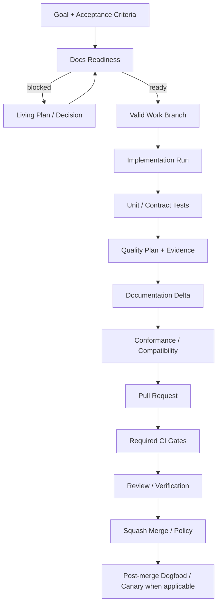

# 76 — Gates Transversais: CI/CD, Schemas, Release, Security e Self-Dogfooding

> Authority: canonical specification.
> Logical ID: PHASE-76
> Source: Notion Living Book (3d69bb7d023f813e9070e83368dbbf15)
> Status: Fase/Gate de implementação (76 — Gates Transversais CI CD, Schemas, Release, S).

## Objetivo

Definir os Gates que atravessam todas as fases 64–75. Esta página evita que cada milestone invente sua própria definição de “pronto” e fornece ao OpenCode/agents uma ordem comum de validação.

## Princípio

> Uma feature não está pronta quando o código compila; está pronta quando seu contract, comportamento, evidence, documentação, migration/compatibility e operational safety atingem o Gate proporcional ao risco.
> 

# 1. Pipeline universal de mudança

Risk-low changes podem ter versão simplificada, mas nunca bypass de invariants.

# 2. CI layers

## Layer 0 — Fast local

Antes de commit/PR quando aplicável:

- gofmt;
- focused unit tests;
- schema/resource validation;
- generated artifact freshness check quando barato.

## Layer 1 — Required PR

- `go test ./...`;
- `go vet ./...`;
- formatting;
- relevant conformance;
- governance policy validation;
- schema validation;
- docs consistency/link checks onde implementados;
- generated artifact diff/check.

## Layer 2 — Risk/domain jobs

Somente quando change/profile requer:

- race detector;
- integration/end-to-end;
- security scanning;
- Playwright/GUI/provider tests;
- migration old-version matrix;
- connector host matrix;
- install/release smoke;
- performance benchmarks.

## Layer 3 — Harness Evals/Canary

Para heuristic/harness/model/context/router/skills/connector changes:

- scenario corpus;
- baseline comparison;
- policy violation metrics;
- context/token/cost metrics;
- recovery/evidence quality;
- canary/shadow before default promotion.

Não rodar todos Layer 2/3 em toda typo de docs.

# 3. Required-check stability

GitHub main ruleset depende de check names estáveis. Required checks fazem parte de operational contract. Renomear job obrigatório exige:

1. atualizar workflow;
2. provar novo check em branch/PR;
3. atualizar RepositoryPolicy/ruleset;
4. remover old check somente depois.

Evitar deadlock de ruleset com check inexistente.

# 4. Test selection por mudança

Quality Orchestrator, quando disponível, deriva minimum sufficient plan usando:

- Goal acceptance criteria;
- changed paths/components;
- Documentation Contracts/evidence requirements;
- risk;
- public API/schema impact;
- runtime/provider/connector impact;
- historical flaky/regression evidence.

Antes dele, phases usam explicit test matrix equivalente.

# 5. Test pyramid do Atlas Core

Preferência:

1. pure/unit domain tests numerosos;
2. package/service integration;
3. filesystem/temp-repo conformance;
4. provider/host adapters com fake/test server;
5. selected real-host/system tests;
6. harness eval/canary.

Não usar end-to-end como substituto de domain tests.

# 6. Determinism policy

Outputs protocol/canonical/generated devem:

- ordenar collections explicitamente;
- não depender de map iteration;
- normalizar path/platform quando contract exige;
- separar timestamps/ephemeral IDs de golden output ou normalizá-los;
- evitar nondeterministic model call em conformance obrigatório.

# 7. Golden fixtures

Golden é apropriado para:

- machine envelopes;
- compiler/generated connector artifacts;
- deterministic plans/manifests;
- conformance reports;
- migration results.

Não snapshotar enormes outputs voláteis sem rationale. Golden change exige review como contract change quando comportamento público muda.

# 8. Fuzz/property tests

Adicionar onde invariants combinatórios justificarem:

- schema/config parsers;
- Goal/Run state transitions;
- DAG/cycle resolution;
- permission/policy evaluation;
- migration parser/transform boundaries;
- package version/range resolution;
- connector capability negotiation.

Não transformar fuzz em requisito universal.

# 9. Schema change policy

Classificar schema change:

- additive compatible;
- behavior-compatible but validation-changing;
- migration-required;
- breaking/protocol-major/minor conforme versioning policy.

Toda mudança migration-required inclui:

- old fixture;
- Migration Contract;
- dry-run;
- post-validation;
- rollback/recovery;
- docs/migration note;
- conformance.

Schema novo não entra porque “pode ser útil”; precisa persisted/interchange use case.

# 10. Protocol compatibility

Separar versões:

- Atlas protocol;
- individual schemas/contracts;
- package manifest;
- Connector Contract;
- connector implementation;
- provider/host APIs.

CLI `version/doctor/explain` deve ajudar a diagnosticar mismatch.

# 11. Release channels

## Alpha

Permite schema/runtime migrations frequentes, mas todas explícitas/testadas. Não promete host/provider compatibility ampla.

Gate alpha:

- core tests/conformance verdes;
- install/release artifact funcional;
- known limitations documentadas;
- no destructive migration default.

## Beta

Principais contracts e CLI surfaces fechados. Requer:

- dogfood Level 2+;
- Documentation/Runtime/Skills fundamentals ativos;
- supported platform install matrix;
- migration from previous alpha/beta;
- security baseline;
- Harness Eval baseline.

## RC

Freeze de compatibility salvo blocker. Requer:

- OpenCode native full cycle;
- Connector Contract candidate stable;
- zero known critical policy/security/conformance failures;
- clean install/update/rollback/uninstall;
- release docs/troubleshooting;
- canary results.

## Stable v0.4

Requer program-complete criteria acordados; specialized packs podem ficar posteriores.

# 12. Release artifact gate

Cada release deve possuir, conforme platform/channel:

- versioned binaries;
- checksums;
- provenance/signature policy outcome;
- release notes/migration notes;
- compatibility matrix;
- known limitations;
- installer/uninstaller tested;
- rollback path;
- SBOM quando supply-chain phase decidir formato, sem bloquear early alpha se ainda não contracted.

# 13. Performance budgets

Não otimizar sem métricas. Baselines úteis:

- CLI startup;
- repo discovery/index update;
- docs audit/readiness;
- context compilation;
- Run checkpoint/resume;
- policy check;
- package resolution;
- connector compile.

Performance regression threshold deve ser calibrado por benchmark real. Evitar número arbitrário sem baseline.

# 14. Large-repo Gate

Antes de chamar Runtime/Adoption production-ready, testar corpus com ~100K LOC ou escala representativa, cobrindo:

- incremental index;
- scan budget/partial output;
- Context Compiler;
- memory/latency;
- branch diff;
- generated/vendor exclusions.

# 15. Security gates por risco

## Baseline all changes

- no committed secrets;
- least privilege workflows;
- untrusted content does not become authority;
- no unauthorized path/egress expansion;
- dependencies reviewed/locked appropriately.

## Tool/provider/connector change

Adicionar:

- permission matrix;
- sandbox/environment tests;
- egress/secret redaction;
- malicious input fixture;
- supply-chain/provenance.

## High/Critical

Adicionar independent verifier/security review e explicit approval conforme RepositoryPolicy.

# 16. Data/privacy Gate

Qualquer novo persistence/export/telemetry/Experience field responde:

- data classification;
- canonical vs derived;
- retention;
- egress destinations;
- redaction;
- deletion/GC behavior;
- whether user/project can disable when not invariant.

# 17. Documentation Gate

Para toda change pública/semantic:

1. `docs impact` identifica contracts;
2. Documentation Delta é aplicado/proposto;
3. contradictions/staleness recalculadas;
4. CLI/reference/user guide atualizados;
5. migration/compatibility docs quando necessário.

“Código autoexplicativo” não substitui contract/user docs quando behavior público mudou.

# 18. Repository Governance Gate

Antes de merge:

- valid branch/PR title/commit final;
- PR template information proporcional ao risco;
- required checks verdes;
- conversations resolved;
- review/approval profile satisfied;
- no direct/force main mutation;
- squash strategy conforme policy;
- generated/derived files ownership correto.

# 19. Evidence Gate

Evidence precisa identificar:

- subject/revision;
- test/eval/provider version;
- environment quando relevant;
- result/status;
- artifacts/pointers;
- retries/flakiness;
- timestamp/provenance;
- limitations/inconclusive state.

Agent statement “tests passed” sem machine/evidence ref não satisfaz Gate crítico.

# 20. Rollback Gate

Mudança com state/schema/install/remote mutation deve declarar rollback ou irreversibility. Se irreversible:

- explicit risk;
- backup/snapshot;
- human approval profile apropriado;
- post-validation.

# 21. Dogfood ladder

## Level 0 — Docs-driven

Agents/humans usam Atlas docs/specs manualmente.

## Level 1 — Self-inspection

Atlas roda contra seu repo: validate, docs audit/readiness, repo policy, doctor/explain.

## Level 2 — Self-runtime

Atlas Run/Context/Budget/Tools/Quality governa Goals reais, mesmo com host bridge ainda genérico.

## Level 3 — Native self-development

OpenCode connector executa ciclo end-to-end.

## Level 4 — Multi-harness proof

Segundo connector + generic fallback executam mesmos canonical Goals/contracts sem Core branching por host.

Cada fase declara qual nível precisa provar.

# 22. Agent stop rules

Agent deve **parar no Gate** quando:

- acceptance criterion ambíguo/blocking;
- canonical contradiction high/critical;
- migration unsafe/no rollback where required;
- required permission unavailable;
- budget hard-exhausted;
- provider/tool side effect unknown e replay unsafe;
- required test/evidence inconclusive;
- host capability abaixo do enforcement mínimo;
- repository changed concurrently e expected state divergiu.

Parar significa checkpoint + structured blocker/evidence, não simplesmente abandonar worktree.

# 23. Agent continuation rules

Agent pode continuar automaticamente entre tasks quando:

- mesmo Goal/approved scope;
- next task dependency satisfied;
- no new high-cost/irreversible decision;
- docs readiness remains ready;
- budget available;
- required environment/permissions available;
- prior Gate green.

Não pedir confirmação a cada micro-step; pedir/aprovar nas boundaries materiais.

# 24. CI/CD ownership

Workflows são generated/maintained engineering artifacts sob Repository Governance. Secret permissions, release tokens e signing credentials nunca entram em repo plaintext. CI não é canonical project authority; ela executa/verifica canonical policies.

# 25. Release incident/recovery

Falha de release/installer/provider publish deve:

- stop promotion;
- preserve previous release;
- create incident/evidence bundle;
- avoid moving published tag;
- support rerun from deterministic artifacts where safe;
- create follow-up Goal/Issue as governed work.

# 26. Definition of Done universal

Uma implementação de fase/Goal relevante deve declarar:

- code/domain complete;
- schemas/contracts validated;
- CLI/API behavior tested;
- conformance/compatibility satisfied;
- security/permissions checked;
- docs delta applied;
- evidence recorded;
- dogfood scenario passed when required;
- rollback/recovery known;
- Repository Governance merge gate green.

# 27. Final v0.4 readiness snapshot

Antes de v0.4 stable gerar uma matriz contendo:

| Area | Required proof |
| --- | --- |
| Go Core | Python-independent critical conformance |
| Distribution | install/update/rollback/uninstall matrix |
| Governance | main/release policy dogfood |
| Documentation | Goal readiness + delta + contradiction |
| Runtime | resume/budget/context/tool/model/sandbox |
| Quality | normalized Evidence + reference provider |
| Planning/Adoption | greenfield + brownfield scenarios |
| Trace/Experience | cross-session handoff + trace path |
| OpenCode | native Level proven by conformance |
| Connector SDK | second connector without Core semantic change |

Esta matriz deve ser derivada de Evidence real, não checklist manual otimista.