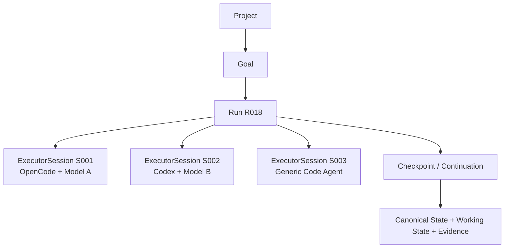
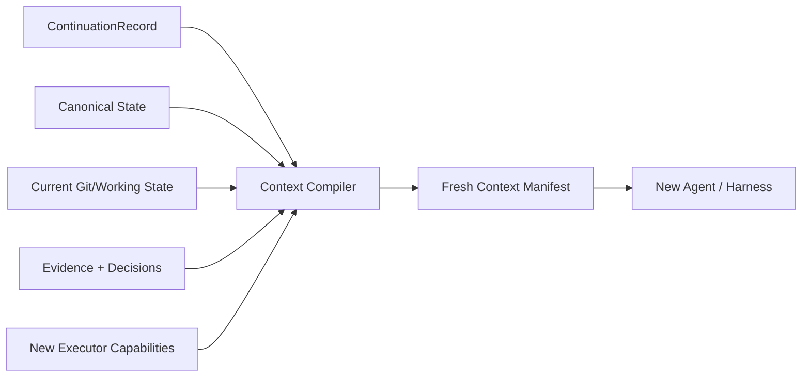

# 77 — Portable Continuation Protocol: Continuidade Agnóstica de Session, Model e Harness

> Authority: canonical specification.
> Logical ID: PHASE-77
> Source: Notion Living Book (3d69bb7d023f813b8255de44b67379df)
> Status: Fase/Gate de implementação (77 — Portable Continuation Protocol Continuidade A).


<aside>
🔄

**Decisão arquitetural:** uma Run pertence ao Atlas e ao estado de engenharia do projeto, não à sessão, ao modelo ou ao harness que a executa. Nenhuma Run ativa pode depender de histórico privado de conversa para ser continuada.

</aside>

## Objetivo

Formalizar uma capability transversal que permita interromper trabalho em um Code Agent e continuar em outro — inclusive sem connector Atlas nativo — preservando identidade da Run, decisões, estado de trabalho, evidence, side effects e próximo passo executável.

## Invariants

1. **Run != Session.** `Run` é a unidade operacional durável; `ExecutorSession` é um executor temporário.
2. **No private-session dependency.** Nenhuma Run de engenharia pode exigir histórico privado de chat, memória do modelo anterior ou scratchpad oculto para continuar.
3. **Fresh-executor resumability.** Toda Run ativa deve poder ser retomada por um executor fresco usando estado canônico + working state estruturado + checkpoint/continuation.
4. **Recompile, do not replay context.** Ao trocar de model/harness, Context Compiler recompila contexto adequado ao novo executor; não transporta cegamente o prompt anterior.
5. **Connector optional.** Connector nativo pode automatizar discover/claim/injection, mas a continuidade básica deve funcionar via CLI/arquivos/MCP/generic fallback.
6. **No transcript requirement.** Transcript completo e chain-of-thought nunca são requisitos do protocolo.
7. **Side effects before replay.** Estado `unknown` ou side effect pendente deve ser reconciliado antes de repetir operação.

## Modelo conceitual



Trocar de executor cria/encerra `ExecutorSession`; não cria uma nova Run somente porque quota, model ou harness mudou.

## Entidades

### Run

Mantém identidade do trabalho, lifecycle, Goal/Task, branch/workspace, checkpoints, budgets, evidence, failure/blocked state e side-effect journal.

### ExecutorSession

Representa uma associação temporária entre Run e executor. Campos conceituais mínimos:

- id/version;
- run ref;
- started/ended timestamps;
- harness/connector id quando conhecido;
- model/provider ref quando conhecido;
- host/environment ref quando relevante;
- capability snapshot;
- end reason: completed, user switch, provider limit, timeout, crash, cancellation, unknown;
- predecessor/successor session refs opcionais;
- no raw transcript obrigatório.

### Checkpoint

Responde: **se o processo morrer, consigo reconstruir a execução?** É orientado à recuperação operacional.

### ContinuationRecord

Artefato portátil que responde: **o que qualquer executor precisa para reidratar e continuar esta Run agora?**

### Handoff

Em H, enriquece a continuidade com síntese, histórico útil, rejected approaches, claims/leases e Experience. Handoff não é pré-requisito para a continuidade básica de D1.

## ContinuationRecord v1

Campos mínimos recomendados:

```yaml
version: 1
project: atlas
goal: G042
task: T017
run: R018
state: implementing
repository:
  branch: feat/g042-context
  revision: abc123
  dirty: true
executor:
  previous_session: S001
  end_reason: provider_limit
completed:
  - Context Manifest schema
  - domain implementation
current:
  - CLI implementation
pending:
  - integration tests
  - conformance
  - documentation delta
decisions:
  - CONTEXT-004
files:
  relevant: []
  modified: []
evidence:
  - EV-0182
blockers: []
pending_side_effects: []
next_steps:
  - implement CLI
  - run tests
context_sources:
  - goal:G042
  - decision:CONTEXT-004
```

O formato final deve seguir schemas/convenções Atlas; o exemplo descreve semântica, não congela serialização antes da implementação.

## Fonte dos dados

ContinuationRecord deve ser derivado preferencialmente de dados já estruturados:

- Run record;
- latest valid checkpoint;
- Goal/Task;
- Git branch/revision/status;
- dirty working tree metadata;
- completed/pending steps;
- accepted decisions/constraints;
- Evidence/Gates;
- side-effect journal;
- current blockers;
- Context Manifest/source refs;
- session end reason quando conhecido.

Não depender de um LLM recordar o que fez.

## Working tree

Dirty working tree é first-class. Continuation precisa distinguir:

- modified/untracked paths;
- staged vs unstaged quando relevante;
- whether change is known-complete, partial ou unknown;
- last tests/evidence associated with working state;
- checkpoint revision/base;
- diff/hash pointer, sem duplicar payload grande no record.

Um novo executor deve inspecionar o diff atual antes de modificar os mesmos arquivos.

## Pending side effects

O record deve carregar pointers para qualquer ação externa cujo resultado possa ser relevante ou desconhecido:

- PR/Issue criada;
- package/release publicada;
- remote repository mutation;
- external API/resource mutation;
- tool action com outcome incerto.

`atlas continue` nunca deve sugerir replay automático de side effect `unknown`.

## Context rehydration

Fluxo canônico:



O Context Manifest deve ser recompilado para context window, capabilities, policy, budget e trust do executor atual.

## CLI mínima

### `atlas continue`

Descobre projeto e Run ativa/recentemente interrompida adequada, valida working state e produz briefing humano curto + próximo passo.

Não executa mudança automaticamente.

### `atlas continue --run <id>`

Seleciona Run explicitamente.

### `atlas continue --json`

Retorna ContinuationRecord/rehydration plan machine-readable.

### `atlas continue --prompt`

Renderiza bootstrap mínimo, portátil e sem provider-specific instructions, apropriado para copy/paste em Code Agent genérico.

### Export/import

Pode entrar após MVP ou H, conforme necessidade real:

- `atlas continuation export <run>`;
- `atlas continuation import <artifact>`.

Não tornar cross-machine bundle obrigatório para o MVP local.

## Generic Code Agent path

Sem connector nativo, qualquer agent com terminal pode receber uma instrução mínima:

```
Este projeto usa Atlas. Antes de modificar arquivos, execute `atlas continue` e siga a Run ativa.
```

Se o agent não puder executar Atlas CLI mas puder ler arquivo/prompt, usar renderer/export portátil. Se suporta MCP, Atlas MCP pode expor continuation/status de forma read-only/policy-bound.

## Native Connector path

Connector pode automatizar:

1. session start;
2. detectar Run ativa;
3. criar `ExecutorSession`;
4. chamar continuation/Context Compiler;
5. injetar briefing/context permitido;
6. registrar session end/end reason;
7. criar checkpoint/continuation quando quota/compaction/host shutdown permitir.

A semântica permanece no Core.

## Cross-machine

Continuidade entre máquinas exige também transportar working state. Caminhos suportáveis:

- branch/revision remota + clean/committed checkpoint;
- patch/bundle explícito para dirty state;
- future remote/shared workspace provider.

Nunca afirmar resumability cross-machine se alterações locais não foram transportadas.

## Drift detection

Antes de continuar:

- branch existe e corresponde ao record;
- revision/base não mudou de forma incompatível;
- dirty state é comparado com checkpoint;
- canonical decisions/docs atuais são reconsultadas;
- schemas/protocol version são compatíveis;
- pending side effects são reconciliados;
- policy/permissions do novo executor são avaliados.

Drift seguro pode ser recompilado; drift incompatível bloqueia com diagnóstico.

## Segurança e privacidade

ContinuationRecord não deve persistir:

- secrets;
- raw credentials;
- hidden reasoning/CoT;
- transcript completo por default;
- raw tool payload grande quando pointer/resumo basta;
- confidential/restricted data fora da policy.

Renderer `--prompt` deve ser sanitizado e respeitar egress/data classification.

## Persistência

- Run/Goal/decisions canônicos seguem seus owners definidos;
- ExecutorSession/Continuation podem ser runtime/episodic derived state com schema versionado;
- records necessários a historical trace/handoff podem ser promovidos/sumarizados conforme H;
- SQLite pode indexar, mas não se torna fonte de verdade de decisões canônicas.

## Schemas/contracts

Candidates em D1:

- `ExecutorSession`;
- `ContinuationRecord`;
- `ContinuationPlan`/diagnostics apenas se persistido/interchange justificar;
- extensions em Run/Checkpoint para active/last session refs.

Evitar duplicar campos já pertencentes a Run/Checkpoint; Continuation é projeção portátil.

## Goal decomposition mínima

- **D1-C01:** formalizar `Run != ExecutorSession` + schema/state semantics.
- **D1-C02:** `ContinuationRecord v1` derivado de Run/Checkpoint/Git/Evidence.
- **D1-C03:** `atlas continue` human + JSON + fresh Context Compiler rehydration.
- **D1-C04:** generic renderer `--prompt` e sanitização.
- **D1-C05:** cross-agent conformance/dogfood com troca real de executor.

Capabilities avançadas como claims/leases, Experience enrichment e cross-machine dirty bundle ficam em H/D3 conforme dependências.

## Tests e conformance

Obrigatórios:

- mesma Run atravessa duas ExecutorSessions;
- fresh session sem chat history continua task correta;
- model/context window diferentes geram novo Context Manifest;
- branch/revision drift detectado;
- dirty tree preservado/explicado;
- completed work não é refeito no scenario fixture;
- pending side effect unknown bloqueia replay;
- secrets nunca aparecem em JSON/prompt renderer;
- generic path funciona sem connector;
- connector path e generic path produzem mesma semantic continuation;
- kill/quota/timeout end reasons não encerram Run indevidamente.

## Dogfood obrigatório

No próprio Atlas:

1. iniciar Run em harness A;
2. implementar apenas parte de um Goal;
3. criar checkpoint/continuation e encerrar ExecutorSession A com reason `provider_limit` ou simulado;
4. abrir harness/agent B sem histórico da conversa;
5. executar `atlas continue`;
6. recompilar Context Manifest para B;
7. B identifica corretamente completed/current/pending work;
8. B continua na mesma Run e conclui Goal;
9. Evidence comprova que trabalho concluído não foi repetido e side effects não foram duplicados.

Executar pelo menos um cenário com generic Code Agent path sem connector nativo.

## Métricas

- continuation success rate;
- time/steps até primeiro progresso útil após troca;
- repeated-work rate;
- missing-critical-context rate;
- stale-context inclusion;
- side-effect replay violations;
- continuation context tokens;
- connector vs generic-path semantic equivalence.

## Custo e impacto arquitetural

Classificação: **baixo–médio para MVP, médio para robustez completa**.

Não exige redesign porque Run resume, Checkpoint, Context Compiler, Handoff e generic fallback já existem no desenho. A principal mudança é antecipar uma pequena parte de H para D1 e tornar a separação Run/Session um invariant explícito.

## Exit Gate — PORTABLE CONTINUATION BASELINE READY

Passa quando:

- `Run != ExecutorSession` está modelado e testado;
- Run sobrevive à troca de model/harness/session;
- `ContinuationRecord v1` é reproduzível sem transcript;
- `atlas continue` funciona em human/JSON e generic prompt path;
- novo executor recebe fresh Context Manifest;
- branch/dirty-state/side-effect drift são tratados com segurança;
- cross-agent dogfood sem connector nativo conclui a mesma Run corretamente;
- nenhuma capability nativa do connector é necessária para continuidade básica.