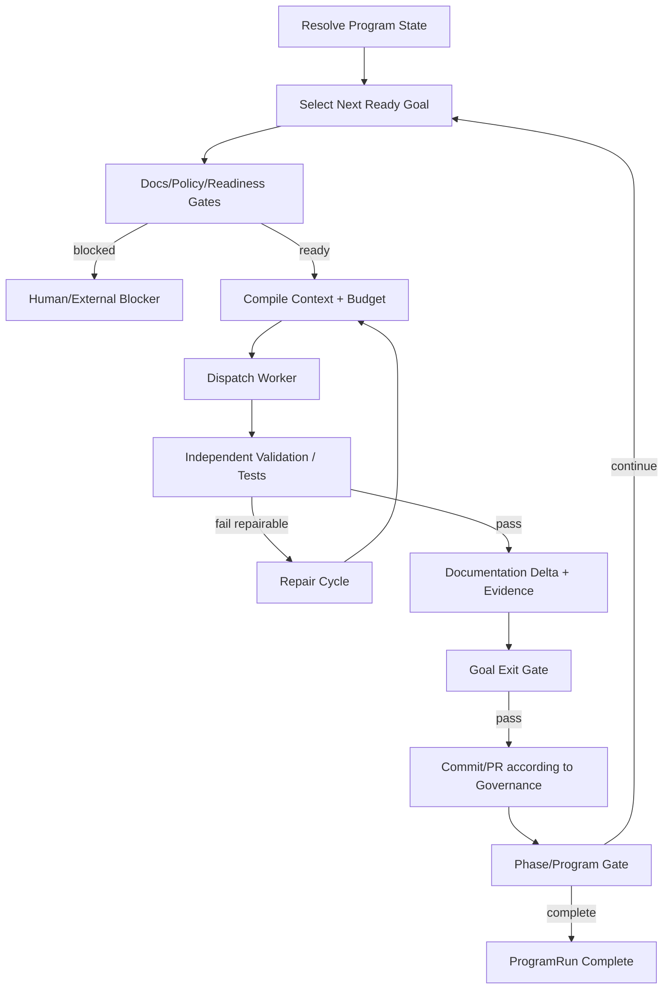

# 78 — Continuous Execution Mode: Program Runner, Worker Loop e Autonomia Opt-in

> Authority: canonical specification.
> Logical ID: PHASE-78
> Source: Notion Living Book (3d69bb7d023f8123beaae66f6250512e)
> Status: Fase/Gate de implementação (78 — Continuous Execution Mode Program Runner, Wor).


<aside>
♾️

**Decisão arquitetural:** execução contínua é uma capability explícita e opt-in. O Atlas, não o Code Agent, controla o ciclo `Goal → implementação → testes → correção → gates → próximo Goal`. Um agent individual é um worker substituível.

</aside>

## Objetivo

Permitir que projetos selecionados executem desenvolvimento de ponta a ponta sem novos prompts humanos entre cada implementação, preservando segurança, budgets, Repository Governance, Documentation Readiness, Portable Continuation, Evidence e stop conditions.

## Princípios

1. **Opt-in explícito.** Default permanece manual.
2. **Atlas owns the loop.** Prompt não é mecanismo de enforcement.
3. **Worker is replaceable.** OpenCode/Codex/Claude/Pi/outros executam work units; o Program Runner controla progresso.
4. **Gate before progress.** Worker não declara Goal concluído sozinho.
5. **Test-fix loop bounded.** Falha de teste produz repair cycle com budgets/retry/livelock.
6. **Portable continuation.** Troca de model/harness não encerra Program/Run.
7. **Human gates permanecem first-class.** Operações high/critical/destructive podem exigir approval.
8. **No silent autonomy escalation.** Um projeto manual nunca entra em program mode por inferência.

## Execution scopes

Política mínima:

- `manual`: Atlas prepara/valida, mas não dispara próximo worker automaticamente.
- `goal`: executa até o Exit Gate do Goal atual e para.
- `phase`: continua Goals prontos até o Exit Gate da fase e para.
- `program`: continua pelo dependency DAG até o Exit Gate do programa ou blocker humano real.

O scope pode ser definido por invocation e, opcionalmente, por project policy. Invocation explícita pode reduzir autonomia; aumento acima da policy exige autorização adequada.

## CLI alvo

```
atlas execute --goal G042
atlas execute --phase D1
atlas execute --program v0.4
atlas execute --program v0.4 --dry-run
atlas execute resume <program-run>
atlas execute status <program-run>
atlas execute cancel <program-run>
atlas execute explain <program-run>
```

Nomes finais devem respeitar superfície CLI existente; não criar aliases redundantes.

## Entidade ProgramRun

`ProgramRun` coordena múltiplas Runs/Goals sem substituir `Run`.

Campos conceituais:

- id/version;
- program/phase/goal scope;
- execution mode;
- dependency DAG snapshot/ref;
- policy/budget refs;
- current Goal/Run;
- completed/skipped/blocked Goals;
- phase/program gates;
- worker/harness strategy;
- repair counters;
- approval state;
- status/failure/stop reason;
- created/started/finished;
- latest continuation/checkpoint refs.

## Program Runner

Loop canônico:



## Goal selection

Program Runner não pede ao model “o que fazer agora” sem constraints. Seleção usa:

- dependency DAG;
- Goal states;
- Documentation Readiness;
- blocking approvals;
- repository/worktree availability;
- package/provider health;
- budget;
- risk;
- concurrency/file claims quando disponíveis.

Heuristics podem priorizar entre múltiplos Goals igualmente ready, mas não atravessam dependencies.

## Worker contract

Worker recebe uma WorkUnit limitada:

- Goal/Task;
- current Run/Continuation;
- Context Manifest;
- allowed scope/files/tools;
- budget slice;
- expected deliverables;
- required tests/evidence;
- stop conditions;
- machine-readable completion report.

Worker pode ser OpenCode, Codex, Claude Code, Pi, Atlas Reference Harness futuro ou outro adapter.

## Worker result

Não aceitar apenas texto “done”. Resultado normalizado deve distinguir:

- completed candidate;
- needs repair;
- blocked;
- provider/quota failure;
- policy/permission denied;
- budget exhausted;
- cancelled;
- unknown.

Program Runner verifica estado real do repo/tests antes de promover completion.

## Test–fix loop

Após implementação:

1. executar minimum sufficient test plan;
2. normalizar Evidence;
3. classificar falha;
4. se repairable e dentro de budget, criar repair WorkUnit;
5. recompilar contexto mínimo focado na falha;
6. executar worker novamente;
7. repetir até PASS ou stop condition.

Nunca transformar flaky/failing em PASS por retry cego. Livelock detection impede loops infinitos.

## Stop conditions

Sempre parar/checkpoint quando:

- program/phase/goal Exit Gate concluído conforme scope;
- human approval obrigatória;
- destructive/privileged operation sem autorização;
- unresolved architectural/product blocker;
- hard budget exhaustion;
- repeated repair/livelock threshold;
- security/invariant violation;
- dirty/side-effect state não reconciliável;
- provider/harness indisponível sem fallback compatível;
- user cancellation.

Quota/model failure, por si só, deve preferir Portable Continuation + fallback de executor quando policy permitir.

## Human approval policy

Continuous mode não significa `--dangerously-skip-permissions`. Risk policy governa approvals:

- low: pode continuar automaticamente quando gates passam;
- medium: pode exigir review/verifier conforme profile;
- high: independent verifier + approval onde policy define;
- critical/destructive: explicit human approval por default.

## Repository Governance

Program mode deve continuar usando branch/PR/merge policies.

Estratégias permitidas incluem:

- Goal PR;
- phase PR;
- bounded stacked branches quando policy suporta.

Nunca usar um único mega-commit apenas porque execução é contínua. Merge para protected main continua sujeito a ruleset/approval.

## Program policy — exemplo conceitual

```yaml
execution:
  mode: program
  program: v0.4
  worker:
    preferred: opencode
    fallbacks: [codex, claude]
  testing:
    repair_attempts: 3
    require_exit_gate: true
  budget:
    wall_time: 8h
    max_cost: 40
  approvals:
    low: auto
    medium: policy
    high: human
    critical: human
  stop_on:
    architectural_blocker: true
    security_violation: true
```

Formato final deve seguir contracts Atlas; exemplo não congela serialização.

## Harness control levels

### Native/API driver

Atlas consegue criar sessão, enviar WorkUnit, observar eventos, cancelar e coletar resultado. Maior enforcement.

### Headless process driver

Atlas invoca CLI não-interativa, controla cwd/env/timeout/stdout/stderr/exit e pode reiniciar com Continuation. Enforcement intermediário.

### Interactive/manual driver

Sem API/headless invocation confiável, Atlas não consegue **forçar** continuidade. Pode gerar WorkUnit/Continuation, mas precisa de humano para iniciar próximo turn.

A UI deve reportar honestamente `continuous_execution` capability/enforcement.

## OpenCode

OpenCode é bom reference worker porque SDK/server permitem programmatic session create/prompt/abort/events. Connector pode integrar lifecycle profundamente sem mover Program Runner para TypeScript.

## Outros harnesses

Qualquer host com CLI headless/API/SDK pode receber driver. Ex.: Claude Code possui modo não-interativo; Codex possui execução não-interativa. Hosts puramente interativos ficam em guidance/manual até existir surface controlável.

## Generic Process Harness Driver

Para ferramentas sem connector formal, considerar provider configurável e governado:

- executable/command;
- cwd;
- input/prompt transport;
- structured/text output parser;
- timeout/cancel;
- environment policy;
- continuation/session flags quando conhecidos;
- capability declaration.

Arbitrary shell template vindo de untrusted project é privileged configuration; não executar silenciosamente.

## Relação com Connector SDK

Connector Contract deve declarar capabilities como:

- `execution.invoke`;
- `execution.cancel`;
- `execution.result.structured`;
- `execution.session.resume`;
- `execution.events`;
- `continuation.portable`;
- `continuation.native`;
- `permissions.block`;
- `tools.observe`.

Program Runner negocia o enforcement real antes de iniciar program mode.

## Relação com Automation Engine

Automation Engine dispara Programs/Rules; Program Runner executa desenvolvimento multi-Goal. Não misturar scheduler/event triggers com semantics do implementation loop.

## Relação com Living Plan

Living Plan cria/refina Goals e blockers. Program Runner executa somente Goals suficientemente ready. Se surgir pergunta de produto/arquitetura sem autoridade suficiente, Program Runner bloqueia em vez de inventar decisão.

## Relação com Quality Platform

Quality Orchestrator determina minimum sufficient test/eval plan. Program Runner só controla sequencing e repair loop; não redefine semântica de Evidence/Gates.

## Portable Continuation

ProgramRun e Run devem sobreviver a worker/model/harness switch. Ao trocar executor:

- encerra ExecutorSession;
- checkpoint;
- ContinuationRecord;
- seleciona fallback;
- recompila Context Manifest;
- inicia nova ExecutorSession;
- continua mesma Run/ProgramRun.

## Recovery

Após crash/restart:

```
atlas execute resume <id>
```

reconstrói ProgramRun a partir de canonical project state + Run/Checkpoint/Continuation + derived runtime state válido. Pending side effects unknown bloqueiam replay até reconciliation.

## Budget hierarchy

Program budget → Phase → Goal → Run → Worker/repair → model/tool calls. Repair loops não possuem orçamento infinito. Reservation evita workers paralelos consumirem o mesmo residual.

## Concurrency

MVP pode ser sequencial. Paralelismo só entra quando Goals são dependency-independent e file/resource claims evitam conflito. Correctness antes de throughput.

## Schemas/contracts

Candidates:

- ExecutionPolicy;
- ProgramDefinition/ProgramRef se ainda não coberto por roadmap/phase contracts;
- ProgramRun;
- WorkUnit;
- WorkerResult;
- WorkerCapability/Driver descriptor;
- RepairPolicy;
- StopCondition/StopReason.

Evitar duplicar Run, Goal, Gate, Budget, Connector ou Automation schemas existentes.

## Package boundaries

Conceitualmente:

- program execution/application service;
- goal scheduler/resolver;
- worker dispatch boundary;
- repair coordinator;
- drivers/adapters fora do domain.

Program Runner depende de Run/Context/Budget/Quality/Governance; drivers dependem de host APIs. Host nunca define canonical progression.

## Goal decomposition recomendada

- **D3-CE01:** ExecutionPolicy + modes `manual|goal|phase|program`.
- **D3-CE02:** ProgramRun state machine + next-ready Goal resolver.
- **D3-CE03:** WorkUnit/WorkerResult + worker driver boundary.
- **D3-CE04:** validation/test-fix repair loop + livelock/budgets.
- **D3-CE05:** OpenCode programmatic driver/reference integration.
- **D3-CE06:** generic headless process driver + capability honesty.
- **D3-CE07:** crash/resume + Portable Continuation integration.
- **D3-CE08:** end-to-end phase/program dogfood.

Connector-specific finalization continua em I/J.

## Test strategy

- manual mode nunca auto-avança;
- goal mode para após Goal Gate;
- phase mode não atravessa Phase Gate;
- program mode percorre DAG completo;
- dependency blocked nunca é selecionada;
- worker “done” com tests failing não completa Goal;
- repair loop corrige e revalida;
- repair limit/livelock bloqueia;
- quota failure troca executor sem nova Run;
- hard budget checkpoint + stop;
- privileged approval bloqueia;
- cancel propaga;
- crash/resume retoma próximo estado correto;
- connector/native e headless driver preservam semantics;
- no connector/manual driver reporta inability to enforce continuous mode.

## Dogfood

No próprio Atlas:

1. definir um pequeno programa com pelo menos 3 Goals dependentes;
2. ativar `phase` ou `program` explicitamente;
3. OpenCode implementa Goal 1;
4. Atlas executa testes externos e força repair se necessário;
5. Gate passa e Atlas despacha Goal 2 sem novo prompt humano;
6. simular quota failure e trocar worker via Portable Continuation;
7. concluir Goal 3;
8. validar docs/evidence/governance;
9. terminar automaticamente no Exit Gate correto.

Depois repetir parte do corpus com segundo harness/headless driver.

## Métricas

- autonomous Goal completion rate;
- human interventions por Goal;
- false-completion rate;
- repair success rate;
- repeated-work rate;
- policy violations;
- tests/evidence completeness;
- cost/time por Goal;
- worker switch recovery rate;
- livelock rate;
- native vs generic driver success.

## Custo de implementação

O custo incremental é **médio**, não extremo, porque Run, Budget, Context, Continuation, Quality, Repository Governance e Automation já são dependências planejadas. O trabalho novo principal é ProgramRun/scheduler, Worker Contract/drivers e repair loop.

## Exit Gate — CONTINUOUS EXECUTION READY

Passa quando:

- autonomia é explicitamente opt-in e `manual` é default;
- Atlas controla progressão, não o prompt do worker;
- `goal`, `phase` e `program` scopes respeitam Exit Gates;
- implementação só é promovida após tests/evidence reais;
- repair loop é bounded e livelock-safe;
- ProgramRun sobrevive a crash e troca de worker;
- OpenCode executa multi-Goal sem novos prompts humanos;
- pelo menos um segundo/generic headless path prova semântica equivalente;
- hosts sem enforcement suficiente são reportados honestamente e não recebem falso `program mode` forte;
- Repository Governance/approvals/budgets permanecem ativos durante autonomia.