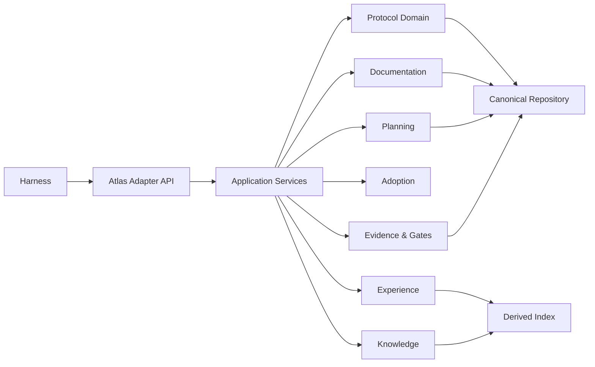
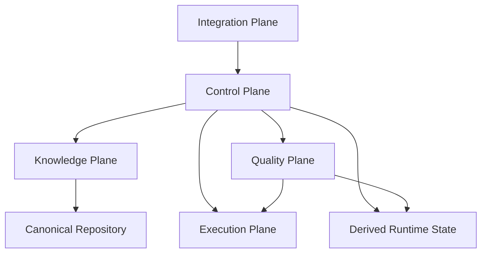

# 02 — Arquitetura Atlas v0.4 e Boundaries do Core

> Authority: canonical specification.
> Logical ID: PART1-CH-02
> Source: Notion Living Book (3d59bb7d023f81dca786d0338eb4ec16)
> Status: Especificação de engenharia do Framework (Capítulo 02).


O Atlas Core em Go é a autoridade de protocolo. Harnesses enviam eventos/intenção e recebem contexto, decisões, validações e artefatos derivados.



## Boundaries

### Protocol Domain

Goals, Plans, Tasks, Events, Evidence, Gates, lifecycle, schema validation, locks, amendments e invariantes.

### Project Service

Descoberta de root, `atlas.json`, capabilities, profiles, repository metadata e state snapshot.

### Resolution Service

Risk, recipe, workforce, model policy, context selection e documentation applicability.

### Documentation Engine

Contracts, profiles, gap analysis, document ownership, delta, contradiction checking e coverage.

### Planning Engine

Interview, decision extraction, open questions, confidence, authority e readiness.

### Adoption Engine

Scanner, classifier, semantic map de documentação, gap detection e migration plan.

### Knowledge Engine

Traceability graph, typed edges, retrieval, contradictions e histórico derivado.

### Experience Engine

Session events, summaries, handoffs, cross-session patterns e experience proposals.

### Evidence/Gate Engine

Validação determinística, evidência requerida por risco, release readiness e completion gates.

### Integration Layer

OpenCode, Codex, Claude Code, Gemini CLI, Copilot CLI, Kiro etc. Nunca contém regra canônica.

## Interfaces internas recomendadas

Usar interfaces somente nos boundaries que de fato possuem múltiplas implementações: `Repository`, `EventSink`, `DerivedIndex`, `HarnessTransport`, `Clock` para testes e, futuramente, `EmbeddingProvider`.

## Regras de dependência

- Domain não importa CLI, storage concreto ou harness.
- CLI depende de application services.
- Storage implementa ports definidos pelo consumidor.
- Integrations chamam Atlas Core via CLI JSON/stdio ou API estável; não importam internals diretamente quando executadas fora do processo.
- SQLite nunca é requisito para interpretar estado canônico.

## Internal command/API layer

Criar uma interface machine-readable estável, por exemplo:

```
atlas internal project-status --json
atlas internal resolve --json
atlas internal validate-tool --json
atlas internal docs-impact --json
atlas internal context --json
atlas internal handoff --json
```

Essa interface deve ser versionada e usada por plugins finos.

## Recomendação adicional — Protocol Version Negotiation

Todo adapter deve declarar:

- connector id/version;
- Atlas protocol version suportada;
- capabilities;
- lifecycle hooks disponíveis;
- write-blocking support;
- agent/skill primitives.

O Atlas deve recusar enforcement “strict” quando o harness não fornece primitives suficientes, evitando falsa sensação de segurança.

# Architecture Amendment — Runtime Control Plane

<aside>
🧭

A arquitetura anterior permanece válida, mas `Resolution Service` deixa de carregar implicitamente responsabilidades de runtime. O Control Plane passa a ser um boundary explícito entre decisão e execução.

</aside>

## Cinco planes

- **Control Plane:** Run Engine, Budget/Cost, Context Compiler, Model Router, Tool Gateway, Automation, Execution Environment e Observability.
- **Knowledge Plane:** Goals, documentation, architecture knowledge, Experience, journal e traceability.
- **Quality Plane:** Test Providers, evidence, gates, security e independent verification.
- **Execution Plane:** models, tools/MCPs, sandboxes/runtimes e external providers.
- **Integration Plane:** OpenCode/Codex/Claude/Gemini/Kiro e outros harnesses; apenas adapters/transports.

## Dependency direction



Control Plane pode consultar Knowledge/Quality, mas model/tool providers nunca importam regras canônicas. External harness não controla invariants.

## Novos application boundaries

`RunService`, `BudgetService`, `ContextService`, `ModelRoutingService`, `ToolGateway`, `EnvironmentService`, `AutomationService`, `ObservabilityService`, `PackageRuntimeService` e `MigrationService`.

Interfaces só devem surgir quando há boundary/múltiplas implementações reais; evitar abstrações prematuras durante a migração Go.

## Regra de design

**Hard-code invariants; configure policies; evaluate heuristics.**

Exemplos: Goal lock = invariant; verifier independente para critical risk = policy; quantidade de agents/model route/context packing = heuristic sujeita a eval.

## Architecture Amendment — Session/Model/Harness-Agnostic Continuity

O estado de engenharia pertence ao Atlas, não à sessão de um Code Agent.

Invariants adicionais:

- `Run != ExecutorSession`;
- trocar agent/model/harness não altera por si só a identidade da Run;
- nenhuma Run ativa pode depender de histórico privado de chat, memória do modelo anterior ou hidden reasoning para continuar;
- qualquer Run ativa deve poder ser retomada por um executor fresco usando canonical state + structured working state + checkpoint/continuation;
- Context Compiler recompila contexto para o executor atual em vez de transportar cegamente o prompt/contexto anterior;
- connector nativo melhora automação/enforcement, mas não é requisito para continuidade básica.

O baseline entra em D1 através de `ExecutorSession`, `ContinuationRecord v1` e `atlas continue`. Handoff/Experience em H enriquecem a continuidade; Connector SDK deve provar equivalência semântica entre caminho nativo e generic fallback.

[77 — Portable Continuation Protocol: Continuidade Agnóstica de Session, Model e Harness](../../development/phases/phase-77.md)

## Referências do Control Plane

[48 — Agent Runtime Control Plane: Arquitetura e Princípios](ch48.md)

[50 — Context Compiler, Token Budget, Cache e Compaction](ch50.md)

[51 — Run Engine, Checkpoints, Retry, Resume e Cancellation](ch51.md)

[52 — Tool Gateway, MCP Governance e Lazy Tool Discovery](ch52.md)

[55 — Observability Plane, Run Explainability e Incident Bundles](ch55.md)