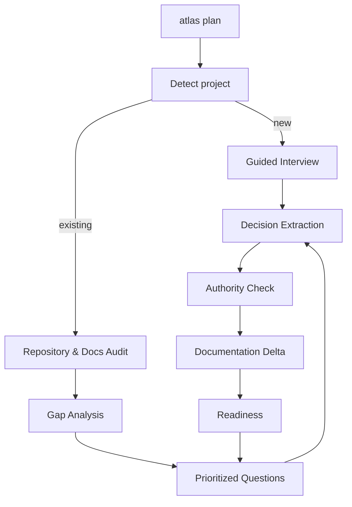

# 05 — Living Plan Mode e Interview Engine

> Authority: canonical specification.
> Logical ID: PART1-CH-05
> Source: Notion Living Book (3d59bb7d023f818ea927d1f7ea75dfb3)
> Status: Especificação de engenharia do Framework (Capítulo 05).


Transformar planejamento em uma conversa incremental, estruturada e persistente. O usuário não precisa responder um formulário gigante nem pedir “gere documentação” no fim.

## Fluxo



## Entrevista incremental

Perguntar um tópico de cada vez, priorizando:

1. blockers de implementação;
2. decisões irreversíveis/alto custo;
3. arquitetura de alto risco;
4. comportamento do usuário;
5. detalhes importantes;
6. nice-to-have.

Não perguntar informações inferíveis com alta confiança do repositório.

## Tipos de resposta

- explicit decision;
- preference;
- constraint;
- requirement;
- non-goal;
- unresolved question;
- hypothesis;
- agent suggestion.

Somente decisões com autoridade suficiente atualizam diretamente a verdade canônica.

## Conversation -> Documentation Delta

Após cada decisão confirmada:

- extrair statement;
- classificar tipo;
- calcular documentos afetados;
- detectar contradições;
- gerar patch mínimo;
- atualizar readiness;
- registrar origem/decision id.

## Open Questions Registry

Cada questão deve possuir:

- id;
- topic;
- reason;
- blocking severity;
- alternatives conhecidas;
- owner;
- resolution state;
- affected contracts.

## Interview Coverage Model

Exemplo:

```
Product 100%
Architecture 82%
UI/UX 91%
Security 55%
Testing 74%
Performance 40%
Implementation blockers: 2
```

Coverage não é objetivo absoluto. O que importa é readiness contextual.

## Modos

- `atlas plan` — conversa e design, sem implementação.
- `atlas plan --goal <id>` — planejamento focado.
- `atlas plan --docs <role>` — entrevista para completar documentação específica.
- `atlas plan --resume` — retoma open questions e estado anterior.

## Recomendação adicional — Decision preview

Antes de uma mudança canônica ampla, o harness deve poder mostrar: “esta resposta altera 4 documentos e supersede ADR-007”. Isso dá ao usuário controle sem exigir confirmação para cada frase trivial.