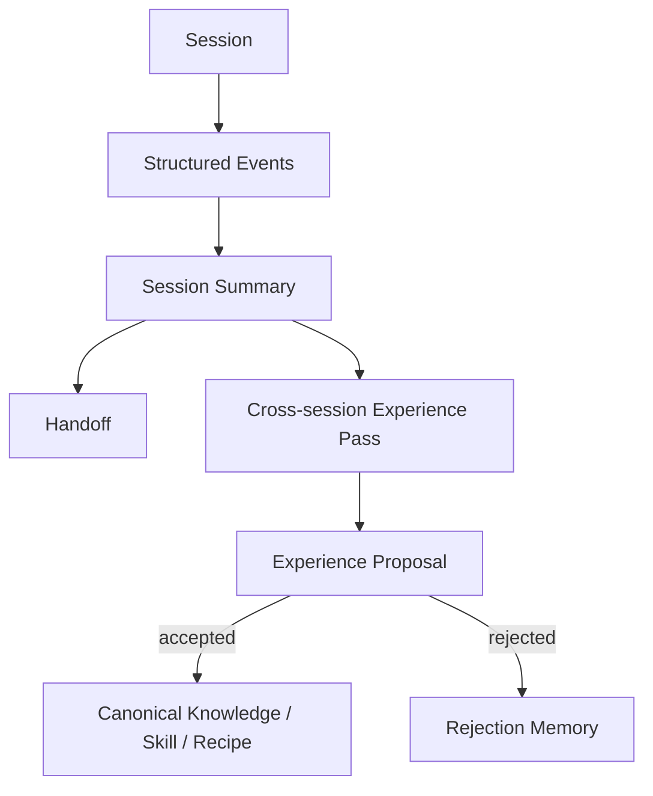

# 08 — Experience Layer, Memória e Handoff inspirados no ai-memory

> Authority: canonical specification.
> Logical ID: PART1-CH-08
> Source: Notion Living Book (3d59bb7d023f817dbc41d342e686bf6b)
> Status: Especificação de engenharia do Framework (Capítulo 08).


Incorporar ao Atlas os conceitos mais úteis do ai-memory sem trocar a fonte de verdade, sem armazenar chain-of-thought e sem acoplar o protocolo a um motor específico de memória.

## Taxonomia de memória

### Canonical Memory

Specs, ADRs, contracts, profiles, Goals, Plans e documentação durável. Fonte: Git/Markdown/JSON.

### Historical Memory

Implementation Journal, releases, migrations, experiments e decisões superseded. Fonte: Git.

### Episodic Memory

Eventos e resumo de uma sessão/execução. Efêmera e sujeita a retenção/GC.

### Experiential Memory

Padrões extraídos de múltiplas sessões/Goals. Nasce como proposta e só se torna conhecimento durável após validação.

## Pipeline



## Eventos a adicionar

- session.started
- session.ended
- conversation.decision
- conversation.question_opened
- conversation.question_resolved
- documentation.proposed
- documentation.updated
- implementation.approach_started
- implementation.approach_rejected
- experience.proposed
- experience.accepted
- experience.rejected
- handoff.created
- handoff.claimed
- handoff.expired

## Handoff Protocol

Um handoff deve transportar estado útil, não transcript.

**Architecture amendment:** Handoff deixa de ser o mecanismo mínimo de continuidade entre sessões. O baseline agora nasce em D1 com `Run != ExecutorSession`, `ContinuationRecord v1` e `atlas continue`. Handoff é uma camada mais rica para coordenação/Experience sobre esse estado portátil. Um Code Agent sem connector nativo deve continuar conseguindo retomar a Run pelo Portable Continuation Protocol.

Referência: [77 — Portable Continuation Protocol: Continuidade Agnóstica de Session, Model e Harness](../../development/phases/phase-77.md).

Formato de Handoff enriquecido:

```json
{
  "goal": "P03-G02",
  "task": "T017",
  "state": "implementing",
  "summary": "...",
  "files_touched": [],
  "decisions": [],
  "failed_approaches": [],
  "open_questions": [],
  "next_steps": [],
  "evidence": []
}
```

## Experience Pass

Detecta padrões recorrentes como:

- procedimento que sempre resolve uma classe de falha;
- regra de build/test que não está documentada;
- preferência de arquitetura repetida;
- contradiction recorrente;
- workflow que merece virar recipe;
- conhecimento que merece virar skill.

Nunca atualizar docs automaticamente com inferência experiencial de alto impacto. Gerar `ExperienceProposal` com evidence pointers.

## Rejection memory

Guardar rejeições relevantes evita repropôr constantemente a mesma solução. Deve possuir reason, context e reconsideration conditions.

## Experience Provider Contract

Definir interface abstrata:

```
capture(event)
query(context)
briefing(project)
consolidate(session)
handoff_create()
handoff_claim()
experience_review()
```

Backends possíveis: `AtlasLocal`, `AiMemoryProvider`, futuros providers.

## Integração inicial com ai-memory

Pode ser usada como provider experimental via MCP/plugin sem transformar o formato interno do ai-memory em protocolo Atlas.

## Retention/GC

- raw structured events: retenção limitada/configurável;
- session summaries: retenção longa;
- accepted experiences: duráveis;
- canonical docs: permanentes até superseded;
- secrets/sensitive content: não persistir por padrão.

## Retrieval benchmark

Antes de embeddings, criar evals reais: hit@1, hit@5, recall, tokens de contexto e latency. Comparar structural lookup, FTS, graph, FTS+graph e só depois embeddings.

## Segurança

Não capturar prompt/output completo por padrão. Persistir decisões, outcomes, evidence, paths e summaries sanitizados.

Continuidade nunca deve exigir raw transcript, chain-of-thought ou memória privada de um provider. `ContinuationRecord`/Handoff devem ser sanitizados e conter apenas estado de engenharia necessário para retomada.

## Extensão: aprendizado global cross-project

O Experience Layer permanece responsável por eventos, summaries, handoffs e propostas derivadas de sessões. A consolidação **entre projetos** é especificada em [81 — Global Learning Layer: Padrões Cross-Project, Preferências Globais e Filosofias Compartilhadas](../../runtime/global-learning-layer.md). Essa extensão adiciona Global Pattern Registry, scopes project/global, promoção governada, applicability matching e um Global Philosophy Pack explícito, sem transformar inferência probabilística em regra canônica automaticamente.