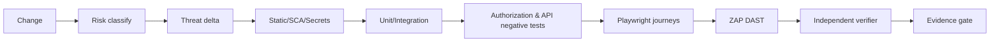

# 24 — Protocolo DevSecOps e Rotinas de Teste Web/SaaS

> Authority: canonical specification.
> Logical ID: PART1-CH-24
> Source: Notion Living Book (3d59bb7d023f810e8a29e811b0c8fe9d)
> Status: Especificação de engenharia do Framework (Capítulo 24).

Transformar segurança em workflow repetível e evidence-backed, proporcional ao risco, sem transformar todo commit em pentest completo.

## Risk tiers

### Web Standard

Mudança comum sem auth/payment/tenant boundary: unit/integration + SAST/SCA/secrets diff + Playwright smoke/E2E aplicável.

### Web Sensitive

Auth, permissions, tenant, admin, upload, webhook, billing, sensitive data: inclui threat delta, authorization matrix, negative tests, DAST focal, business-logic abuse e independent security review.

### Release Security

Full project/release gate: dependency/SBOM/IaC/container/config scan, ASVS mapping aplicável, API security coverage, authenticated ZAP, critical Playwright journeys, security logging/audit verification, rate/resource abuse, tenant isolation suite e unresolved finding policy.

## Pipeline recomendado

## DAST com ZAP

Usar ZAP Automation Framework via provider configurável. Suportar spider/AJAX spider, authenticated context, OpenAPI/GraphQL inputs, passive scan e active scan quando ambiente autoriza. Melhorar cobertura roteando regressions/E2E pelo proxy quando útil.

## Finding normalization

Todo provider converte output para schema Atlas: finding id, rule/CWE/OWASP mapping, severity, confidence, location/route, evidence, exploitability status, false-positive status, owner, waiver expiry e remediation evidence.

## Waivers

Security waiver exige justification, owner, risk acceptance, expiry/review date e compensating control. Nunca “ignore forever”.

## Security regression

Todo vulnerability fix confirmado deve, quando reproduzível, ganhar regression test ou checker para impedir retorno.

## CI cadence

PR: incremental/diff scans + risk-required tests. Main/nightly: broader SAST/SCA/DAST/fuzz. Release: full applicable security profile. Frequência é ajustável pelo projeto, sem reduzir blockers de high-risk changes.

## Security evidence bundle

Armazenar pointers para tool versions/configs, test report, DAST report, threat delta, authorization coverage, finding dispositions e verifier conclusion; evitar secrets/raw sensitive traces.