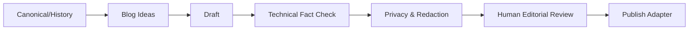

# 29 — Engineering Blog e Publishing System

> Authority: canonical specification.
> Logical ID: PART1-CH-29
> Source: Notion Living Book (3d59bb7d023f8155b788d9f4a3895a16)
> Status: Especificação de engenharia do Framework (Capítulo 29).

Criar uma superfície editorial que transforme conhecimento de engenharia acumulado pelo Atlas em artigos humanos, sem transformar blog em fonte canônica nem publicar automaticamente informação interna.

## Fonte

Goal, ADR, Implementation Journal, experiments, rejected approaches, benchmark/evidence, release notes e accepted experience.

## Pipeline

## CLI

`atlas blog init`, `ideas`, `draft --goal`, `draft --release`, `check`, `preview`, `publish`.

## Publication Contract

Claims técnicos apontam para source/evidence; secrets/credentials/private paths/internal identities são proibidos por padrão; links verificados; code examples executados quando viável; unreleased/internal content exige explicit opt-in; generated article possui source manifest.

## Adapters

Hugo primeiro pela afinidade Go/Markdown/Git/static. Depois generic Markdown, Astro, Jekyll, Eleventy e outros por connector. Publicação externa sempre exige ação/approval explícito.

## Skill `engineering-blog`

Knowledge de technical writing, narrative, diagrams, fact-checking, code examples e release storytelling; workflows discovery/draft/review/publish; checks de source traceability, secret detection, privacy e claim verification.

## Blog Ideas Scorer

Sugere temas por novelty, engineering depth, evidence richness, audience value e release relevance, mas não força publicação.

## Distinção documental

Docs dizem o que é verdade e como operar. Journal diz como chegamos aqui. Blog explica a história e lições para uma audiência. Release notes comunicam mudança de produto.