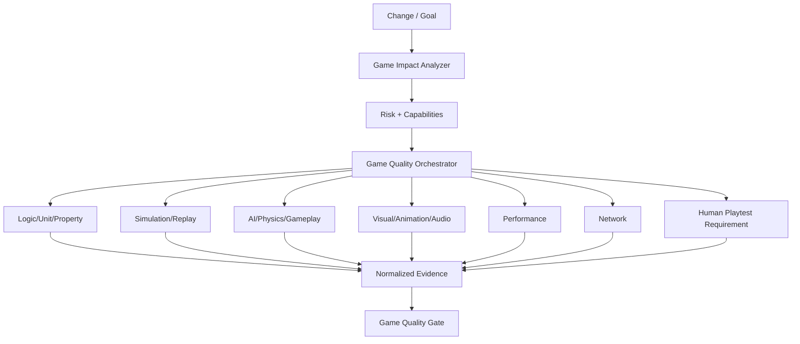

# 46 — Game Quality Orchestrator: Rotina de Testes e Agentes Especializados

> Authority: canonical specification.
> Logical ID: PART1-CH-46
> Source: Notion Living Book (3d59bb7d023f8141bb8ff7216ac4bf36)
> Status: Especificação de engenharia do Framework (Capítulo 46).

O Game Quality Orchestrator transforma mudança de código/conteúdo em um plano mínimo de verificação baseado em impacto e risco.

# Pipeline

# Change mapping examples

### Mudança em dano de arma

Ativar:

- unit/formula tests;
- combat scenarios;
- balance simulation;
- relevant AI encounters;
- playtest requirement se percepção/pacing mudar materialmente.

### Mudança no character controller

Ativar:

- physics collision matrix;
- replay movement corpus;
- gamefeel metrics;
- camera interactions;
- platform performance sanity.

### Mudança em behavior tree

Ativar:

- AI node/state coverage;
- perception/action scenarios;
- stuck/recovery;
- nav tests;
- performance/crowd test;
- regression replay corpus.

### Mudança em shader

Ativar:

- compile matrix;
- reference renders;
- GPU/performance profile;
- platform-specific visual baselines.

### Mudança em netcode

Ativar:

- multi-instance session;
- desync detection;
- latency/loss/jitter profiles;
- reconnect;
- server performance;
- security review quando trust boundaries mudarem.

# Test cadence

## On-change / fast

- pure logic;
- static/content validation;
- selected scenario tests;
- short headless simulation.

## PR / standard

- affected subsystem matrix;
- replays;
- visual checks pertinentes;
- performance sanity;
- deterministic seed corpus;
- independent verifier quando high-risk.

## Nightly

- large seed corpus;
- fuzz/property tests;
- long AI/crowd simulations;
- map traversal;
- content stress;
- broader renderer/platform matrix.

## Release candidate

- target hardware matrix;
- soak;
- multiplayer adverse network suite;
- full visual baseline set;
- memory/performance budgets;
- save migration;
- human playtest evidence requerida pelo projeto.

# Specialized agents

- **Game Test Planner** — cria matriz de verificação.
- **Simulation Agent** — headless, seeds, replays e invariants.
- **Game AI Verifier** — comportamento/coverage/stuck/perf.
- **Physics Verifier** — collision/movement edge cases.
- **Visual QA Agent** — render baselines e diffs.
- **Performance Agent** — budgets e profiling.
- **Netcode Adversarial Agent** — network profiles/desync.
- **Balance Analyst** — simulations, telemetry e matchups.
- **Level Quality Agent** — reachability/spatial metrics.
- **Player Experience Research Agent** — planeja playtests; não inventa conclusão humana.
- **Independent Game Quality Verifier** — revisão final proporcional ao risco.

# Evidence policy

Bots e agentes podem gerar evidência objetiva, mas não podem auto-certificar claims subjetivos como `fun`, `balanced` ou `good gamefeel` sem critérios e dados humanos apropriados.