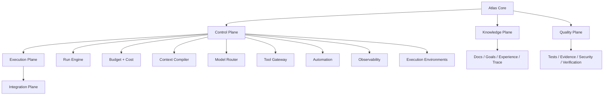

# 48 — Agent Runtime Control Plane: Arquitetura e Princípios

> Authority: canonical specification.
> Logical ID: PART1-CH-48
> Source: Notion Living Book (3d59bb7d023f81e8826acb0302c78a95)
> Status: Especificação de engenharia do Framework (Capítulo 48).

<aside>
🧭

**Decisão arquitetural:** o Atlas v0.4 passa a distinguir explicitamente Knowledge Plane, Control Plane, Quality Plane, Execution Plane e Integration Plane. O maior gap restante do framework está no Control Plane: orçamento, contexto, execução resiliente, ferramentas, modelos, sandbox, automação e observabilidade.

</aside>

## Objetivo

Transformar o Atlas de um excelente protocolo de engenharia e conhecimento em um harness confiável para execução longa, multiagente e multiprovider.

## Planes

## Nova regra de governança

**Hard-code invariants; configure policies; evaluate heuristics.**

- invariants: nunca dependem de modelo;
- policies: variam por projeto/risco e são configuráveis;
- heuristics: workforce, context packing e model routing devem ser avaliados por evals e permanecer substituíveis.

## Não objetivos

- não criar distributed scheduler no primeiro corte;
- não transformar SQLite em fonte canônica;
- não criar dependência obrigatória de cloud;
- não duplicar lógica do Core em connectors;
- não usar chain-of-thought como telemetria.

## Critério de sucesso

O Atlas deve conseguir explicar, sem raciocínio privado: o que executou, por quê segundo regra/policy, qual contexto forneceu, qual orçamento consumiu, quais tools/models foram usados, qual evidência foi produzida e como uma run pode ser retomada.