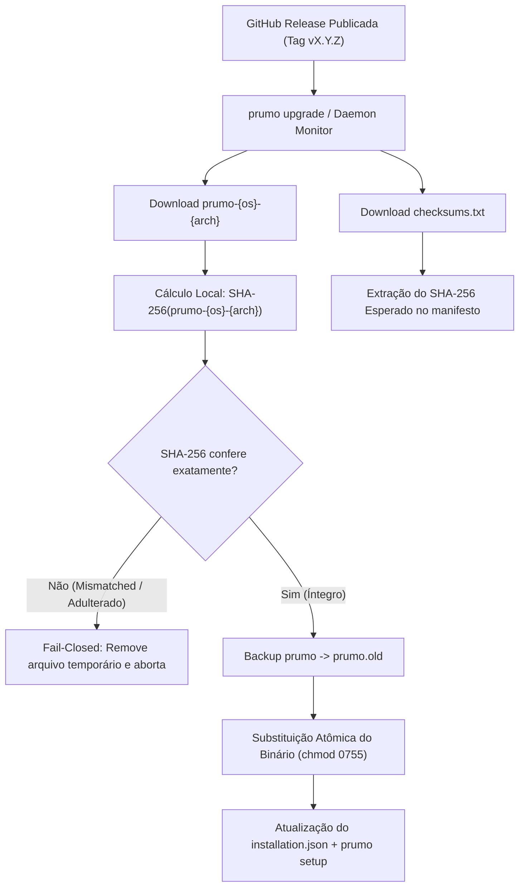

# Prumo Harness & Binary Autoupdate Specification

> **Authority:** Canonical engineering specification.  
> **Relates to:** `docs/harness/agent-runtime.md`, `docs/harness/daemon.md`, `docs/harness/security.md`, `docs/security/security-control-plane.md`.

---

## 1. Visão Geral e Princípios de Design

O sistema de **Autoupdate do Prumo** permite a atualização contínua, segura e atômica do binário estático e do Harness a partir de releases publicadas no GitHub.

Em conformidade com os princípios fundacionais do Prumo:
1. **Supply Chain Security & Verificação Criptográfica Obrigatória:** Nenhum binário é executado ou substituído sem que seu hash SHA-256 seja estritamente validado contra o `checksums.txt` assinado/gerado na release oficial. Falhas de integridade acionam interrupção imediata (*fail-closed*).
2. **Substituição Atômica e Rollback:** A atualização substitui o executável ativo utilizando técnicas atômicas de sistema de arquivos (`rename` / staging), mantendo backup prévio (`prumo.old`) para permitir recuperação instantânea em caso de erro.
3. **Não-Disrupção do Runtime do Daemon:** O daemon em background (`prumo serve`) monitora novas releases sem bloquear nem interromper execuções de agentes em andamento. Atualizações são aplicadas apenas em safe points de checkpoint.
4. **Zero Dependências Externas:** O mecanismo utiliza exclusivamente a biblioteca padrão do Go (`net/http`, `crypto/sha256`, `os`, `path/filepath`), sem necessidade de scripts externos, Node.js ou Python.

---

## 2. CLI de Upgrade (`prumo upgrade`)

O comando `prumo upgrade` (com aliases `prumo update` e `prumo self-update`) oferece interface interativa e automatizável:

```bash
# Verificar se há atualizações disponíveis sem baixar ou modificar nada
prumo upgrade --check

# Verificar com payload JSON para integrações e dashboards
prumo upgrade --check --json

# Atualizar para a versão mais recente com verificação SHA-256
prumo upgrade

# Atualizar para uma versão específica
prumo upgrade --version v0.6.1

# Simular a execução sem alterar o disco
prumo upgrade --dry-run

# Forçar reinstalação mesmo se a versão já for a mais recente
prumo upgrade --force
```

### Flags Suportadas

| Flag | Descrição |
| :--- | :--- |
| `--check` | Apenas consulta a API de releases e informa se há atualização pendente. |
| `--version <v>` | Define a versão ou tag alvo para download (ex: `v0.6.1`). |
| `--force` | Força o download e reinstalação mesmo se a versão for idêntica. |
| `--dry-run` | Simula a resolução do binário alvo e os passos de atualização. |
| `--no-cache` | Bypassa o cache local de checagem (TTL padrão de 4 horas). |
| `--repo <owner/repo>` | Customiza o repositório GitHub (padrão: `raillen/prumo`). |
| `--token <token>` | Token de autenticação GitHub para evitar *rate limiting* de IP. |
| `--json` | Emite o envelope estruturado do protocolo Prumo (`protocol.Envelope`). |

---

## 3. Monitoramento Automático em Background no Daemon

Quando o daemon do harness é inicializado com a flag `--auto-update` ou com a variável de ambiente `PRUMO_AUTO_UPDATE=true`:

```bash
prumo serve --auto-update
# ou
PRUMO_AUTO_UPDATE=true prumo serve
```

### Ciclo de Execução:
1. **Inicialização Silenciosa:** O daemon inicia o worker em background (`StartPeriodicChecker`) com intervalo padrão de 6 horas.
2. **Checagem de Releases:** Consulta a API do GitHub Releases via HTTP condicional com cabeçalhos `Accept: application/vnd.github.v3+json`.
3. **Download e Verificação de Checksum:** Baixa o asset correspondente ao sistema operacional e arquitetura (`prumo-${GOOS}-${GOARCH}`) e o `checksums.txt`.
4. **Aplicação Segura:** Atualiza o binário no disco (`~/.local/bin/prumo` ou caminho da instalação) e sincroniza o manifesto `installation.json`.
5. **Preservação de Sessões:** Se houver runs ativas, o daemon não as derruba; cada run continua isolada em seu safe-point de checkpoint, garantindo que nenhum estado seja perdido.

---

## 4. Garantias de Integridade de Supply Chain


