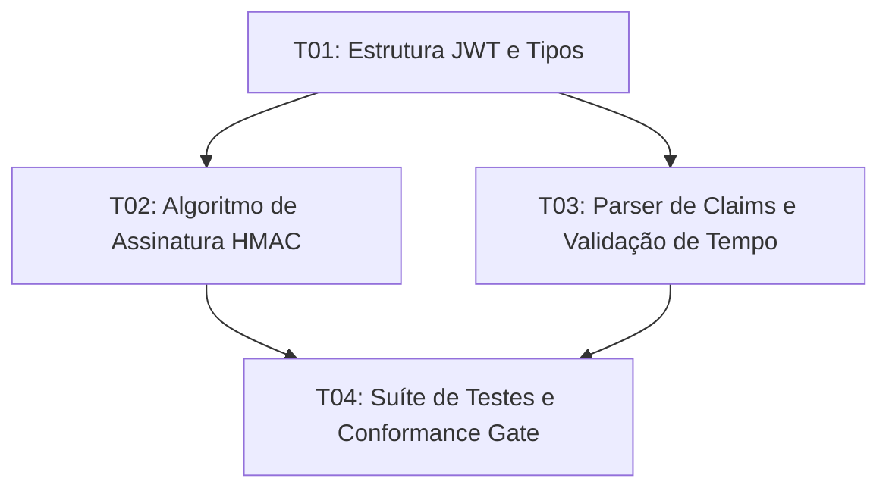

# Diretivas & Task DAGs

No Prumo, agentes de IA não trabalham sobre instruções abertas e vagas. Em vez disso, o compilador Prumo transforma Metas (Goals) e Tarefas (Tasks) em **Diretivas Executáveis** estruturadas em formato JSON Schema Draft 2020-12.

## Estrutura de uma Diretiva

Cada diretiva encapsula o contexto estritamente necessário (LPC) e a regra de validação correspondente:

```json
{
  "$schema": "https://prumo.dev/schemas/directive.json",
  "directive_id": "DIR-P01-G01-T01",
  "goal_ref": "P01-G01",
  "task_ref": "T01",
  "actor": "systems-core",
  "context_capsule": {
    "target_files": ["internal/auth/jwt.go", "internal/auth/jwt_test.go"],
    "referenced_contracts": ["security.trust-model", "architecture.dependency-rules"],
    "budget_tokens": 8000
  },
  "acceptance_criteria": [
    "TestJWTVerification deve passar com cobertura mínima de 90%",
    "Nenhum pacote externo além da stdlib deve ser adicionado ao go.mod"
  ],
  "verification_command": "go test ./internal/auth/... -race"
}
```

## Grafo Direcionado Acíclico (DAG) de Tarefas

Quando um Plano (Plan) é formulado, suas tarefas formam um DAG determinístico:



1. **Execução Paralela Segura**: Tarefas sem dependências mútuas podem ser executadas simultaneamente por agentes especialistas distintos.
2. **Portões de Bloqueio (Gates)**: O avanço para a tarefa subsequente só é liberado mediante produção da evidência de sucesso do portão anterior.
3. **Rollback Determinístico**: Caso uma verificação falhe, o Prumo preserva o estado intermediário e cria um checkpoint de diagnóstico sem corromper a árvore Git principal.
