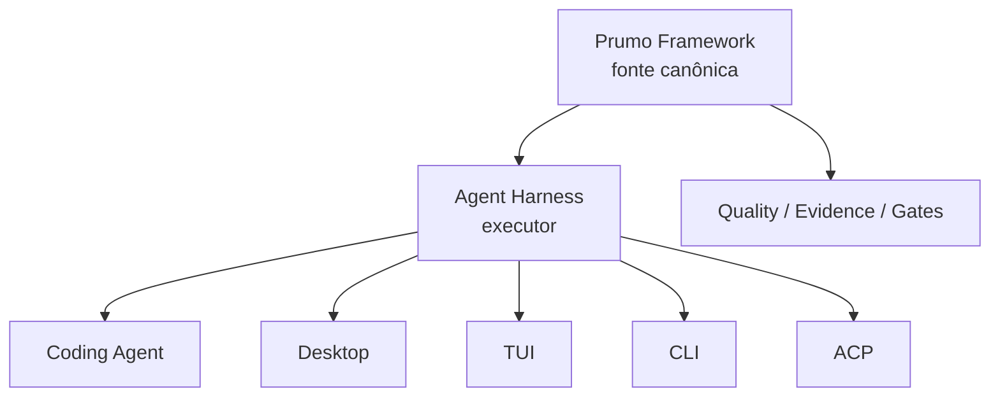

# 00 — Visão, Escopo e Relação com o Prumo Framework

> Authority: canonical specification.
> Logical ID: PART2-CH-00
> Source: Notion Living Book (3d89bb7d023f818f8507f9dac3fb8cbb)
> Status: Especificação especializada do Harness / Code Agent (Capítulo 00).

<aside>
🧭

**Objetivo desta página:** congelar a identidade do projeto antes de escolher bibliotecas ou interfaces. Prumo Code Agent é uma evolução opcional do Prumo, e não uma substituição do protocolo/framework atual.

</aside>

# Problema que queremos resolver

O Prumo atual já organiza engenharia de projeto e colaboração com agentes, mas delega a execução conversacional/interativa a harnesses externos. A evolução estudada aqui fecha essa lacuna com um runtime próprio, preservando interoperabilidade.

# Definição de produto

**Prumo Code Agent** será, se aprovado, uma família composta por:

- **Prumo Agent Harness:** engine headless responsável por modelos, turn loop, tools, approvals, sandbox, context, budget, evidence e resume;
- **Prumo Code Agent:** perfil/produto padrão de coding agent executado pelo harness;
- **Prumo Code Desktop:** cockpit nativo opcional;
- **Prumo Code TUI:** cockpit terminal avançado opcional;
- **Prumo Code CLI:** superfície headless/automation;
- **ACP Adapter:** integração editor ↔ agente;
- clientes remotos/mobile somente depois da fundação local.

# Relação de autoridade

O Harness **consome** Goals, Plans, Tasks, policies, workforce e contratos do Prumo. Ele não deve criar um segundo sistema de verdade.

# Não objetivos iniciais

- não criar uma IDE completa antes do Agent Runtime;
- não competir com VS Code em extensões genéricas no primeiro ciclo;
- não suportar execução distribuída antes do local-first estar sólido;
- não duplicar toda API de Git, LSP ou terminal no Core quando uma boundary estável resolver;
- não tornar desktop obrigatório para usar o agent;
- não tornar TUI uma versão reduzida do desktop: ambos serão clientes first-class com capacidades negociadas.

# Princípios de evolução

1. **Engine first, surfaces later.**
2. **Native-first, benchmark-driven.**
3. **Single source of truth.**
4. **Capability negotiation em vez de acoplamento por cliente.**
5. **Execution is untrusted by default.**
6. **Resume sem transcript privado.**
7. **Observability sem chain-of-thought.**
8. **Extensibilidade por contratos versionados.**
9. **Desempenho medido em hardware modesto.**
10. **Stacks e runtimes concretos continuam benchmark-driven mesmo depois de uma direção arquitetural ser aceita.**

# Autoridade para decisões arquiteturais

O usuário delega ao arquiteto/agent responsável a decisão autônoma sobre **arquitetura técnica e estratégia de implementação** quando o caderno e os invariantes já fornecem contexto suficiente.

Isso inclui, entre outros:

- boundaries e divisão de módulos/packages;
- state ownership e lifecycle;
- interfaces e contratos internos;
- algoritmos, estruturas de dados e estratégias de cache/incrementalidade;
- persistência e índices derivados;
- concorrência, scheduling e filas;
- resource/runtime management;
- protocolos internos e adapters;
- error handling, retries e recovery;
- test architecture, conformance e observability;
- decisões de implementação necessárias para manter Clean Code, segurança, performance, modularidade e manutenção.

## Regra de execução

Não é necessário pedir aprovação para cada decisão técnica. A decisão deve ser tomada, documentada com rationale e conectada aos contracts/evidence relevantes quando necessário.

## Quando escalar ao usuário

Escalar quando uma decisão alterar materialmente:

- funcionalidades ou escopo de produto;
- UX/UI, design, acessibilidade ou comportamento visível;
- ferramenta, linguagem, framework ou tecnologia que o usuário queira escolher diretamente;
- custos recorrentes, licenças, termos ou privacidade;
- compatibilidade/distribuição suportada;
- capability anteriormente aceita;
- invariant ou direção já marcada como `ACCEPTED`.

Na dúvida entre duas soluções tecnicamente equivalentes sem impacto nesses pontos, escolher a opção mais simples, modular, segura, testável, eficiente e consistente com o restante do Prumo.

# Vínculo canônico

[Prumo — Livro Vivo Unificado: Framework, Harness & Code Agent](../../LIVRO_VIVO_HUB.md)

Quando uma decisão deste caderno alterar um invariant do Prumo, ela deve virar ADR/amendment no caderno canônico; enquanto for apenas pesquisa de produto/harness, permanece aqui.