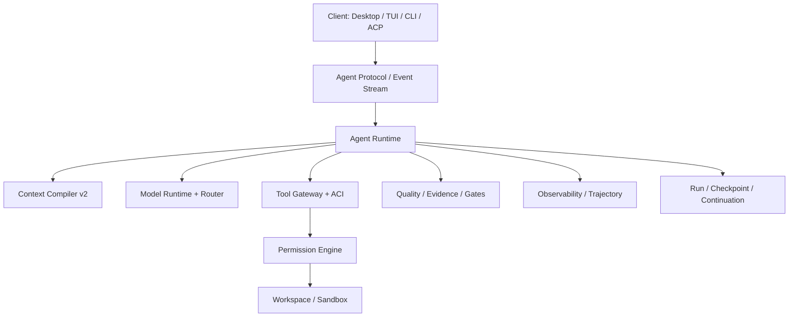

# 03 — Arquitetura Alvo do Agent Harness

> Authority: canonical specification.
> Logical ID: PART2-CH-03
> Source: Notion Living Book (3d89bb7d023f81598dd0d1d2b2105d75)
> Status: Especificação especializada do Harness / Code Agent (Capítulo 03).


<aside>
🏗️

**Status: ACCEPTED.** O Harness é um engine headless Prumo-native em Go, utilizável sem TUI/Desktop. Clients consomem protocol/event stream; harnesses externos entram como `AgentProvider`, não como kernel ou domínio canônico.

</aside>

# Camadas propostas



# Boundaries

## Prumo Core / Project Plane

Continua responsável por Goal, Plan, Task, policy, workforce, documentation contracts, traceability e state transitions.

## Agent Runtime

Coordena um turno: prepara contexto, seleciona modelo, transmite tokens/eventos, recebe tool calls, envia observations, avalia stop conditions e persiste checkpoints.

## Model Runtime

Traduz contrato Prumo para APIs/providers reais. Não escolhe sozinho o modelo; a escolha pertence ao Router.

## Tool Runtime

Resolve e executa ACI/MCP/native tools por meio de policy, permission, budget e environment.

## Workspace Runtime

Responsável por root, worktree, processes, PTYs, sandbox, network e artifact storage.

## Client Protocol

Eventos versionados para que desktop/TUI/CLI possam reconectar, replay e continuar um Run.

# Contrato arquitetural obrigatório

- o runtime não pode depender da implementação da TUI;
- providers não podem importar regras de Goal/Plan;
- ferramenta não executa diretamente sem Tool Gateway;
- cliente não deve receber secrets necessários apenas ao provider;
- modelo não recebe capabilities que policy proibiu;
- cada ação com side effect gera intent/outcome/evidence;
- cancellation e resume são first-class;
- event ordering deve ser determinístico por run/session/turn.

# Estratégia build vs reuse

O Core do Harness é proprietário do Prumo porque Run/state, Context, permissions, evidence, Knowledge, Handoff e budgets são diferenciais canônicos. Infraestrutura genérica pode ser reutilizada atrás de ports; coding agents completos são consumidos como runtimes externos.

```
Prumo Native Path
Run → NativeAgentRuntime → ModelProvider → Model Gateway/API

External Agent Path
Run → AgentProvider → ACP/SDK/RPC/server → Codex/OpenCode/Goose/etc.
```

A decisão e matriz de referências estão em [35 — Harness Build Strategy: Prumo-Native Core, External Agent Providers e Selective Reuse](ch35.md) e [02 — Referências de Harnesses, Agent Frameworks e Coding Agents](ch02.md).

# Native runtime execution model

`AgentRuntime` é state machine reentrante. Nenhuma correctness property pode depender de coroutine/stack suspensa.

```
Prepare
→ CompileContext
→ RequestModel
→ ConsumeModelEvent
→ PlanToolCalls
→ PermissionCheck
→ ExecuteTool
→ RecordObservation
→ EvaluateStop/Quality
→ Checkpoint
→ Yield / Continue / Complete
```

Safe points são first-class para cancellation, steering, permission wait, crash/resume e Handoff.

# Ports obrigatórios

```
AgentRuntime
├── ModelService
├── ContextService
├── ToolService
├── PermissionService
├── WorkspaceService
├── BudgetService
├── CheckpointStore
├── EventSink
├── EvidenceService
└── KnowledgeService
```

Adapters concretos não vazam tipos vendor para esse domínio.

# Conformance-first

Antes do primeiro provider real, um `FakeProvider` scriptado deve cobrir text, streaming, tool calls parciais, multiple tools, malformed output, cancellation, retryable failures, permission wait, context overflow, usage events e crash/resume. Todo provider real executa a mesma contract suite.

# Módulos Go candidatos

```
internal/agentruntime
internal/modelruntime
internal/conversation
internal/permissions
internal/aci
internal/workspace
internal/pty
internal/trajectory
internal/agentprotocol
```

Nomes permanecem provisórios até revisarmos boundaries existentes.