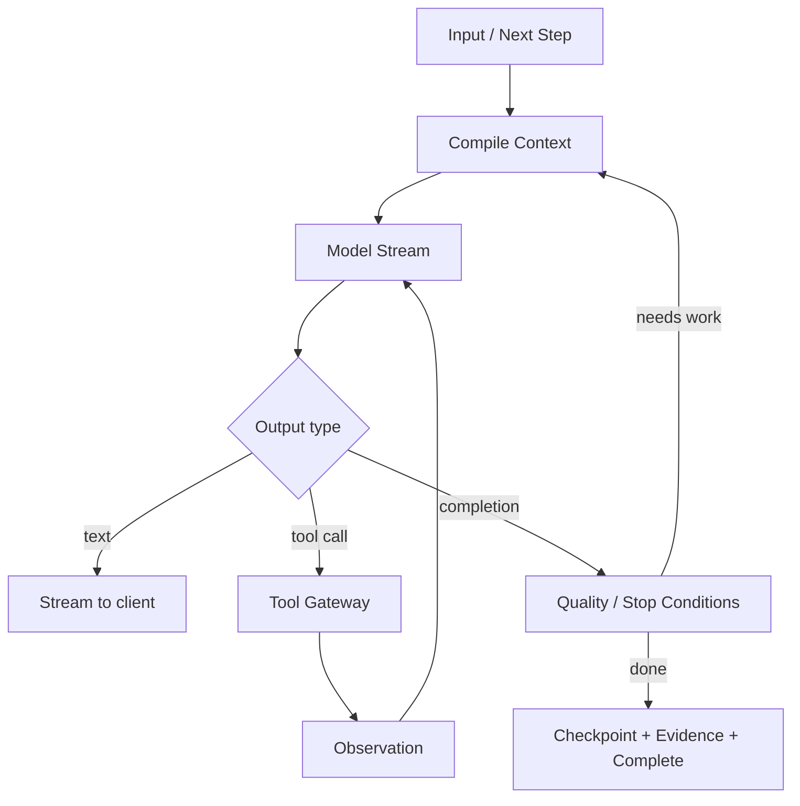

# 05 — Agent Loop, Conversation, Turns, Checkpoints e Portable Continuation

> Authority: canonical specification.
> Logical ID: PART2-CH-05
> Source: Notion Living Book (3d89bb7d023f814aa91fdff68fef108f)
> Status: Especificação especializada do Harness / Code Agent (Capítulo 05).


# Princípio

Um `Run` não é uma conversa. Uma `ExecutorSession` não é um Goal. Um `Turn` não é uma Task. Essa separação deve continuar explícita.

# Modelo conceitual

```
Project
└── Goal
    └── Run
        ├── ExecutorSession
        │   ├── Turn
        │   │   ├── User/System Input
        │   │   ├── Context Manifest
        │   │   ├── Model Call
        │   │   ├── Tool Calls
        │   │   ├── Observations
        │   │   └── Usage
        │   └── ...
        ├── Checkpoints
        ├── Evidence
        ├── Artifacts
        └── ContinuationRecord
```

# Loop mínimo



# Native Agent Runtime — state machine reentrante

Direção ACCEPTED: o agent loop nativo não será implementado como uma coroutine/`while` monolítico que mantém estado implícito na stack. Ele será uma **state machine reentrante/unrolled**, com boundaries persistíveis e testáveis.

```
Prepare
→ CompileContext
→ RequestModel
→ ConsumeModelEvent
→ PlanToolCalls
→ PermissionCheck
→ ExecuteTool
→ RecordObservation
→ EvaluateStop/Quality
→ Checkpoint
→ Yield / Continue / Complete
```

Cada step pode persistir state/event e devolver controle ao scheduler. Isso torna crash/resume, Handoff, cancellation, steering em safe points, replay/evals e execução daemon/background naturais.

O runtime depende de ports Prumo (`ModelService`, `ContextService`, `ToolService`, `PermissionService`, `WorkspaceService`, `BudgetService`, `CheckpointStore`, `EventSink`, `EvidenceService`, `KnowledgeService`) e não de SDK/vendor concreto.

Estratégia completa: [35 — Harness Build Strategy: Prumo-Native Core, External Agent Providers e Selective Reuse](ch35.md).

# Harness reference constraints

O Agent Loop deve ser implementado a partir de contratos Prumo e validado contra padrões observados em Google ADK Go, Goose, OpenCode, Codex, Pydantic AI Harness, Eino, Pi, SWE-agent e Aider. Essas referências fornecem padrões; nenhuma delas fornece canonical state ao Prumo. Matriz: [02 — Referências de Harnesses, Agent Frameworks e Coding Agents](ch02.md).

## External Agent não é nested ModelProvider

Quando Codex/OpenCode/Goose/Claude Code/etc. controlam seu próprio loop, tools e session, o Prumo os trata como `AgentProvider`. Não encapsular um segundo agent loop dentro do Native loop fingindo que sua resposta é apenas inference de modelo.

## FakeProvider e scripted trajectories

A implementação começa com provider determinístico capaz de reproduzir trajetórias como:

```
Text
→ ToolCall(read)
→ Observation
→ ToolCall(edit)
→ Permission wait
→ ToolCall(test)
→ Completion
```

Variantes de erro/cancel/crash permitem provar o scheduler e persistência antes de adicionar variabilidade de LLM real.

## Safe-point invariant

Model streaming pode ser interrompível, porém side effects são reconciliados somente em boundaries explícitas. Antes de cada side effect persistir intent/idempotency; após execução persistir outcome/observation antes de novo model step. Isso é requisito para retry e Handoff sem duplicação.

# Steering

Cliente pode enviar follow-up enquanto um Run está ativo. Precisamos definir se o steering entra imediatamente, no próximo safe point ou cria uma nova Task/amendment dependendo do impacto.

# Loop guards

- max turns;
- max tool calls;
- no-progress detector;
- repeated identical failures;
- repeated same-file patch churn;
- cyclic delegation;
- budget burn without evidence delta;
- deadline/wall-time limit.

# Portable Continuation

Continuação deve reconstruir estado usando canonical state + checkpoint + workspace state + pending side effects. Nunca depender de memória privada do modelo.

A especificação **Handoff v2 ACCEPTED** está em [32 — Handoff v2 e Knowledge API: Typed Continuation, Query/Write Contracts e Agent Portability](ch32.md). O bundle é tipado/pointer-first, inclui pending effects/idempotency, Context Manifest, workspace/checkpoint refs, evidence/gates e integrity revisions; cross-provider continuation não depende de transcript.

# Cross-model continuation

Um Run iniciado com modelo A pode continuar com modelo B. O novo provider recebe HandoffBundle + Context Manifest reconstruído + compact continuation summary. Provider-native resume token é opaque/optional; a portabilidade do Prumo nunca depende dele.

# PlanningSession é distinto de Run

`PlanningSession` representa exploração, pesquisa, perguntas, alternativas e decisões antes ou durante a definição de um Project/Goal. Não deve ser modelado como um Run de implementação. Pode gerar Goals/Plans/Tasks e então fazer handoff para Build/Run.

PlanningSession persiste por registros estruturados — Decision Ledger, Research Ledger, open questions, requirements e artifacts — e não depende do transcript integral como fonte canônica. Especificação: [25 — Planning & Knowledge Runtime: Plan Mode, Decision Ledger e Memory Atlas](ch25.md).

# Persistência

A trajetória completa pode ser runtime-derived, possivelmente SQLite + append-only log. Artefatos canônicos continuam no repositório. Devemos decidir política de retenção/redaction antes de armazenar prompts completos.