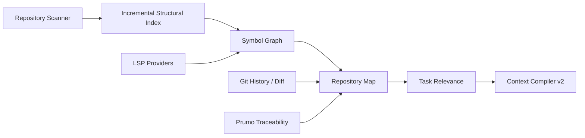

# 08 — Context Compiler v2, Repo Map, LSP e Code Intelligence

> Authority: canonical specification.
> Logical ID: PART2-CH-08
> Source: Notion Living Book (3d89bb7d023f81ff86c1e42169acfaef)
> Status: Especificação especializada do Harness / Code Agent (Capítulo 08).


# Problema

O Context Compiler atual é uma boa fundação de budget/authority, mas um coding agent precisa encontrar **o menor conjunto de código semanticamente útil**, não apenas empacotar fontes ordenadas.

# Pipeline aceito



# Ordem de retrieval

1. referências canônicas do Goal/Task;
2. arquivos modificados/recently relevant;
3. símbolos/definitions/references;
4. structural/FTS search;
5. repo map;
6. embeddings/semantic retrieval apenas quando benchmark mostrar ganho.

# Repository Map

Representação compacta de módulos, tipos, funções, signatures, imports/dependencies e símbolos importantes. Inspirado conceitualmente em Aider, mas integrado ao graph/authority model do Prumo.

# LSP first

Em vez de escrever indexadores semânticos completos para cada linguagem, usar Language Servers para uma interface comum:

- workspace symbols;
- document symbols;
- definition;
- references;
- hover;
- diagnostics;
- code actions;
- rename;
- formatting quando apropriado.

# LanguageIntelligenceProvider

```
Provider
├── gopls
├── rust-analyzer
├── clangd
├── basedpyright/pyright
├── TypeScript LSP
├── Roslyn-compatible
└── generic/no-LSP
```

# Tree-sitter

Continua útil para highlighting, structural fallback, outline e linguagens sem LSP, mas não deve forçar o Prumo Core a conhecer AST interna de cada linguagem.

# Freshness

Cada índice precisa de revision/hash. Context derivado de código antigo deve ser invalidado por mudança no workspace.

# Context Manifest v2

Além de included/excluded, registrar: relevance score, authority, freshness/revision, provenance, token estimate, reason, retrieval method, compression level e pointer para conteúdo completo.

A arquitetura detalhada agora está **ACCEPTED** em [31 — Context Compiler v2: Hybrid Retrieval, Authority/Freshness, Budget Packing e Progressive Disclosure](ch31.md). Ela fecha eligibility gates por authority/trust/freshness/privacy, retrieval structured→BM25→semantic→graph, RRF como baseline de hybrid fusion, MMR para anti-redundancy, dependency/coverage constraints, greedy marginal-utility-per-token packing e progressive disclosure L0–L4.

# Memory Atlas como fonte de contexto

O Context Compiler também pode consultar o **Memory Atlas cross-project** do Prumo. O Atlas não é despejado no prompt; ele participa do retrieval como fonte estruturada e progressive-disclosure.

```
Task / Query
→ scope + authority + freshness filters
→ lexical/structured retrieval
→ graph expansion
→ compact MemoryRecord summaries
→ selective full record fetch
→ Context Compiler
```

Priorizar structured filters + FTS/BM25 + graph relationships. Embeddings são opcionais e derivados, adicionados somente se evals mostrarem ganho real. Toda memória incluída deve aparecer no Context Manifest com provenance, reason, authority/freshness e token estimate.

Especificação: [25 — Planning & Knowledge Runtime: Plan Mode, Decision Ledger e Memory Atlas](ch25.md).

# Evals

Comparar baseline grep/full-file contra repo map/LSP em: resolução de símbolos, arquivos relevantes encontrados, tokens, latency, success rate e regressões por linguagem.

Para retrieval/packing, medir também context precision, required-evidence survival, duplicate token ratio, authority/stale violations, dependency completeness e downstream quality. RRF/MMR/top-K/graph depth permanecem benchmark-driven, sem alterar a arquitetura aceita.