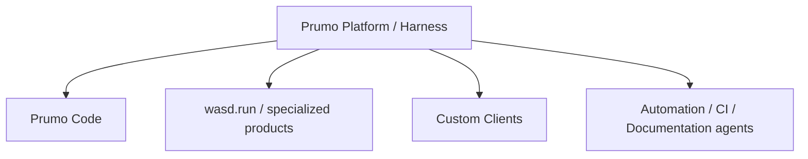

# 40 — Repository Boundary & Product Split: Prumo Platform vs Prumo Code

> Authority: canonical specification.
> Logical ID: PART2-CH-40
> Source: Notion Living Book (3d89bb7d023f81b1ad81ecdd5ac99017)
> Status: Especificação especializada do Harness / Code Agent (Capítulo 40).


<aside>
🧱

**Status: ACCEPTED.** O desenvolvimento do Harness continua no repositório `raillen/prumo`. `Prumo Code` nasce posteriormente como repositório/produto separado e consumidor first-class do protocolo público do Prumo. A separação deve ocorrer apenas quando o Harness headless e seus contratos estiverem maduros o suficiente para que o novo produto não precise importar APIs internas.

</aside>

# Decisão

```
raillen/prumo
= platform + framework + harness + native agent + daemon + CLI + protocol + SDK

raillen/prumo-code
= coding-oriented product + Desktop/TUI clients + workflows/UX específicos
```

O Harness pertence ao Prumo. `Prumo Code` não possui uma segunda implementação de Run, Context, ToolGateway, Handoff, Knowledge Runtime, Model Gateway ou Agent Runtime.

# Relação de produto



Prumo é a plataforma generalizável. Prumo Code é o primeiro grande produto especializado em desenvolvimento de software.

# Ownership do repositório Prumo

`raillen/prumo` continua responsável por:

- Project / Goal / Plan / Task / Run;
- Native Agent Runtime;
- `ModelProvider` e `AgentProvider`;
- Model Gateway / routing / fallback;
- ToolGateway / ACI / MCP;
- Permission Engine;
- Environment / Sandbox / Worktree;
- Context Compiler;
- Knowledge Runtime / Memory Atlas;
- Documentation Compiler e Human Documentation Runtime;
- Workforce / Handoff;
- Evidence / Gates / Readiness;
- budgets / observability / automation;
- daemon/headless runtime;
- CLI;
- protocol schemas;
- public SDKs/bindings.

# Ownership do futuro Prumo Code

`raillen/prumo-code` possui apenas comportamento e apresentação específicos do coding workbench:

- Agentic workspace;
- Code workspace;
- Review workspace;
- Terminal workspace;
- Native Desktop / Workspace Viewer construído do zero com Freya, conforme decisão vigente do Livro Vivo; as direções anteriores Rust + Floem e Oxi permanecem somente como histórico/SUPERSEDED;
- TUI Go + Bubble Tea v2;
- editor/terminal/diff/review UX;
- inspectors, command palette e presentation state;
- coding recipes e product-specific workflows;
- branding, themes, onboarding e documentação do produto;
- client-side caching/presentation adapters permitidos pelo protocol.

# Boundary invariant

`prumo-code` **nunca importa `internal/` do Prumo**.

```
Prumo Code
    ↓
Prumo Client SDK / generated bindings
    ↓
Versioned Prumo Protocol
    ↓
Prumo daemon / Harness
```

Se uma capability necessária não puder ser realizada pelo protocol público, isso é um gap do Prumo Protocol/API — não justificativa para acoplamento direto.

# One engine, many clients

A separação física de repositórios transforma `Protocol over client` em constraint real.

```
Desktop ─┐
TUI ─────┼→ Prumo Protocol → Prumo Harness
CLI ─────┤
IDE/ACP ─┘
```

Clientes podem evoluir independentemente, reconectar, replay e operar contra engine local ou remoto.

# Local e remoto

Local:

```
Prumo Code
→ Unix socket / named pipe / local transport
→ prumo daemon
```

Futuro remoto:

```
Prumo Code
→ authenticated WebSocket/remote transport
→ Prumo daemon em workstation/server
```

A UI não precisa conhecer onde o engine está executando além das capabilities da conexão.

# Protocol como produto versionado

Versionar separadamente:

```
Prumo Core       SemVer próprio
Prumo Protocol   compatibility major/minor
Prumo Code       SemVer próprio
```

Mudança interna em scheduler/Context Compiler não exige nova major do Protocol se contratos externos continuam compatíveis.

Breaking change em Commands/Events/schemas públicos exige evolução explícita do Protocol.

# Protocol contract

O protocol deve expor IDs e schemas estáveis para, no mínimo:

- Project/Workspace/Worktree refs;
- Goal/Plan/Task/Run;
- Thread/Session/Turn/Message projections;
- Command Registry;
- DomainEvent / AgentEvent;
- Agent/model/provider capabilities;
- Context summaries/manifests apropriados ao client;
- ToolCall/Process/TerminalSession;
- PermissionRequest;
- Change/Patch/Diff;
- Evidence/Gate/Diagnostic;
- notifications;
- replay/reconnect cursors;
- protocol negotiation/version.

Vendor types não atravessam essa boundary.

# SDK strategy

O contrato canônico é schema/protocol, não uma library Go.

```
Protocol schemas / IDL
├── Go server/client implementation
├── Rust bindings/client for Desktop
└── future TypeScript/other bindings
```

Generated bindings são preferíveis para DTOs mecânicos; domain behavior continua no Harness.

# Distribuição

Arquitetura separada não obriga experiência de instalação separada.

O instalador do Prumo Code pode incluir uma versão compatível do Prumo runtime:

```
Prumo Code distribution
├── prumo-code client
├── compatible prumo daemon/runtime
└── protocol compatibility manifest
```

Usuário avançado pode apontar o cliente para runtime já instalado/remoto quando suportado.

# Repository layout inicial

Evitar fragmentação prematura em muitos repos.

```
raillen/prumo
├── cmd/
├── internal/
├── protocol/
├── schemas/
├── sdk/
├── docs/
└── ...

raillen/prumo-code
├── product/
├── desktop/
├── tui/
├── client/
├── workflows/
├── resources/
└── docs/
```

Não criar imediatamente `prumo-core`, `prumo-sdk`, `prumo-protocol`, `prumo-daemon` etc. como repositórios separados. Extrair somente após necessidade operacional comprovada.

# Gate para criar raillen/prumo-code

A separação acontece quando estes requisitos estiverem satisfeitos:

- HA0 Agent Runtime contracts/normalized events estáveis;
- HA1 FakeProvider + primeiro ModelProvider funcionando;
- HA2 Native Agent state machine funcional;
- HA3 ToolGateway + Permission lifecycle integrados;
- HA4 checkpoint/restart/resume comprovados;
- HA5 Coding ACI + Sandbox baseline utilizável;
- `prumo agent` headless consegue executar um coding Run end-to-end;
- protocol versionado suporta Commands/Events necessários ao primeiro client;
- reconnect/replay funciona;
- client pode observar e controlar Run sem importar implementation internals.

# Split acceptance test

O primeiro grande teste do novo repositório é:

> **Construir o primeiro Prumo Code funcional sem nenhum acesso a APIs internas do Prumo.**
> 

Se isso falhar, corrigir o protocolo/SDK antes de criar um atalho de acoplamento.

# Compatibilidade

`prumo-code` declara intervalo de Protocol suportado. Startup executa capability/version negotiation e produz erro explicável quando incompatível.

Runtime bundled deve ser uma versão conhecida compatível; runtime externo pode ser aceito conforme compatibility range.

# Evolution rule

Capabilities genéricas descobertas durante o desenvolvimento do Prumo Code sobem para o Prumo quando pertencem à plataforma. UX/workflows específicos permanecem no produto.

```
generic agent/platform capability → Prumo
coding-workbench presentation/workflow → Prumo Code
```

# Benefício estratégico

Essa boundary permite usar o Prumo como foundation para outros produtos sem transformar `prumo-code` em dependência transitiva, incluindo ferramentas especializadas como `wasd.run`, automações, clients corporativos e futuros agents de documentação/research.

# Invariantes

- Harness/Native Agent continuam no Prumo;
- Prumo Code é consumidor, não owner do Core;
- protocol público é única boundary suportada entre repos;
- split somente após headless Harness + protocol maduros;
- versões Core/Protocol/Product são independentes;
- instalação pode ser unificada mesmo com arquitetura separada;
- primeiro Prumo Code funciona sem `internal/` imports;
- não fragmentar o ecossistema em múltiplos repos antes de necessidade real.