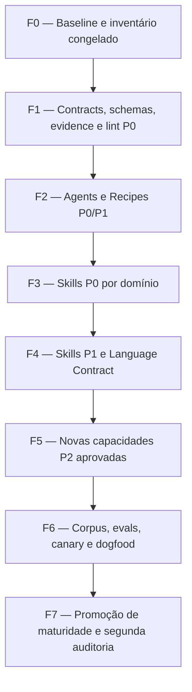

# 79 — Programa de Aprimoramento do Workforce: Agents, Skills, Recipes e Quality Contracts

> Authority: canonical specification.
> Logical ID: 79
> Source: Notion Living Book (3d89bb7d023f8197a3bec0dba3a2ad29)
> Status: Documento especializado: 79 — Programa de Aprimoramento do Workforce Agents.

<aside>
🧠

**Status:** planejamento aprovado para documentação; **nenhuma implementação está autorizada por esta página**. Este programa consolida a auditoria do diretório `src/prumo/resources/workforce` do repositório `raillen/prumo` e transforma as lacunas encontradas em um plano de hardening sistemático, verificável e incremental.

</aside>

# Propósito

Este programa define como elevar o Workforce do Prumo de um catálogo amplo de agents, skills e recipes para um **sistema de capacidades especializado, verificável, componível e governado por evidência**.

A auditoria identificou três classes diferentes de problema, que devem permanecer separadas durante a implementação:

1. **Lacunas internas:** o componente existe, mas seu conteúdo, contrato, procedimento, evidência ou especialização ainda é insuficiente.
2. **Lacunas de integração:** os componentes existem, mas relações Agent ↔ Skill ↔ Recipe ↔ Capability ↔ Evidence ↔ Gate ↔ Handoff não estão formalizadas ou podem divergir.
3. **Capacidades ausentes:** existe um domínio recorrente sem skill, agent ou recipe próprio e cuja criação reduz duplicação ou risco sistêmico.

# Fonte e relação com a documentação existente

Esta página é complementar a [21 — Skill Package v3, Resolver, Configuração e Evals](../framework/specs/ch21.md). A página 21 continua sendo a definição conceitual do pacote de skill, activation, progressive disclosure, lifecycle, resolver, curator e evals. Este programa especifica **como aplicar esse modelo ao workforce real encontrado no repositório**.

Relaciona-se também a:

- [13 — Testes, Conformance, Evals e Quality Gates](../framework/specs/ch13.md);
- [14 — Roadmap de Implementação v0.4](../framework/specs/ch14.md);
- [55 — Observability Plane, Run Explainability e Incident Bundles](../framework/specs/ch55.md);
- [61 — Atlas Harness Eval Suite, Canary e Runtime Quality Metrics](../framework/specs/ch61.md);
- [78 — Continuous Execution Mode: Program Runner, Worker Loop e Autonomia Opt-in](../development/phases/phase-78.md).

# Princípios obrigatórios

- **Hard-code invariants; configure policies; evaluate heuristics.** Tudo que puder ser validado deterministicamente deve sair do prompt e entrar em schema, linter, check, fixture ou gate.
- **Least Workforce.** Mais agents/skills não é sinônimo de melhor execução. O resolver deve escolher a menor composição que cubra o risco e o domínio.
- **Especialização real.** Criar uma pasta ou trocar substantivos em um template não transforma conteúdo genérico em skill especializada.
- **Evidence before confidence.** Nenhum componente é promovido para maturidade estável apenas por parecer correto em revisão manual.
- **Progressive context.** Manifest e resumo primeiro; conhecimento e workflows detalhados somente sob demanda.
- **Independent verification.** Implementação e aprovação independente permanecem separadas onde risco exigir.
- **Compatibilidade incremental.** A migração não deve exigir reescrever todo o catálogo em um único changeset.
- **Sem inflação artificial.** Antes de criar uma nova skill, provar que ela não é apenas uma responsabilidade já pertencente a uma skill existente.

# Prioridades

| Prioridade | Significado | Regra |
| --- | --- | --- |
| **P0** | Fundação ou risco sistêmico | Bloqueia a maturidade do workforce ou pode produzir seleção, execução, segurança ou evidência incorreta. Resolver antes da reescrita massiva. |
| **P1** | Hardening necessário | Melhora cobertura, especialização, precisão, robustez e operação. Executar após os contratos P0 estarem estabilizados. |
| **P2** | Expansão condicionada | Capacidade nova útil, mas só deve ser criada após provar que não pode ser composta de componentes existentes. |

# Escala de esforço

- **S:** alteração localizada, contrato simples ou documentação pequena.
- **M:** revisão de um componente/família com checks e fixtures limitados.
- **L:** mudança transversal, schemas/evals ou reescrita significativa de família.
- **XL:** campanha de migração ampla envolvendo dezenas de componentes, corpus e automação.

# Ordem de implementação obrigatória

**Regra:** não iniciar uma reescrita mecânica das skills antes de estabilizar os contratos de package/evidence/eval/lint. Isso reproduziria o débito atual em um formato novo.

# Macro-matriz de execução

| Fase | Objetivo | Entrega principal | Gate de saída |
| --- | --- | --- | --- |
| F0 | Congelar baseline | Inventário canônico + coverage map | 100% de agents/skills/recipes identificados e referenciáveis |
| F1 | Estabilizar contratos | Skill/Agent/Recipe contracts, evidence, handoff, failure taxonomy, lint | Validator detecta drift, órfãos, privilégios e contratos inválidos |
| F2 | Corrigir coordenação | Agents e Recipes revisados | Recipe steps compatíveis com agent/skill capabilities |
| F3 | Eliminar riscos críticos | Security, accessibility, orchestration, context, testing e release P0 | Procedimentos especializados + checks/evals mínimos |
| F4 | Elevar profundidade | Skills P1 + Language Skill Contract | Cobertura homogênea e domain-specific |
| F5 | Adicionar gaps reais | Privacy, i18n, fuzz/property, compatibility e resilience condicionais | Nova capacidade possui justificativa anti-duplicação |
| F6 | Provar comportamento | Positive/negative/adversarial corpus, evals, canary, dogfood | Baselines e thresholds aprovados |
| F7 | Promover maturidade | Stable promotion + deprecation/migration + auditoria final | DoD completo e zero lacuna P0 aberta |

# Definition of Success do programa

O programa só pode ser considerado concluído quando:

- todo agent, skill e recipe ativo possui contrato machine-readable suficiente;
- não existem referências órfãs ou dependências circulares não justificadas;
- activation precision/recall é mensurada para skills automáticas/contextuais críticas;
- outputs críticos são validados por schema;
- gates recebem evidence normalizada e verificável;
- handoffs permitem continuidade sem depender do transcript;
- permissões seguem least privilege;
- skills críticas possuem procedimento específico, exemplos e evals;
- o resolver consegue explicar **por que** selecionou ou rejeitou uma skill/agent/recipe;
- uma segunda auditoria mede qualidade por cobertura/evals/contratos, não por quantidade de arquivos.

# Estrutura das subpáginas

As subpáginas deste programa detalham separadamente: baseline e matriz completa; contratos transversais; agents; recipes; accessibility/UX; security/trust; context/orchestration/agentic; testing/quality; languages; compiler/native/runtime; backend/data/API; frontend/design/UI; DevOps/release/observability; GitHub/tooling/docs/research; game/rendering/networking; novas capacidades candidatas; roadmap por fases; evals/metrics e Definition of Done.

# Referência externa

- [Repositório Prumo — workforce](https://github.com/raillen/prumo/tree/main/src/prumo/resources/workforce)
- [Repositório Prumo](https://github.com/raillen/prumo)

[79.A — Baseline da Auditoria, Taxonomia de Lacunas e Matriz Mestra](notion-3d89bb7d.md)

[79.B — Contratos Transversais, Schemas, Permissions, Evidence, Handoff e Lifecycle](notion-3d89bb7d.md)

[79.C — Hardening dos 26 Agents: Planejamento Individual](notion-3d89bb7d.md)

[79.D — Hardening das 14 Recipes: DAGs, Gates Condicionais, Recovery e Aceite](notion-3d89bb7d.md)

[79.E — Accessibility, UX e Cognitive Quality: Skills P0/P1](notion-3d89bb7d.md)

[79.F — Security, Trust, Permissions e Supply Chain: Skills P0/P1](notion-3d89bb7d.md)

[79.G — Context, Agentic Workflow, Orchestration, MCP e Indexing](notion-3d89bb7d.md)

[79.H — Testing, Code Quality, Review, Benchmarking e Evidence Strategy](notion-3d89bb7d.md)

[79.I — Language Skills Contract e Hardening de Todas as lang-*](notion-3d89bb7d.md)

[79.J — Compiler, Native, Memory, Concurrency, Runtime e Low-Level Skills](notion-3d89bb7d.md)

[79.K — Backend, API, Database, Caching, Serialization e RPC Skills](notion-3d89bb7d.md)

[79.L — Frontend, Design System, UI Implementation, Visual Quality e Web](notion-3d89bb7d.md)

[79.M — DevOps, CI/CD, Containers, Release Engineering e Observability](notion-3d89bb7d.md)

[79.N — Git, GitHub, Documentation, Editor Tooling e Research Operations](notion-3d89bb7d.md)

[79.O — Game, Rendering, Physics, Networking, Assets, Audio e Realtime Skills](notion-3d89bb7d.md)

[79.P — Novas Capacidades Candidatas: Skills, Agents e Recipes](notion-3d89bb7d.md)

[79.Q — Matriz Completa de Prioridade, Work Packages, Dependências e Sequenciamento](notion-3d89bb7d.md)

[79.R — Evals, Métricas, Canary, Definition of Done e Exit Gates do Workforce](notion-3d89bb7d.md)

[79.S — Architecture Quality, Goal Management, State e Plugin Architecture](notion-3d89bb7d.md)

[79.T — Technology Skill Packs: egui, Bubble Tea v2 e Ecossistemas de Frameworks](notion-3dd9bb7d.md)

[79.U — Skill Research, Knowledge Freshness, Vision e Evidence Operations](notion-3dd9bb7d.md)

[79.V — Language Ecosystem Packs: C, C3, Odin, D, Lua e Nim](notion-3dd9bb7d.md)

# Expansão 2026-09-16 — sistemas, web graphics, CS e ensino

A pesquisa atual expande o Programa 79 para novas famílias: **C++ moderno/seguro**, **WebAssembly/WAT/WASI/Component Model**, **WebGPU/WGSL/Three.js**, **assembly/ISA/ABI/IR/microarquitetura**, **programming-language engineering**, **Computer Science/Software Engineering**, **database engineering/administration** e **Linux avançado**. Em paralelo, a camada pedagógica deixa de ser tratada apenas como uma skill: será especificada como novo módulo de harness no Programa 80, preservando `cognitive-accessibility` como capability transversal.

[79.W — Modern C++, WASM/WAT, WebGPU, Three.js e Low-Level Systems Packs](notion-3dd9bb7d.md)

[79.X — Programming Language Engineering, Paradigms, Compiler Theory e Language Design Skills](notion-3dd9bb7d.md)

[79.Y — Computer Science, Software Engineering, Databases e Advanced Linux Skills](notion-3dd9bb7d.md)

[79.Z — Teaching Module, Professor Agents e Neurodivergent Learning Architecture](notion-3dd9bb7d.md)

# Expansão 2026-09-16 — Skills de Sistemas, Fundamentos e Ensino

Esta rodada acrescenta quatro extensões oficiais ao Programa 79:

- [79.W — Modern C++, WebAssembly/WAT, WebGPU e Three.js Skill Packs](notion-3dd9bb7d.md);
- [79.X — Assembly, ISA, ABI, Reverse Engineering e Low-Level Systems Skills](notion-3dd9bb7d.md);
- [79.Y — Programming Languages, Computer Science, Software Engineering, Databases e Linux Advanced Skills](notion-3dd9bb7d.md);
- [79.Z — Teaching Module: Professor Mode, Neurodivergent Pedagogy e Learning Progression](notion-3dd9bb7d.md).

Estas extensões não alteram a ordem fundamental F0→F7: contracts/evidence/freshness permanecem pré-requisitos para expansão massiva. O Teaching Module, entretanto, adiciona uma nova dimensão arquitetural que deve receber RFC/ADR próprio antes de implementação, pois introduz learning state, curriculum graph e um novo tipo de handoff `teach ↔ build`.

# Amendment 2026-09-21 — Workforce Assurance

[84 — Total Assurance Constitution: Gauntlet Loop, Evidence e Anti-False-Green](notion-3e29bb7d.md) passa a ser consumida pelo Programa 79. Agents/skills/recipes de implementação e review devem aprender a procurar false-green, oracle weakness, negative space, state-sequence bugs, stale evidence, dead public surfaces, performance/resource degradation e failure/recovery gaps. Um reviewer que apenas repete “tests pass” não satisfaz o contrato de review.

[79.AA — Grounding, Spec Compliance, Surface Conformance e Novas Skills do Prumo Unificado](notion-3e29bb7d.md)

# Amendment 2026-09-21 — Grounding e Prumo Unificado

[79.AA — Grounding, Spec Compliance, Surface Conformance e Novas Skills do Prumo Unificado](notion-3e29bb7d.md) integra formalmente grounding/spec compliance, implementation-reality verification, surface/protocol conformance, documentation promotion/reconciliation e agent-aware UI/UX ao Programa 79.

Também são metacontratos:

- [85 — Canonical Truth, Authority Graph e Constituição Anti-Invenção](notion-3e29bb7d.md) — anti-invention/authority;
- [87 — Model Portfolio, Roteamento por Custo/Quota e Budget Mensal](notion-3e29bb7d.md) — budget/routing;
- [88 — Arquitetura Documental v2: Canonical Graph, IR, Microcontextos e Promotion](notion-3e29bb7d.md) — microcontextos/documentation architecture;
- [89 — Programa de Consolidação e Implementação do Prumo Unificado](../development/consolidation-program.md) — migration/conformance program.

**Regra:** anti-invention, evidence freshness, hard budget e authority resolution são Core contracts/checks. Não criar agents/skills artificiais para substituir enforcement determinístico.

# Amendment 2026-09-21 — Directive Compiler e Skill Gap Register

[92 — Directive Compiler: Regras Executáveis para LLMs, Agents, Harness e Surfaces](../contracts/directive-compiler.md) passa a ser metacontrato operacional do Workforce: agents, skills e recipes recebem projeções de DirectiveIR e não podem redefinir authority, permission, budget, scope ou completion.

[93 — Capability & Skill Gap Register: Lacunas Obrigatórias, Anti-Duplicação e Evals](../harness/capability-skill-gap-register.md) passa a ser o registro de lacunas pós-fusão. Implementações futuras do Programa 79 devem consultá-lo antes de criar qualquer novo pacote.

**Regra adicional:** se uma capacidade puder ser resolvida por Core check/service determinístico, sua criação como skill/agent deve ser rejeitada salvo evidência formal de responsabilidade adicional.