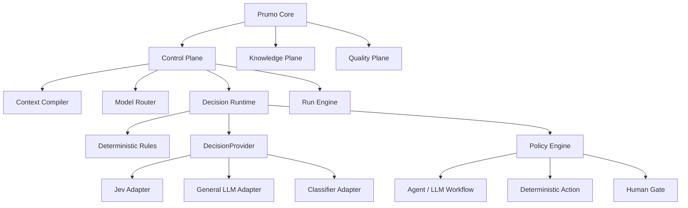
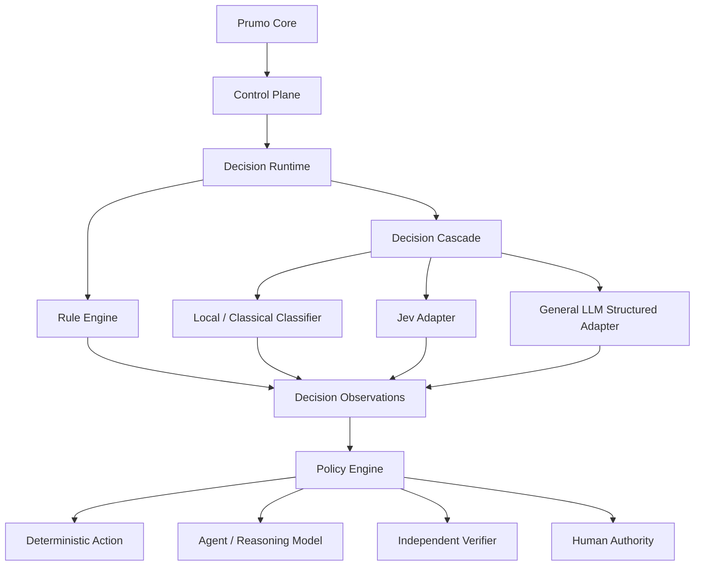
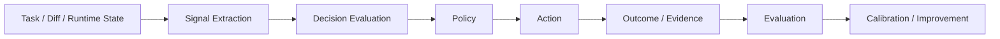
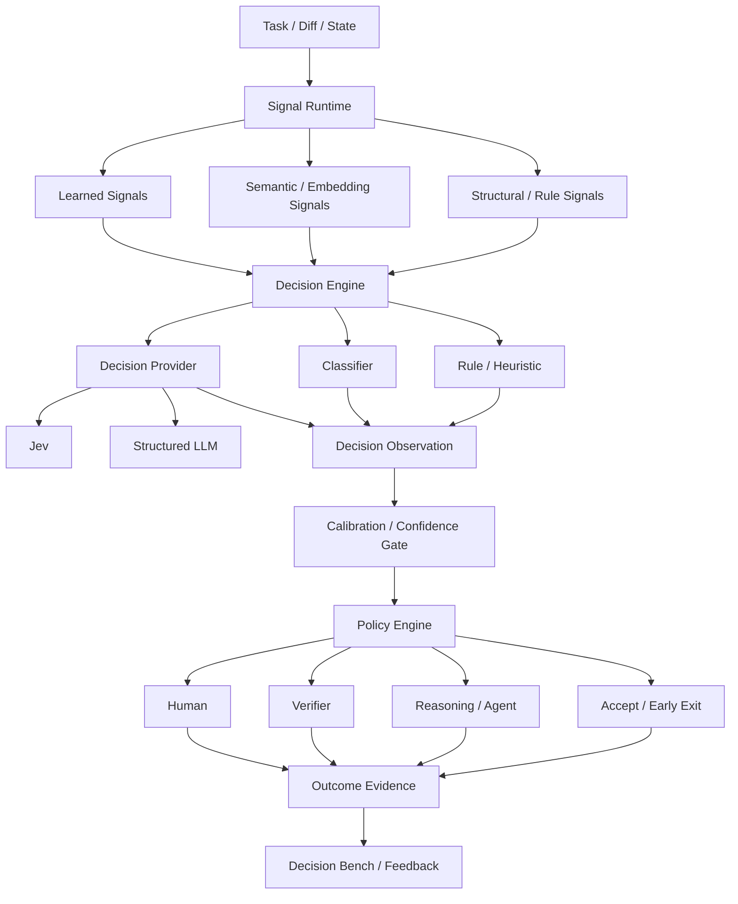

# 83 — Adendo: Decision Intelligence Runtime, System One e Decision Providers

> Authority: canonical specification.
> Logical ID: CONST-83
> Source: Notion Living Book (3e09bb7d023f81f8ac4afb4e85cc5d01)
> Status: Documento especializado: 83 — Adendo Decision Intelligence Runtime, System.


<aside>
🧠

**Status:** adendo arquitetural experimental. Este capítulo formaliza a hipótese de separar **decision intelligence** de **generative intelligence** no Prumo. **Jev 1.13 é tratado apenas como provider experimental de referência**, nunca como dependência arquitetural obrigatória.

</aside>

## Resumo executivo

O Prumo deve incorporar a filosofia de que **nem toda decisão agentic precisa ser tomada por um agente generativo**.

A arquitetura recomendada passa a distinguir quatro níveis:

| Nível | Mecanismo | Papel |
| --- | --- | --- |
| L0 — Rule | Go determinístico / policy engine | Invariantes, regras exatas, side effects, gates obrigatórios |
| L1 — Decision | DecisionProvider | Classificação, scoring, routing e julgamentos fuzzy com espaço de resposta fechado |
| L2 — Reasoning | LLM generativo / agent | Análise aberta, síntese, planejamento, programação, explicação e criação |
| L3 — Authority | Humano / policy explícita | Decisões críticas, irreversíveis, normativas ou de risco elevado |

O princípio é:

```
DETERMINISTIC
    ↓
quando possível

DECISION MODEL
    ↓
quando existe julgamento fuzzy,
mas o espaço de respostas é fechado

GENERATIVE MODEL
    ↓
quando precisamos criar,
raciocinar, programar ou explicar

HUMAN
    ↓
quando risco/incerteza exige
autoridade humana
```

Isso estende diretamente a regra já adotada no Prumo:

> **Hard-code invariants; configure policies; evaluate heuristics.**
> 

### Relação com capítulos existentes

- [48 — Agent Runtime Control Plane: Arquitetura e Princípios](../framework/specs/ch48.md)
- [50 — Context Compiler, Token Budget, Cache e Compaction](../framework/specs/ch50.md)
- [53 — Model Registry, Router, Drift, Fallback e Provider Health](../framework/specs/ch53.md)
- [32 — Test Provider Contract, Quality Orchestrator e Evidence Normalization](../framework/specs/ch32.md)

---

## 1. Não criar um novo Plane inicialmente

A primeira implementação não deve introduzir um novo top-level `Decision Plane`.

A recomendação é criar um **Decision Runtime dentro do Control Plane**, ao lado de Context Compiler, Model Router, Tool Gateway, Run Engine e demais mecanismos de controle.



Se, no futuro, o volume e a importância semântica justificarem um Plane independente, isso deve surgir por evidência e novo ADR, não por antecipação.

---

## 2. DecisionProvider como abstração canônica

Jev não deve aparecer como tipo arquitetural do Core.

O Core deve conhecer apenas um contrato provider-neutral semelhante a:

```go
type DecisionProvider interface {
    Decide(
        context.Context,
        DecisionRequest,
    ) (DecisionResult, error)
}
```

Modelo conceitual:

```
DecisionRequest
├── state
├── questions
├── constraints
├── policy_context
└── trace_context

DecisionQuestion
├── Choice
├── Score
└── Probability / BooleanProbability

DecisionResult
├── answers
├── distributions
├── confidence
├── provider
├── model_revision
├── latency
├── cost
└── trace metadata
```

O vocabulário interno do Prumo não precisa copiar termos específicos de vendors. Se Jev utilizar nomes próprios, estes podem permanecer confinados ao adapter.

---

## 3. Jev como provider experimental

Jev 1.13 deve ser estudado por sua filosofia e por sua especialização em decisões tipadas/probabilísticas.

Ele NÃO deve ser registrado como mais um LLM generativo comum.

Conceitualmente:

```
ModelProvider
→ gera texto/código/raciocínio/tool calls

DecisionProvider
→ gera classificação/score/probabilidade/choice
```

O adapter experimental Jev deve provar:

- latência;
- custo;
- qualidade de classificação;
- calibração;
- estabilidade;
- facilidade de schema;
- capacidade de batch/fan-out de perguntas;
- observabilidade;
- comportamento em baixa confiança;
- comportamento sob drift de distribuição;
- ganho real sobre rules e LLMs gerais.

---

## 4. A arquitetura NÃO depende do Jev

Este é um invariante.

O Decision Runtime deve operar mesmo quando:

- Jev não estiver disponível;
- Jev for caro;
- Jev não puder ser usado por política;
- Jev não funcionar offline;
- o provider desaparecer;
- o usuário preferir outro modelo;
- o projeto exigir local-only;
- benchmarks internos mostrarem que outra opção é melhor.

A ordem preferencial é:

```
deterministic rule
        ↓
classical/local decision mechanism
        ↓
specialized DecisionProvider
        ↓
general LLM with structured output
        ↓
reasoning model / human escalation
```

Nenhum degrau é obrigatório universalmente.

---

## 5. Provider determinístico

Muitos casos de uso NÃO exigem modelo algum.

Exemplo:

```
diff touches:
Cargo.lock / package-lock / go.sum
→ dependency_review = required

diff touches:
auth/
→ security_profile = material

schema version changed
→ migration_review = required

public CLI flags changed
→ docs.cli = stale

UI token changed
→ visual_regression = required
```

Essas decisões devem permanecer em código/policy, porque são:

- explicáveis;
- reproduzíveis;
- baratas;
- testáveis;
- versionáveis;
- auditáveis.

O objetivo do Decision Runtime não é substituir regras. É evitar usar modelos generativos para decisões que não são totalmente determinísticas, mas também não exigem raciocínio aberto.

---

## 6. Classificadores tradicionais e modelos locais

O mesmo contrato pode ser implementado por mecanismos muito menores que um LLM:

- logistic regression;
- gradient boosted trees;
- random forest;
- linear classifier;
- embeddings + nearest neighbors;
- reranker;
- small transformer classifier;
- local ONNX classifier;
- fine-tuned small language model;
- rules + statistical score híbrido.

Exemplo:

```
Task
  ↓
features
  ├── changed files
  ├── diff size
  ├── subsystem
  ├── dependency changes
  ├── historical labels
  └── project profile
  ↓
local classifier
  ↓
risk / task class / review class
```

Vantagens:

- offline;
- custo quase zero;
- latência baixa;
- reprodutibilidade maior;
- excelente para classes estáveis;
- útil quando há dados históricos suficientes.

Portanto, o Prumo deve permitir `ClassifierDecisionProvider`.

---

## 7. General LLM DecisionProvider

Um LLM geral também pode implementar o mesmo contrato, desde que usado de forma estreita.

Exemplo:

```
state:
  task + diff summary + project profile

questions:
  architecture_change:
    enum [no, local, cross_cutting]

  security_relevance:
    enum [none, low, material, critical]

  docs_impact:
    enum [none, small, material, major]
```

O LLM deve retornar somente structured output validado por schema.

Fluxo:

```
General LLM
   ↓
structured output
   ↓
schema validation
   ↓
DecisionResult
   ↓
Prumo Policy
```

O LLM não recebe autoridade operacional direta.

Ele produz **observações/decisões estruturadas**; o Core aplica policy.

Isso permite implementar o Decision Runtime inicialmente com providers já disponíveis, sem esperar por Jev.

---

## 8. Hybrid DecisionProvider

Uma abordagem particularmente promissora é combinar mecanismos.

```
Rule Engine
    ↓
if resolved → done
    ↓
if ambiguous
    ↓
Local Classifier
    ↓
if high confidence → done
    ↓
if ambiguous
    ↓
Jev / General LLM
    ↓
if low confidence
    ↓
Reasoning Model / Human
```

Essa arquitetura pode ser chamada de **Decision Cascade**.

Benefícios:

- custo mínimo;
- baixa latência;
- preserva determinismo;
- reduz chamadas de modelos;
- permite offline-first;
- oferece fallback natural;
- facilita experimentação A/B.

---

## 9. Policy separada do Provider

Nunca executar diretamente o resultado do modelo.

Errado:

```
Jev:
security_review = yes
→ invoke Security Agent
```

Correto:

```
DecisionProvider
    ↓
DecisionObservation
    ↓
Prumo Policy Engine
    ↓
accept / verify / escalate / reject
```

Princípio:

> **Provider = inteligência probabilística. Policy = autoridade operacional.**
> 

---

## 10. Confidence como dado de primeira classe

O Prumo deve tratar confiança como eixo próprio.

```
Decision
├── answer
├── probabilities
├── confidence
├── provider
├── revision
├── policy
├── input refs
└── resulting action
```

Padrão recomendado:

```
HIGH CONFIDENCE
→ cheap automatic path

MEDIUM CONFIDENCE
→ verifier / reasoning model

LOW CONFIDENCE
→ gather context / abstain / human
```

Thresholds não devem ser universais. Devem ser calibrados por:

- task class;
- project;
- provider;
- risk;
- consequence.

---

## 11. Abstention é resultado válido

O contrato deve aceitar explicitamente:

```
decided
uncertain
abstain
insufficient-context
provider-error
policy-blocked
needs-verification
```

Um provider que admite incerteza é preferível a um provider que sempre fabrica classificação.

---

## 12. Primeiros casos de uso no Prumo

Prioridade inicial:

### 12.1 Task Intake

Classificar:

- task class;
- complexity;
- likely scope;
- research need;
- architecture relevance;
- documentation impact;
- migration relevance;
- security relevance.

### 12.2 Documentation System

Apoiar:

- profile detection;
- documentation impact;
- workforce selection;
- delta classification;
- stale-doc triage;
- translation impact.

### 12.3 Workforce Selection

Sinalizar necessidade provável de:

- architecture;
- UI/UX;
- accessibility;
- security;
- performance;
- research;
- documentation;
- specialist reviewer.

O Core aplica Least Workforce.

### 12.4 Quality Orchestrator

Gerar sinais sobre:

- concurrency sensitivity;
- persistence sensitivity;
- migration sensitivity;
- visual impact;
- security relevance;
- performance relevance.

O plano de testes final permanece governado pelo Quality Orchestrator e por regras/policies.

### 12.5 Context Compiler

Uso somente como camada auxiliar/tie-breaker após:

```
structural lookup
→ exact references
→ graph/FTS
→ authority/freshness filters
→ semantic decision
```

Nunca substituir Authority, Freshness, Deduplication ou token budgeting determinísticos.

---

## 13. Model Router exige mais cautela

Não assumir que um DecisionProvider é automaticamente o melhor Model Router.

O roteamento de modelos deve continuar:

- eval-driven;
- task-class-specific;
- cost/latency-aware;
- provider-health-aware;
- drift-aware.

Decision Runtime pode fornecer features ao router, mas a promoção para controle real depende de evals internos.

---

## 14. Shadow Mode obrigatório

Antes de controlar qualquer workflow real:

```
Prumo decision real
        │
        ├── execução normal
        │
        └── DecisionProvider shadow
                ↓
              log
```

Comparar:

- expected decision;
- real decision;
- provider decision;
- confidence;
- cost;
- latency;
- false positives;
- false negatives;
- abstention;
- downstream outcome.

Somente depois promover para low-risk automation.

---

## 15. Prumo Decision Bench

Criar dataset próprio.

Exemplo:

```yaml
case: task-001
input:
  request: "change README typo"
expected:
  task_class: docs
  complexity: trivial
  architecture_review: false
  security_review: false
```

```yaml
case: task-002
input:
  request: "replace SQLite persistence format"
expected:
  task_class: migration
  complexity: architectural
  migration_review: true
  data_review: true
  documentation_delta: major
```

Comparar:

```
Rules
vs
Classical Classifier
vs
Jev
vs
Cheap General LLM
vs
Frontier LLM
```

Métricas:

- accuracy;
- macro/micro F1 quando apropriado;
- calibration;
- Brier score;
- abstention quality;
- latency;
- cost;
- deterministic reproducibility;
- downstream task success;
- false-negative cost;
- false-positive cost;
- agent calls avoided;
- expensive LLM calls avoided.

---

## 16. Roadmap experimental

| Fase | Objetivo | Controle produção |
| --- | --- | --- |
| D0 — Philosophy | Formalizar System One / Decision Runtime | Não |
| D1 — Contract | DecisionProvider + DecisionResult + Policy | Não |
| D2 — Deterministic Provider | Rules provider + fixtures | Sim, apenas regras existentes |
| D3 — General LLM Adapter | Structured-output provider substituível | Shadow |
| D4 — Jev Adapter | Provider especializado experimental | Shadow |
| D5 — Decision Bench | Comparação interna e calibração | Não |
| D6 — Low Risk | Task/docs/profile routing | Sim, gated |
| D7 — Medium Risk | Workforce/quality/context heuristics | Sim, gated |
| D8 — Model Routing | Experimentos controlados | Somente após eval |
| D9 — High Risk | Security/migrations/release | Nunca provider sozinho |

---

## 17. Arquitetura final desejada



---

## 18. Invariantes

1. **Jev is optional.**
2. **DecisionProvider is canonical; vendor adapters are replaceable.**
3. **Rules win when the decision can be deterministic.**
4. **Provider output never bypasses policy.**
5. **Confidence never substitutes for evidence.**
6. **Low confidence may abstain.**
7. **High-risk decisions require independent verification and/or human authority according to policy.**
8. **No chain-of-thought is stored as audit evidence.**
9. **Every material automated decision should be explainable through structured inputs, provider, result, confidence, policy and resulting action.**
10. **Promotion from shadow to production is eval-driven.**
11. **General LLMs can implement the same DecisionProvider contract.**
12. **Local/classical classifiers are first-class candidates.**
13. **The architecture must survive removal of every probabilistic provider.**

---

## 19. Recomendação de implementação inicial

O primeiro protótipo não precisa de Jev.

Implementar nesta ordem:

```
Decision contract
→ RuleDecisionProvider
→ Policy Engine
→ trace/evidence
→ fixtures
→ GeneralLLMDecisionProvider
→ Shadow Mode
→ Decision Bench
→ Jev adapter opcional
```

Isso prova a arquitetura antes de provar o vendor.

---

## 20. Regra final

> **A descoberta mais importante não é “usar Jev”. É reconhecer que classification, scoring, routing e gating são uma classe arquitetural própria e não deveriam exigir, por padrão, um agente generativo completo.**
> 

A arquitetura-alvo do Prumo passa a ser:

```
Deterministic Software
        +
Probabilistic Decisions
        +
Generative Reasoning
        +
Explicit Policies
        +
Evidence
        +
Human Authority
```

Jev é um experimento valioso dentro dessa arquitetura; não é sua fundação.

---

## 21. Pesquisa aprofundada — fundamentos externos para o Decision Runtime

Este adendo foi enriquecido com pesquisa em documentação oficial, papers acadêmicos e projetos open source. O resultado reforça que a direção arquitetural não é específica ao Jev: ela se conecta a linhas maduras de pesquisa em **selective prediction**, **reject option**, **learning to defer**, **confidence calibration**, **conformal prediction**, **adaptive inference**, **LLM cascades** e **semantic routing**.

### 21.1 Linha conceitual

A ideia central pode ser vista como convergência de várias áreas:

```
classification with reject option
        ↓
selective prediction
        ↓
calibrated uncertainty
        ↓
learning to defer
        ↓
adaptive / early-exit inference
        ↓
model cascades
        ↓
LLM routing
        ↓
signal-driven decision orchestration
        ↓
Prumo Decision Runtime
```

O Prumo não precisa inventar a disciplina do zero. Ele deve adaptá-la ao contexto de engenharia de software e agentes.

---

## 22. Selective prediction e reject option

A literatura clássica de selective classification trata explicitamente o problema de um modelo poder **abster-se** quando não consegue garantir risco aceitável.

Referências importantes:

- [On the Foundations of Noise-free Selective Classification — El-Yaniv & Wiener, JMLR 2010](https://www.jmlr.org/papers/v11/el-yaniv10a.html)
- [Classification Methods with Reject Option Based on Convex Risk Minimization — Yuan & Wegkamp, JMLR 2010](https://www.jmlr.org/papers/v11/yuan10a.html)
- [SelectiveNet: A Deep Neural Network with an Integrated Reject Option — ICML 2019](https://proceedings.mlr.press/v97/geifman19a)
- [Optimal Strategies for Reject Option Classifiers — JMLR 2023](https://www.jmlr.org/beta/papers/v24/21-0048.html)

### Implicação para o Prumo

`abstain` não deve ser tratado como falha excepcional.

Deve ser resultado normal:

```
DecisionStatus
├── decided
├── abstained
├── insufficient_context
├── needs_verification
├── policy_blocked
└── provider_error
```

Além disso, devemos medir explicitamente **risk–coverage**:

```
coverage ↑
→ maior automação
→ possivelmente maior erro

coverage ↓
→ mais defer/escalation
→ maior qualidade seletiva
```

Portanto o Decision Bench não deve medir somente accuracy. Deve medir também:

- coverage;
- selective risk;
- false-negative cost;
- false-positive cost;
- abstention rate;
- escalation rate.

---

## 23. Learning to Defer

A área de Learning to Defer formaliza sistemas nos quais o modelo pode encaminhar decisões para um especialista/humano.

Referências:

- [Consistent Estimators for Learning to Defer to an Expert — ICML 2020](https://proceedings.mlr.press/v119/mozannar20b.html)
- [Calibrated Learning to Defer with One-vs-All Classifiers — ICML 2022](https://proceedings.mlr.press/v162/verma22c.html)
- [Who Should Predict? Exact Algorithms For Learning to Defer to Humans — AISTATS 2023](https://proceedings.mlr.press/v206/mozannar23a.html)
- [Exploiting Human-AI Dependence for Learning to Defer — ICML 2024](https://proceedings.mlr.press/v235/wei24a.html)

### Implicação para o Prumo

A pergunta relevante não é apenas:

> “Estou confiante?”
> 

Mas:

> “Quem tem maior expectativa de acerto/custo-benefício para esta decisão?”
> 

Então o Prumo pode evoluir de:

```
confidence threshold
→ accept / human
```

para:

```
Decision Utility
├── rules expected utility
├── classifier expected utility
├── decision model expected utility
├── reasoning model expected utility
└── human/reviewer expected utility
```

Isso sugere futuramente um `DeferralPolicy` explícito.

---

## 24. Confidence não é suficiente — calibração importa

Modelos neurais podem ser sistematicamente superconfiantes.

Referências:

- [On Calibration of Modern Neural Networks — ICML 2017](https://proceedings.mlr.press/v70/guo17a)
- [Trainable Calibration Measures for Neural Networks — ICML 2018](https://proceedings.mlr.press/v80/kumar18a)
- [Expectation Consistency for Calibration — UAI 2023](https://proceedings.mlr.press/v216/clarte23a.html)
- [How Flawed Is ECE? — ICML 2024](https://proceedings.mlr.press/v235/chidambaram24a.html)
- [Can a calibration metric be both testable and actionable? — COLT 2025](https://proceedings.mlr.press/v291/rossellini25a.html)
- [A Perfectly Truthful Calibration Measure — COLT 2026](https://proceedings.mlr.press/v336/hartline26a.html)

### Consequência arquitetural

Nunca tratar `confidence = 0.9` como equivalente a “90% de chance real de acerto” sem calibração empírica.

Precisamos distinguir:

```
raw confidence
calibrated confidence
empirical correctness
decision threshold
```

O Prumo deve armazenar calibration profile por:

- provider;
- model/revision;
- decision class;
- project/domain;
- risk profile.

### Métricas candidatas

- Brier Score;
- negative log likelihood;
- ECE apenas como métrica complementar;
- risk–coverage curves;
- calibration curves;
- cutoff/actionable calibration para decisões com thresholds.

---

## 25. Conformal prediction como camada opcional futura

Conformal Prediction oferece mecanismos model-agnostic de quantificação de incerteza com garantias estatísticas sob hipóteses específicas.

Referência:

- [Conformal Prediction for Natural Language Processing: A Survey — 2024](https://arxiv.org/abs/2405.01976)

Não é recomendação para V1 do Decision Runtime.

Porém pode ser estudado posteriormente para:

- gerar prediction sets em vez de choice única;
- abstention baseada em conjuntos muito amplos;
- risk bounds;
- policy gates em domínios de maior risco.

Exemplo conceitual:

```
architecture_change prediction set:

{ local, cross_cutting }
```

é sinal explícito de incerteza maior do que:

```
{ cross_cutting }
```

---

## 26. Adaptive inference e early exit

A literatura de adaptive neural networks mostra um princípio diretamente compatível com nossa Decision Cascade:

> exemplos simples não devem pagar o custo computacional de exemplos difíceis.
> 

Referência:

- [Adaptive Neural Networks for Efficient Inference — 2017](https://arxiv.org/abs/1702.07811)

Aplicação ao Prumo:

```
easy decision
→ rule

slightly ambiguous
→ cheap classifier

hard decision
→ specialized/general decision model

open-ended hard decision
→ reasoning model

high consequence
→ independent verifier / human
```

Portanto a Decision Cascade pode ser interpretada como **early exit de inteligência**.

---

## 27. LLM cascades

O trabalho FrugalGPT demonstra que cascades podem reduzir custo de uso de LLMs mantendo ou melhorando qualidade em determinados cenários.

Referência:

- [FrugalGPT: How to Use Large Language Models While Reducing Cost and Improving Performance — 2023](https://arxiv.org/abs/2305.05176)

Isso reforça a ideia de:

```
cheap path first
→ escalation only when necessary
```

Mas a implementação do Prumo deve ser mais estrita:

- regras antes de modelos;
- abstention explícita;
- policies versionadas;
- side effects fora do provider;
- evals por task class;
- high-risk verification independente.

---

## 28. Learned LLM routing

Há pesquisa crescente em roteamento entre modelos.

Referências:

- [RouteLLM: Learning to Route LLMs with Preference Data — 2024](https://arxiv.org/abs/2406.18665)
- [RouterBench: A Benchmark for Multi-LLM Routing System — 2024](https://arxiv.org/abs/2403.12031)
- [LLMRouterBench — 2026](https://arxiv.org/abs/2601.07206)

### Resultado importante para nossa arquitetura

LLMRouterBench reporta que várias estratégias recentes de routing ficam próximas de baselines simples quando avaliadas de maneira unificada.

Isso é um alerta arquitetural:

> complexidade do router deve ser conquistada por evidência, não assumida como automaticamente superior.
> 

Portanto:

```
baseline rules
→ simple classifier
→ learned router
```

só deve avançar se houver ganho mensurável.

---

## 29. Signal-driven routing — referência extremamente próxima

O projeto open source **vLLM Semantic Router** tornou-se uma referência particularmente relevante.

Referências:

- [vLLM Semantic Router — GitHub](https://github.com/vllm-project/semantic-router)
- [Signal Driven Decision Routing for Mixture-of-Modality Models — 2026](https://arxiv.org/abs/2603.04444)
- [Workload–Router–Pool Architecture — 2026](https://arxiv.org/abs/2603.21354)
- [System Overview](https://github.com/vllm-project/semantic-router/blob/main/website/docs/overview/semantic-router-overview.md)

O sistema combina sinais heterogêneos:

```
heuristic signals
embedding signals
classifiers
domain
intent
context length
PII
safety
modality
history
preferences
```

e então aplica **decision/policy composition**.

Isso é muito próximo da arquitetura que queremos no Prumo.

### Diferença fundamental

vLLM Semantic Router resolve principalmente **inference routing**.

Prumo precisa de algo mais amplo:

```
task routing
workforce routing
documentation routing
quality routing
context routing
tool routing
model routing
human deferral
workflow gates
```

Portanto devemos estudar suas técnicas, não copiá-lo como componente central.

---

## 30. Signal → Decision → Policy → Action

Após a pesquisa, esta deve ser a abstração principal.



### Signals

Sinais podem ser:

```
deterministic
├── touched files
├── schemas
├── dependency manifests
├── test failures
├── branch state
├── risk policy
└── project capabilities

semantic
├── task intent
├── architecture relevance
├── documentation relevance
├── security relevance
└── likely complexity

learned
├── classifier scores
├── embeddings
├── reranker scores
└── model predictions
```

### Decision

Decision combina sinais, mas não executa side effect.

### Policy

Policy transforma decision em permissão/rota.

### Action

Action pertence ao Run/Execution plane.

---

## 31. Signal Registry

Recomendação nova: criar `SignalProvider` separado de `DecisionProvider`.

Conceitualmente:

```go
type SignalProvider interface {
    Evaluate(
        context.Context,
        SignalRequest,
    ) (SignalSet, error)
}
```

Exemplos:

```
GitDiffSignalProvider
DependencySignalProvider
RepositoryStructureSignalProvider
TestFailureSignalProvider
EmbeddingSignalProvider
ClassifierSignalProvider
DecisionModelSignalProvider
HistoricalOutcomeSignalProvider
```

Isso evita que DecisionProvider vire um “god interface”.

---

## 32. Decision Rule DSL / Policy DSL

A pesquisa em semantic routers reforça o valor de policies declarativas.

O Prumo deve considerar um formato simples e versionável:

```yaml
decision:
  id: review.security
  when:
    any:
      - signal: change.auth
        equals: true
      - signal: security.relevance
        gte: 0.80

  action:
    require:
      - security-review
```

Requisitos:

- schema validável;
- conflitos detectáveis;
- deterministic evaluation;
- explain output;
- dry-run;
- versioning;
- provenance.

Nunca permitir lógica arbitrária e opaca em prompts para invariantes críticos.

---

## 33. Decision Trace

Toda decisão material deve produzir trace estruturado:

```yaml
decision_id: review.security
inputs:
  - change.auth
  - security.relevance

signals:
  change.auth:
    value: true
    source: git-diff

  security.relevance:
    value: 0.91
    source: classifier-v2

policy:
  id: security-review-v3

outcome:
  require: security-review

provider_calls: []

evidence:
  - diff://...
```

Se Jev/LLM participou:

```yaml
provider:
  kind: decision-provider
  id: jev
  revision: ...

confidence:
  raw: ...
  calibrated: ...
```

Sem chain-of-thought.

---

## 34. Outcome feedback

Decision Runtime deve aprender com resultados observados.

Exemplo:

```
decision:
"migration review unnecessary"

outcome:
migration regression found
```

Isso deve gerar:

- false negative;
- benchmark fixture;
- policy review candidate;
- calibration update;
- classifier training example.

Fluxo:

```
decision
→ action
→ outcome
→ evidence
→ evaluation
→ calibration / policy proposal
```

Nunca atualizar policy automaticamente em produção sem governance.

---

## 35. Decision Dataset

Criar dataset versionado:

```
.prumo/evals/decision/
├── intake/
├── security/
├── documentation/
├── quality/
├── workforce/
├── context/
└── routing/
```

Cada fixture deve possuir:

```yaml
id:
input_refs:
signals:
expected_decisions:
acceptable_alternatives:
risk:
false_positive_cost:
false_negative_cost:
source:
review_status:
```

Casos reais promovidos ao dataset após review.

---

## 36. Custos assimétricos

Accuracy isolada é insuficiente.

Exemplo:

```
false negative:
security review skipped
cost = very high

false positive:
extra security review
cost = moderate
```

Então thresholds devem otimizar **expected decision cost**, não simplesmente accuracy.

Conceito:

```
ExpectedCost =
P(false positive) × FP_cost
+
P(false negative) × FN_cost
+
inference_cost
+
latency_cost
+
human_review_cost
```

Isso aproxima o Decision Runtime de uma engine de policy econômica/operacional.

---

## 37. Coverage budgets

Cada decision class pode definir alvo de automação:

```yaml
decision_class: docs-impact

target:
  max_selective_risk: 0.02
  min_coverage: 0.85
```

Em risco alto:

```yaml
decision_class: migration-safe

target:
  max_selective_risk: 0.001
  coverage: best-effort
```

Assim a automação não precisa perseguir cobertura máxima.

---

## 38. OOD e distribution shift

Decisions podem degradar quando:

- nova linguagem entra;
- projeto muda de arquitetura;
- novo provider/model;
- novo tipo de task;
- repository scale muda;
- workflow muda.

Portanto registrar:

```
training/eval distribution
current workload distribution
provider revision
project profile
```

E observar:

- confidence drift;
- class frequency drift;
- error drift;
- abstention drift.

Model drift já existe no Prumo; Decision Runtime deve estender a mesma filosofia.

---

## 39. Ensembles como opção

Deep Ensembles são referência clássica para melhoria de uncertainty estimation:

- [Simple and Scalable Predictive Uncertainty Estimation using Deep Ensembles — NeurIPS 2017](https://proceedings.neurips.cc/paper/2017/hash/9ef2ed4b7fd2c810847ffa5fa85bce38-Abstract.html)

Não recomendar para primeiro corte.

Mas futuramente:

```
rule signal
+
classifier A
+
classifier B
+
decision model
```

podem produzir disagreement signal.

Disagreement alto:

```
→ abstain / escalate
```

---

## 40. Semantic routing local

Projetos como Semantic Router demonstram que várias decisões de roteamento podem ser feitas com embeddings e classificadores locais antes de usar LLM.

Referências:

- [Aurelio Labs Semantic Router](https://github.com/aurelio-labs/semantic-router)
- [vLLM Semantic Router](https://github.com/vllm-project/semantic-router)

Para o Prumo, isso sugere um caminho local-first:

```
exact structural signals
→ embedding similarity
→ small classifier/reranker
→ probabilistic decision provider
→ reasoning model
```

---

## 41. Go-native learned routing

Como Prumo é Go-first, vale acompanhar implementações pequenas de routing em Go.

Exemplo de referência de engenharia:

- [OpenCSGs semantic-router — Go learned LLM routing](https://github.com/OpenCSGs/semantic-router)

Não é recomendação automática de dependência.

É referência para:

- trace storage;
- pairwise preference;
- profile fitting;
- small learned router;
- integração nativa Go.

---

## 42. RouteMoA e seleção pré-inferência

RouteMoA propõe uma abordagem que usa scorer leve para reduzir previamente candidatos antes de colaboração mais cara:

- [RouteMoA — 2026](https://arxiv.org/abs/2601.18130)

A lição relevante:

> reduzir o espaço de candidatos antes da inferência pesada.
> 

Aplicação no Prumo:

```
50 skills
→ deterministic capability filter
→ 8 candidates
→ semantic/decision scoring
→ 2 candidates
→ agent selection
```

O mesmo vale para:

- agents;
- tools;
- models;
- docs;
- knowledge units.

---

## 43. Decision Runtime não deve virar um segundo Agent Runtime

Guardrail importante.

Decision Runtime:

- recebe state limitado;
- responde espaço fechado;
- não executa ferramentas arbitrárias por padrão;
- não mantém conversação livre;
- não escreve arquivos;
- não possui authority de side effects;
- não cria plano aberto.

Agent Runtime:

- raciocina;
- usa ferramentas;
- gera código;
- modifica estado;
- executa workflows longos.

Essa separação reduz blast radius.

---

## 44. API conceitual revisada

```go
type DecisionEngine interface {
    Evaluate(
        context.Context,
        DecisionRequest,
    ) (DecisionEvaluation, error)
}

type DecisionEvaluation struct {
    Signals      []Signal
    Decisions    []Decision
    Abstentions  []Abstention
    Trace        DecisionTrace
}
```

Provider contract:

```go
type DecisionProvider interface {
    Capabilities() DecisionProviderCapabilities

    Decide(
        context.Context,
        ProviderDecisionRequest,
    ) (ProviderDecisionResult, error)
}
```

Separar `DecisionEngine` de `DecisionProvider` é importante:

```
DecisionEngine
= orchestration + policy-neutral evaluation

DecisionProvider
= one source of probabilistic/semantic decisions
```

---

## 45. Providers iniciais recomendados

### Provider A — RuleDecisionProvider

Obrigatório.

### Provider B — HeuristicDecisionProvider

Funções simples:

- weighted scores;
- deterministic feature combinations;
- thresholds.

### Provider C — EmbeddingDecisionProvider

Opcional.

Use para:

- semantic intent;
- nearest known task;
- skill matching;
- agent matching.

### Provider D — ClassifierDecisionProvider

Modelo local/ONNX quando dataset existir.

### Provider E — StructuredLLMDecisionProvider

Usa LLM geral com JSON Schema/structured output.

Deve existir antes de depender de Jev.

### Provider F — JevDecisionProvider

Experimental.

Otimizado para typed probabilistic decisions quando disponível.

---

## 46. Provider selection também é policy

Não criar recursão ilimitada do tipo “modelo decide qual modelo decide”.

Seleção do DecisionProvider deve começar deterministicamente por decision class.

Exemplo:

```yaml
decision_class: task-intent

provider_order:
  - embeddings
  - classifier
  - structured-llm

decision_class: architecture-impact

provider_order:
  - rules
  - classifier
  - structured-llm
```

Jev pode ser inserido experimentalmente no provider order.

---

## 47. Jev — posição final após pesquisa

Jev continua muito interessante porque sua proposta casa diretamente com:

```
unstructured state
→ typed probabilistic decision
```

Fonte primária:

- [Introducing System One Models & Jev — TypeSafe AI, 2026](https://typesafe.ai/blog/introducing-system-one-models-and-jev)
- [TypeSafe AI](https://typesafe.ai/)

Pontos atrativos:

- outputs tipados;
- probabilities/confidence;
- saída paralela;
- custo/latência declarados muito baixos;
- foco explícito em automation.

### Mas manter cautela

Jev é tecnologia muito recente.

Portanto:

- claims de performance precisam de validação própria;
- early access implica risco operacional;
- arquitetura/training detalhados ainda têm pouca validação pública independente;
- provider lock-in deve ser evitado;
- “não hallucina” deve ser interpretado como impossibilidade de gerar output fora do tipo/espaço definido, não garantia de decisão correta.

Conclusão:

> **Jev é excelente candidato de experimento, não dependência fundacional.**
> 

---

## 48. Arquitetura recomendada v2



---

## 49. Implementação Go — packages sugeridos

Sem congelar nomes ainda, uma decomposição possível:

```
internal/decision/
├── engine/
├── signal/
├── policy/
├── provider/
│   ├── rules/
│   ├── heuristic/
│   ├── embedding/
│   ├── classifier/
│   ├── llm/
│   └── jev/
├── calibration/
├── trace/
├── eval/
└── fixture/
```

Guardrail:

- evitar package por tipo minúsculo;
- abstrações devem surgir de seams reais;
- Jev adapter não pode contaminar contratos do Core.

---

## 50. Vertical slice recomendado

Primeiro slice:

```
Task Intake
```

Entradas:

- user request;
- project profile;
- current goal;
- changed files se existirem.

Decisions:

```
task_class
complexity
architecture_relevance
security_relevance
documentation_impact
research_need
```

Providers iniciais:

```
rules
+
structured general LLM
```

Jev entra depois em shadow.

Outcome:

```
workforce recommendation
+
documentation plan signal
+
risk signal
```

Nenhum side effect direto.

---

## 51. Segundo vertical slice

```
Documentation Impact
```

Objetivo:

```
diff
→ impacted semantic docs
→ translation delta
→ docs workforce
```

É um ótimo caso porque false positives são baratos e podemos coletar labels rapidamente.

---

## 52. Terceiro vertical slice

```
Quality Plan Signals
```

Não gerar plano inteiro por IA.

Gerar somente sinais:

```
likely_visual
likely_migration
likely_concurrency
likely_security
likely_performance
```

Quality Orchestrator continua aplicando regras.

---

## 53. Não iniciar por security

Security é caso importante, mas ruim como primeiro experimento.

Razões:

- custo alto de false negative;
- labels mais difíceis;
- necessidade de domain expertise;
- drift grave.

Começar com:

1. task classification;
2. documentation impact;
3. workforce selection;
4. test relevance de baixo risco.

Depois avançar.

---

## 54. Evals necessários antes de produção

### Offline eval

- accuracy/F1;
- risk–coverage;
- calibration;
- false-positive/negative cost;
- abstention quality;
- latency;
- cost.

### Shadow eval

Comparar com decisões reais do Prumo.

### Counterfactual eval

Perguntar:

> se esta decisão tivesse controlado o workflow, teria melhorado ou piorado o resultado?
> 

### Drift eval

Reexecutar corpus em:

- provider update;
- model revision;
- policy update;
- major project profile change.

---

## 55. Governance de thresholds

Thresholds devem ser artefatos versionados.

Exemplo:

```yaml
decision: documentation.material-impact
version: 2

thresholds:
  auto_accept: 0.92
  verify: 0.70
  abstain_below: 0.70

risk:
  false_negative_weight: 3.0
  false_positive_weight: 1.0
```

Mudança material de threshold deve gerar:

- benchmark;
- comparison;
- approval conforme risco;
- changelog.

---

## 56. Default seguro

Quando Decision Runtime estiver indisponível:

```
do not fail open
```

Fallback depende de classe.

Exemplos:

```
low risk task classification
→ generic path

security/migration decision
→ conservative review path
```

---

## 57. Observabilidade

Métricas:

```
decision_requests_total
decision_abstentions_total
decision_escalations_total
decision_latency
decision_cost
decision_coverage
decision_selective_risk
decision_calibration_error
decision_false_positive
decision_false_negative
decision_provider_disagreement
```

Não armazenar conteúdo sensível sem policy.

---

## 58. Privacy e data-egress

Signal/Decision provider também precisa respeitar Data Classification.

Exemplo:

```
secret-bearing diff
→ local rules/classifier only

public task description
→ remote DecisionProvider allowed
```

O Decision Runtime deve consultar egress policy antes de provider selection.

---

## 59. Relação com Least Context

Decision providers não devem receber repository dumps.

Criar **Decision Context Compiler** mínimo ou profile específico do Context Compiler:

```
task
+ selected structural signals
+ concise project profile
+ relevant diff summary
+ exact relevant contract refs
```

Medir:

```
decision quality per token
```

---

## 60. Relação com Least Workforce

Decision Runtime transforma Least Workforce de princípio em mecanismo mensurável.

Medir:

```
agents invoked per task
specialist calls avoided
missed-specialist rate
cost/task
quality/task
```

Goal:

> reduzir workforce sem aumentar selective risk além do budget.
> 

---

## 61. Relação com Experience Layer

Resultados históricos podem virar training/eval data, nunca regra canônica automática.

```
experience
→ candidate signal
→ benchmark
→ pattern proposal
→ review
→ classifier/policy update
```

Preserva a filosofia Global Learning Layer.

---

## 62. Decision Runtime maturity model

```
M0
Rules only

M1
Rules + traces + explicit policies

M2
Semantic signals / embeddings

M3
Structured general LLM in shadow

M4
Calibrated classifiers / Jev in shadow

M5
Low-risk selective automation

M6
Learned deferral + cascades

M7
Cross-project learned routing with governance
```

Nunca saltar maturidade apenas porque provider parece forte.

---

## 63. ADOPT / ADAPT / AVOID da pesquisa

### ADOPT

- abstention como first-class;
- risk–coverage;
- calibration;
- signal-driven routing;
- explicit policy;
- provider-neutrality;
- cascades;
- shadow evaluation;
- workload-specific evals;
- human deferral.

### ADAPT

- LLM model routing → generalizar para workforce/docs/tools/context;
- semantic routing → usar somente após structural routing;
- learning-to-defer → aplicar a expert agents/humans;
- conformal prediction → research tier futuro;
- ensembles → disagreement signal futuro.

### AVOID

- confidence bruto como verdade;
- LLM como authority;
- direct side effects por model output;
- routing complexo sem baseline;
- automatic online policy mutation;
- Jev-specific core abstractions;
- “AI decides everything” orchestration.

---

## 64. Novos research questions

Registrar como backlog:

1. Qual porcentagem das decisões atuais do Prumo é totalmente determinística?
2. Qual porcentagem necessita apenas classificação fechada?
3. Quanto custo/token pode ser removido antes de afetar task success?
4. Qual risk–coverage ideal por decision class?
5. Que decision classes se beneficiam realmente de Jev?
6. Structured LLM barato é suficiente?
7. Quando embeddings + KNN superam classifier?
8. Podemos aprender workforce routing com Experience Layer?
9. Como detectar OOD em novos tipos de projeto?
10. Quais métricas de calibration são mais acionáveis para nossos thresholds?
11. Que decisões exigem verifier independente?
12. Decision Context pode usar menos de 5% do contexto do agent executor?
13. Quanto Least Workforce pode reduzir sem aumentar regressões?
14. Como incorporar cost-sensitive false negative/positive em policy?
15. Podemos oferecer Decision Runtime local-only com ONNX?

---

## 65. Research source index

### System One / Jev

- [TypeSafe AI — Introducing System One Models & Jev](https://typesafe.ai/blog/introducing-system-one-models-and-jev)
- [TypeSafe AI](https://typesafe.ai/)

### Selective prediction / reject

- [El-Yaniv & Wiener 2010](https://www.jmlr.org/papers/v11/el-yaniv10a.html)
- [Yuan & Wegkamp 2010](https://www.jmlr.org/papers/v11/yuan10a.html)
- [SelectiveNet 2019](https://proceedings.mlr.press/v97/geifman19a)
- [Optimal Reject Option 2023](https://www.jmlr.org/beta/papers/v24/21-0048.html)

### Learning to defer

- [Mozannar & Sontag 2020](https://proceedings.mlr.press/v119/mozannar20b.html)
- [Verma & Nalisnick 2022](https://proceedings.mlr.press/v162/verma22c.html)
- [Who Should Predict? 2023](https://proceedings.mlr.press/v206/mozannar23a.html)
- [Wei et al. 2024](https://proceedings.mlr.press/v235/wei24a.html)

### Calibration / uncertainty

- [Guo et al. 2017](https://proceedings.mlr.press/v70/guo17a)
- [Deep Ensembles 2017](https://proceedings.neurips.cc/paper/2017/hash/9ef2ed4b7fd2c810847ffa5fa85bce38-Abstract.html)
- [Clarté et al. 2023](https://proceedings.mlr.press/v216/clarte23a.html)
- [LS-ECE 2024](https://proceedings.mlr.press/v235/chidambaram24a.html)
- [Actionable Calibration 2025](https://proceedings.mlr.press/v291/rossellini25a.html)
- [Truthful Calibration 2026](https://proceedings.mlr.press/v336/hartline26a.html)
- [Conformal Prediction for NLP Survey](https://arxiv.org/abs/2405.01976)

### Cascades / routing

- [FrugalGPT](https://arxiv.org/abs/2305.05176)
- [RouteLLM](https://arxiv.org/abs/2406.18665)
- [RouterBench](https://arxiv.org/abs/2403.12031)
- [LLMRouterBench](https://arxiv.org/abs/2601.07206)
- [RouteMoA](https://arxiv.org/abs/2601.18130)

### Current systems

- [vLLM Semantic Router](https://github.com/vllm-project/semantic-router)
- [vLLM Signal-Driven Decision Routing](https://arxiv.org/abs/2603.04444)
- [vLLM Workload–Router–Pool Architecture](https://arxiv.org/abs/2603.21354)
- [Aurelio Semantic Router](https://github.com/aurelio-labs/semantic-router)
- [OpenCSGs semantic-router](https://github.com/OpenCSGs/semantic-router)

---

## 66. Atualização da recomendação final

A recomendação de implementação fica agora:

```
D0  Formalize decision classes
D1  SignalRegistry + deterministic signals
D2  Policy DSL + DecisionTrace
D3  Rule/Heuristic Decision Engine
D4  Decision Bench + risk/coverage metrics
D5  StructuredLLMDecisionProvider in shadow
D6  Embedding/classifier providers
D7  Calibration + abstention
D8  JevDecisionProvider experimental shadow
D9  Low-risk selective automation
D10 Learned deferral/cascade
D11 Broader workforce/tool/model routing
```

O primeiro objetivo não é maximizar automação.

O primeiro objetivo é:

> **obter decisões pequenas, auditáveis, calibradas e substituíveis, com custo proporcional ao risco.**
> 

Esse princípio deve permanecer mesmo que Jev nunca seja usado.