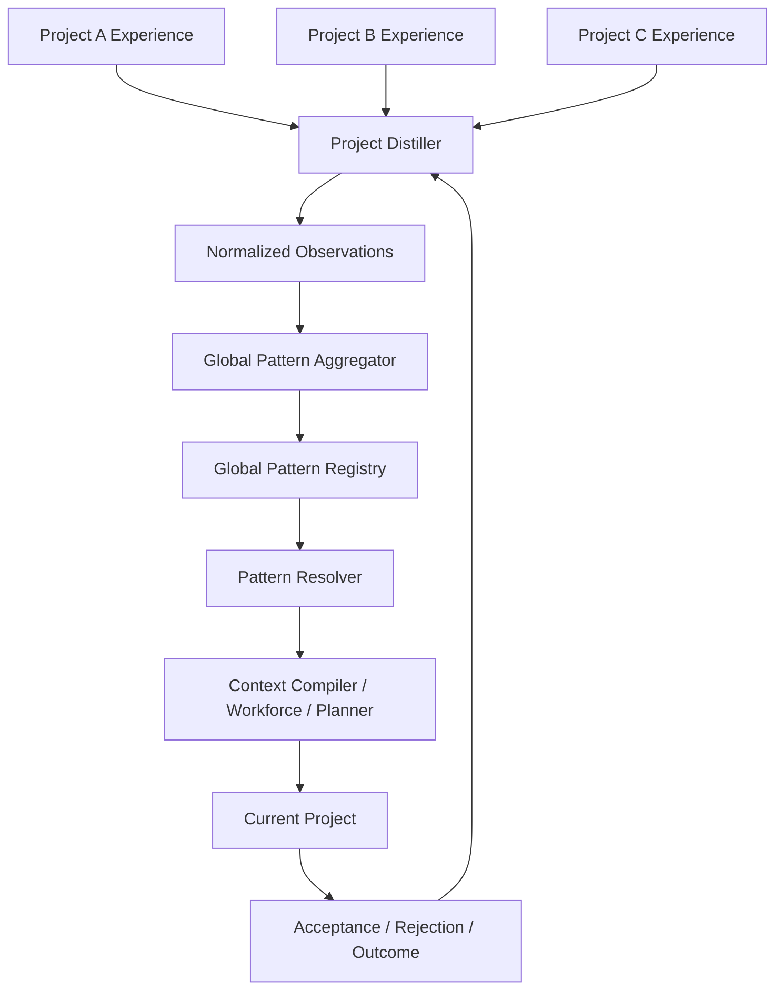

# 81 — Global Learning Layer: Padrões Cross-Project, Preferências Globais e Filosofias Compartilhadas

> Authority: canonical specification.
> Logical ID: CONST-81
> Source: Notion Living Book (3de9bb7d023f81deb239f020182d4972)
> Status: Especificação da Global Learning Layer e Padrões Cross-Project.


<aside>
🧠

**Status:** proposta arquitetural aprovada para extensão do Experience Layer. Objetivo: permitir que o Prumo aprenda padrões recorrentes entre projetos diferentes, consolide filosofias e preferências reutilizáveis em escopo global e aplique esse conhecimento em novos projetos sem confundir inferência com regra canônica.

</aside>

# Problema

O Prumo já possui aprendizado **cross-session** por meio do Experience Layer, `SessionEvent`, summaries, `ExperienceProposal`, review e promoção para conhecimento/skills/recipes. Porém o mecanismo atual é essencialmente project-local: a implementação `FileProvider` grava em um `rootDir`, normalmente `.prumo/experience/`, e `ExperienceProposal` registra uma sessão de origem, mas não modela `ProjectID`, escopo global, frequência entre projetos, contradições cross-project, confiança agregada ou applicability constraints.

Portanto, o Prumo **já possui a fundação correta**, mas ainda não possui um verdadeiro mecanismo de aprendizado global entre projetos.

# Objetivo

Construir um **Global Learning Layer** sobre o Experience Layer existente para responder a perguntas como:

- “Esta preferência apareceu somente neste projeto ou em quase todos?”
- “Nós sempre escolhemos modularidade forte, Clean Code pragmático e boundaries explícitos?”
- “Quando fazemos TUI em Go, quais padrões de arquitetura repetimos?”
- “Em projetos gráficos low-spec, quais decisões de performance aparecem recorrentemente?”
- “Esta correção recorrente deveria virar skill, recipe, policy, template ou apenas preferência?”

O resultado deve permitir que um novo projeto já comece com o conhecimento acumulado dos projetos anteriores, **sem copiar cegamente decisões incompatíveis com o novo contexto**.

# Princípio central

**Project experience teaches. Global experience generalizes. Canonical project state still wins.**

Um padrão global é uma hipótese reutilizável com provenance e confidence. Ele não possui autoridade para sobrescrever requirements, ADRs, security policies, canonical documentation ou decisões explícitas do projeto atual.

# Arquitetura em camadas



# Escopos

O conhecimento deve possuir escopo explícito.

| Scope | Exemplo | Persistência |
| --- | --- | --- |
| `session` | “Nesta sessão estamos evitando refactor amplo.” | efêmera |
| `project` | “Petunia Leaf prioriza PCs low-spec.” | repositório |
| `workspace` | “Projetos desta organização usam determinado processo.” | workspace opcional |
| `global` | “Preferimos modularidade forte, Clean Code pragmático e baixo acoplamento.” | `$PRUMO_HOME` |

O primeiro alvo obrigatório é `project` + `global`; `workspace` pode entrar depois para times/organizações.

# Tipos de padrão global

Não tratar tudo como “preferência”. O registry deve classificar padrões em:

- **preference** — escolha recorrente, mas substituível;
- **philosophy** — princípio transversal de engenharia;
- **heuristic** — regra prática contextual;
- **workflow** — sequência recorrente de trabalho;
- **architecture-pattern** — decisão estrutural recorrente;
- **anti-pattern** — abordagem frequentemente rejeitada ou problemática;
- **quality-practice** — teste/verificação que produz bons outcomes;
- **technology-affinity** — preferência recorrente ligada a stack/ecossistema;
- **candidate-skill** — conhecimento que merece virar skill;
- **candidate-recipe** — processo que merece virar recipe;
- **candidate-policy** — somente para regras explícitas, revisadas e promovidas; nunca por inferência silenciosa.

# Fontes de evidência

A qualidade do aprendizado depende de provenance. Sinais sugeridos, do mais forte para o mais fraco:

1. declaração explícita do usuário;
2. decisão/ADR explícito repetido em múltiplos projetos;
3. rejeição explícita de uma alternativa e escolha de outra;
4. review que transforma repetidamente X em Y;
5. padrão aceito em várias runs com evidence positivo;
6. abordagem que reduz falhas ou melhora quality gates;
7. padrão estrutural repetido em código humano;
8. padrão apenas observado em código existente;
9. código gerado anteriormente por agente — evidência fraca para evitar feedback loops artificiais.

# Normalized Observation

Projetos não devem enviar ao registry global transcripts ou grandes trechos de código. Devem emitir observações compactas, sanitizadas e explicáveis.

```yaml
id: obs-01J...
project_id: petunia3d
run_id: R-142
kind: architecture-pattern
statement: prefer shared core with replaceable frontends
signal: explicit_decision
outcome: accepted
confidence: 0.95
context_tags:
  - desktop-gui
  - rust
  - multi-frontend
provenance:
  - adr:ADR-014
  - decision:D-088
sensitivity: normal
```

# Global Pattern

Estrutura conceitual recomendada:

```yaml
id: gp-architecture-shared-core-frontends
kind: architecture-pattern
statement: >
  Prefer a shared domain/core layer with replaceable UI frontends
  when multiple experience tiers are required.
scope: global
authority: learned
status: active
confidence: 0.88
support_count: 17
contradiction_count: 2
project_count: 5
projects:
  - petunia3d
  - prumo
  - tidyflow
applicability:
  require_any:
    - multi-frontend
    - tui-gui
    - replaceable-interface
  exclude:
    - single-file-tool
source_strength:
  explicit: 6
  accepted: 9
  inferred: 2
first_seen: 2026-09-01
last_seen: 2026-09-17
review:
  required_for_promotion: false
```

# Não usar apenas uma confidence

`confidence` sozinha pode esconder evidência pobre. O Prumo deve preservar métricas separadas:

- `support_count`;
- `contradiction_count`;
- `project_count`;
- número de fontes explícitas;
- número de outcomes bem-sucedidos;
- diversidade dos projetos de origem;
- recência;
- estabilidade temporal;
- versão/contexto tecnológico.

Um padrão observado cem vezes em um único repositório não equivale a um padrão observado consistentemente em dez projetos independentes.

# Independência de evidência

Eventos repetidos do mesmo projeto, branch, template ou código copiado devem ser correlacionados para não criar falsa confiança. A agregação deve reconhecer famílias de evidência relacionadas.

Exemplo: cinco projetos clonados do mesmo template contam como evidência menos diversa do que cinco projetos independentes.

# Pipeline de aprendizado

```
project events
    ↓
project summaries
    ↓
ExperienceProposal / PatternObservation
    ↓
Project Distiller
    ↓
sanitized observation
    ↓
Global Aggregator
    ↓
dedupe + clustering + contradiction analysis
    ↓
Global Pattern Candidate
    ↓
confidence / support / project diversity
    ↓
active learned pattern
    ↓
resolver
    ↓
new/current project
```

# Promotion lifecycle

```
observed
   ↓
candidate
   ↓
corroborated
   ↓
active
   ↓
┌─────────────┬──────────────┐
│             │              │
deprecated  rejected      promote
                             ↓
                      skill / recipe /
                      explicit global rule
```

`active learned pattern` ainda é uma preferência/heurística aprendida, não uma policy.

# Promoção automática vs revisão

Promoção para **active learned pattern** pode ser automática quando risco é baixo e há suporte diversificado suficiente.

Promoção para artefatos com maior autoridade deve exigir revisão:

- learned preference → pode ser automática;
- candidate skill → review;
- candidate recipe → review;
- canonical philosophy explicitamente global → human/governance approval;
- security rule/policy → sempre explícita e revisada;
- qualquer regra capaz de bloquear build, tools ou execução → nunca inferida automaticamente.

# Hierarquia de autoridade

O resolver deve obedecer uma precedência clara:

```
Security / Trust Policy
        ↓
Current Project Requirements + ADRs + Canonical Docs
        ↓
Explicit Project Rules / Preferences
        ↓
Explicit Global Rules / Philosophies
        ↓
Accepted Project Learned Patterns
        ↓
Accepted Global Learned Patterns
        ↓
Candidate / Inferred Patterns
```

Logo, se globalmente usamos Go mas um projeto estabelece Rust explicitamente, o padrão global não disputa a decisão.

# Applicability Matching

O maior risco de aprendizado global é generalização excessiva. Cada padrão deve declarar contexto de aplicabilidade.

Exemplo:

```
"Bubble Tea v2 + Lip Gloss v2 para TUIs Go"
```

não deve aparecer num projeto Rust/egui.

Resolver recomendado:

```
Pattern
  ├── language tags
  ├── platform tags
  ├── project type
  ├── risk profile
  ├── architecture tags
  ├── lifecycle phase
  └── explicit exclusions
          ↓
     Applicability Score
          ↓
context compiler
```

# Global Pattern Registry

Persistência local sugerida:

```
$PRUMO_HOME/
  experience/
    global/
      registry.json
      patterns/
      observations/
      reviews/
      rejections/
      migrations/
```

O registry global **não deve ficar dentro de um projeto específico** e não deve ser commitado acidentalmente em Git.

Project-local continua em:

```
<project>/.prumo/experience/
```

# Source of truth e SQLite

Seguindo a filosofia do Prumo:

- JSON/Markdown estruturado continua canônico;
- SQLite pode indexar padrões, tags, evidence e busca, mas é reconstruível;
- embeddings, se usados futuramente, são índice derivado;
- o Global Registry deve funcionar sem vector DB obrigatório.

# Privacy e segurança

Cross-project learning exige guardrails adicionais:

- não copiar código-fonte bruto para o global registry por default;
- não armazenar secrets, tokens, credentials ou conteúdo sensível;
- paths podem ser normalizados/sanitizados;
- private/proprietary projects podem desabilitar contribuição global;
- permitir `learn: off`, `learn: project-only` e `learn: global`;
- provenance deve saber de qual projeto veio a evidência sem precisar armazenar seu conteúdo completo;
- padrão originado exclusivamente de projeto marcado sensitive não deve ser exportável/sincronizável sem autorização.

# Configuração

Exemplo conceitual:

```yaml
experience:
  learning:
    enabled: true
    project: true
    global: true
    global_contribution: sanitized
    auto_activate_low_risk: true
    min_projects: 2
    min_support: 4
    contradiction_threshold: 0.30
```

Os thresholds devem ser profiles/configuração, não constantes espalhadas pelo código.

# Feedback loop durante uso

Quando um padrão global é aplicado, o Prumo deve acompanhar o resultado.

```
Global Pattern selected
        ↓
applied to plan/context/workforce
        ↓
accepted / edited / rejected
        ↓
tests / gates / outcome
        ↓
feedback observation
        ↓
confidence update
```

Isso permite que padrões globais **envelheçam, percam confiança ou sejam aposentados**.

# Rejection Memory global

Rejeições também devem atravessar projetos quando justificadas.

Exemplo:

```
Pattern: use Dear ImGui for editor UIs
Repeated outcome: rejected
Reason families:
  - visual limitations
  - user preference
  - accessibility constraints
```

O sistema pode então reduzir prioridade dessa abordagem globalmente, mas ainda deve respeitar projetos que a escolham explicitamente.

# Filosofias globais

Algumas decisões recorrentes nossas não são simples preferences; são candidatas a `philosophy` explícita, por exemplo:

- modularidade e baixo acoplamento;
- Clean Code pragmático;
- provider/harness agnostic boundaries;
- core separado da interface;
- interfaces substituíveis sobre contratos comuns;
- progressive context em vez de megaprompt;
- evidence antes de declarar conclusão;
- ferramentas especializadas atrás de provider contracts;
- acessibilidade como qualidade estrutural e não acabamento tardio.

Essas filosofias podem ser aprendidas inicialmente, mas quando estáveis devem ser **promovidas conscientemente** para um pacote global explícito e versionável.

# Global Philosophy Pack

Formato sugerido:

```
$PRUMO_HOME/philosophy/
  engineering.md
  architecture.md
  ui-ux.md
  testing.md
  agentic-workflow.md
```

Diferença importante:

- `Global Pattern Registry` = sistema aprendido e probabilístico;
- `Global Philosophy Pack` = conjunto explícito, aprovado e versionado de princípios estáveis.

O primeiro pode sugerir promoção para o segundo.

# Integração com Skills e Recipes

O sistema global deve detectar quando um padrão deixou de ser mera preferência.

```
recurring knowledge
       ↓
candidate-skill
       ↓
Skill Review Queue
       ↓
Skill Package
```

```
recurring procedure
       ↓
candidate-recipe
       ↓
Recipe Review Queue
       ↓
Reusable Recipe
```

Assim o aprendizado não apenas “lembra”; ele **melhora o próprio workforce do Prumo**.

# Integração com Context Compiler

O Context Compiler não deve carregar todos os padrões globais.

Fluxo:

```
current intent/project fingerprint
        ↓
Pattern Resolver
        ↓
rank by applicability + authority + confidence
        ↓
small selected set
        ↓
context manifest
```

O Context Ledger deve mostrar claramente quais padrões entraram e por quê.

# Explainability

CLI proposta:

```bash
prumo learn status
prumo learn scan
prumo learn global
prumo learn candidates
prumo learn review

prumo patterns list
prumo patterns list --scope global
prumo patterns inspect <id>
prumo patterns explain <id>
prumo patterns evidence <id>
prumo patterns accept <id>
prumo patterns reject <id>
prumo patterns deprecate <id>
prumo patterns promote <id> --to skill

prumo philosophy list
prumo philosophy promote <pattern-id>
```

Exemplo de `explain`:

```
architecture.shared-core-frontends

Selected because:
  5 independent projects support this pattern
  17 supporting observations
  2 contradictions
  applicability matches: desktop-app, multi-frontend
  global confidence: 0.88

Authority:
  learned-global

Can be overridden by:
  project requirement
  ADR
  explicit project preference
```

# Mudanças no modelo atual

`ExperienceProposal` deve evoluir ou ganhar um tipo irmão (`PatternObservation`) com pelo menos:

```
ProjectID
RunID
Scope
Kind
Statement
SignalType
Outcome
Confidence
EvidenceRefs[]
ContextTags[]
Applicability
Sensitivity
CreatedAt
```

O modelo global não deve depender apenas de `SourceSession`.

# Provider boundaries

Separar claramente:

```
ProjectExperienceProvider
GlobalExperienceProvider
PatternAggregator
PatternResolver
PatternPromoter
```

O `FileProvider` atual pode continuar implementando o provider local. Um novo `GlobalFileProvider` pode usar `$PRUMO_HOME` sem contaminar o core com paths concretos.

# MVP recomendado

## Wave 1 — estrutura

- `PatternObservation` schema;
- `GlobalPattern` schema;
- GlobalFileProvider;
- project/global scopes;
- CLI `prumo patterns list/inspect`;
- resolver por tags + authority.

## Wave 2 — aprendizado

- distiller de summaries/proposals;
- aggregator determinístico;
- support/contradiction/project counts;
- candidate → active low-risk;
- rejection memory global.

## Wave 3 — adaptação

- outcome feedback;
- confidence decay;
- contradiction clustering;
- Context Compiler integration;
- Context Ledger explainability.

## Wave 4 — self-improvement governado

- candidate-skill;
- candidate-recipe;
- Global Philosophy Pack;
- promotion review;
- workspace/team scopes.

# Testes e conformance

- projeto A não acessa conteúdo bruto do projeto B via registry;
- padrões globais são aplicados somente quando applicability combina;
- projeto-local sobrescreve learned-global;
- security/canonical state sempre vence;
- evidências duplicadas/correlacionadas não inflam project diversity;
- contradição reduz confiança sem apagar histórico;
- padrão deprecated deixa de ser selecionado;
- `learn: project-only` impede contribuição global;
- dados sensitive não são exportados;
- registry pode ser reconstruído de observations quando aplicável;
- resolver é determinístico com mesmos inputs;
- explain retorna provenance suficiente para auditoria;
- Global Philosophy Pack não é alterado automaticamente por learning probabilístico.

# Decisão

O Prumo deve evoluir de **cross-session learning** para **cross-project learning**, preservando duas ideias separadas:

1. **Global Learned Patterns** — probabilísticos, evidenciados, adaptativos e overrideable;
2. **Global Philosophy Pack** — explícito, aprovado, estável e versionado.

Essa separação permite que o Prumo aprenda continuamente com todos os projetos sem transformar hábitos acidentais em dogma e sem perder a autonomia arquitetural de cada projeto.