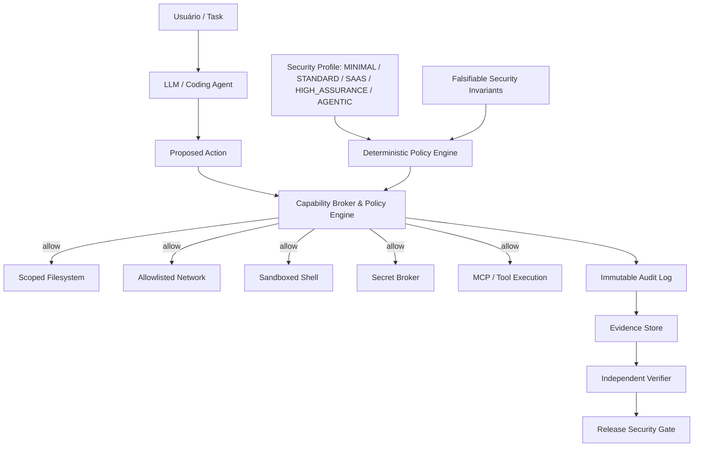

# Prumo Security Control Plane

> **Authority:** Canonical engineering specification.  
> **Relates to:** `docs/security/trust-model.md`, `schemas/security-profile.schema.json`, `schemas/threat-model.schema.json`, `schemas/tenant-isolation.schema.json`, `schemas/tool-manifest.schema.json`, `schemas/release-security-manifest.schema.json`.

---

## 1. Princípio Fundamental: O LLM Nunca é a Raiz de Confiança

A arquitetura do Prumo estabelece uma separação rigorosa e invariante entre o **Plano de Raciocínio (Reasoning Plane)** e o **Plano de Imposição de Segurança (Security Enforcement Plane)**:

### Regras de Separação de Poderes
* **O modelo pode:** propor alterações, raciocinar, sugerir arquiteturas, classificar achados, redigir código, propor testes e explicar resultados.
* **O modelo NUNCA pode sozinho:**
  1. Conceder permissões de sistema de arquivos a si mesmo;
  2. Liberar tráfego de rede de saída (*egress*);
  3. Acessar segredos ou chaves fora do escopo aprovado;
  4. Instalar dependências ou pacotes arbitrariamente;
  5. Alterar políticas de segurança ou filtros de ferramentas;
  6. Aprovar a sua própria correção (*Security Fixer != único Security Verifier*);
  7. Decidir que um release é seguro sem evidências determinísticas.

---

## 2. Invariantes de Segurança Falsificáveis

O Prumo rejeita declarações vagas de segurança (`secure: true`, `multi_tenant: true`). Toda alegação de segurança deve ser uma propriedade formalmente falsificável por testes adversariais.

### Invariante Multi-Tenant Transversal (10 Planos de Isolamento)
$$\forall \text{ principal } P, \text{ resource } R, \text{ operation } O:$$
$$\text{ALLOW}(P, O, R) \iff \text{tenant}(P) = \text{tenant}(R) \land \text{role\_policy}(P, O, R) = \text{allow} \land \text{workflow\_policy}(O, R.\text{state}) = \text{allow} \land \text{resource\_scope}(P, R) = \text{allow}$$

| Plano | Vetor Crítico | Teste Adversarial Mandatório |
| :--- | :--- | :--- |
| **1. API** | BOLA / IDOR, missing object-level auth | Usuário A requisita explicitamente ID do recurso de Usuário B. |
| **2. Banco de Dados** | Queries com service-role contornando tenant | Execução direta de queries SQL sob diferentes roles e tenants. |
| **3. RLS (Row Level Security)** | Policies permissivas ou ausentes em tabelas filhas | Matriz de acesso cross-tenant diretamente contra o banco. |
| **4. Cache (Redis/Memcached)** | Chaves globais (`item:{id}`) sem namespace | Tentativa controlada de colisão de chave entre tenants. |
| **5. Object Storage** | URLs assinadas ou caminhos sem escopo de tenant | Download/upload direto via URL forjada de outro tenant. |
| **6. Search Indexes** | Filtro de tenant omitido ou opcional na busca | Query sem parâmetro de tenant; deve retornar vazio por padrão. |
| **7. Filas & Workers** | Worker confia no `tenant_id` contido no payload | Injeção de mensagem na fila com tenant divergente do contexto. |
| **8. Analytics** | Agregações e joins que cruzam fronteiras | Extração de relatórios analíticos validando ausência de dados de terceiros. |
| **9. Export Jobs** | Job assíncrono executa sob permissão revogada | Revogação de permissão do usuário durante o processamento do export. |
| **10. Backup & Restore** | Restauração acidental de dados em outro tenant | Auditoria de partição e integridade de restauração de snapshots. |

---

## 3. Perfis de Segurança (Security Profiles)

O Prumo classifica os projetos em 5 perfis formais (`schemas/security-profile.schema.json`):

1. **`MINIMAL`** (Protótipo / Desenvolvimento Local):
   * Escaneamento de segredos via Gitleaks, SCA básico de dependências, linter de código limpo.
2. **`STANDARD`** (Aplicações Web Monolíticas / APIs Simples):
   * Requisitos do `MINIMAL` + testes automatizados de autenticação, checagens de IaC, geração de SBOM e DAST passivo de cabeçalhos/cookies.
3. **`SAAS`** (Aplicações Multi-Tenant & Micro-SaaS):
   * Requisitos do `STANDARD` + matriz de autorização papel-recurso-ação, testes adversariais cross-tenant nos 10 planos, validação de webhooks/billing como máquina de estados, e orçamentos contra *Denial of Wallet*.
4. **`HIGH_ASSURANCE`** (Dados Críticos, Finanças, Saúde, Infraestrutura):
   * Requisitos do `SAAS` + verificação independente com aprovador humano mandatória, assinaturas criptográficas de artefatos (Sigstore/Cosign), proveniência SLSA v1.1 e auditorias de código nativo via sanitizers (ASan/TSan).
5. **`AGENTIC`** (Sistemas com Coding Agents, Ferramentas MCP e Execução Autônoma):
   * Requisitos do `HIGH_ASSURANCE` + capability broker determinístico, sandboxing de ferramentas com limites estritos de I/O, pinning criptográfico de manifests de ferramentas MCP e barreira contra indirect prompt injection.

---

## 4. Segurança Agêntica & Ferramentas MCP

### A. Separação entre Detecção e Contenção
A pesquisa comprova que defesas baseadas apenas no modelo (prompts de sistema, filtros de texto) são vulneráveis a ataques adaptativos com taxas de sucesso superiores a 50%. Por isso:
* **Detecção:** Análise de texto para identificar tentativas de *indirect prompt injection* (via `internal/harness/security/boundary.go`).
* **Contenção (Mandatória):** O runtime do harness intercepta e bloqueia chamadas no nível do sistema operacional (filtros de caminhos sensíveis, bloqueio de comandos perigosos via `validateToolExecution`, sandbox de rede).

### B. Pinning Criptográfico de Ferramentas MCP (`tool-manifest`)
Toda ferramenta exposta por um servidor MCP deve possuir um manifesto assinado com digests imutáveis:
* `schema_digest`: Hash SHA-256 do schema de parâmetros JSON da ferramenta.
* `description_digest`: Hash SHA-256 da descrição da ferramenta (evitando *tool description poisoning*).
* `implementation_digest`: Hash SHA-256 do binário ou script que implementa a ferramenta.
* **Invalidação Automática:** Qualquer alteração no schema, descrição ou implementação invalida a concessão de capacidade imediatamente.

---

## 5. Orçamentos Multidimensionais & Prevenção de "Denial of Wallet"

Ataques de consumo irrestrito de recursos (OWASP API4:2023) podem causar exaustão financeira em micro-SaaS através de amplificação de requisições. O Prumo impõe orçamentos em múltiplas dimensões:
* Limite de requisições por minuto por usuário e por tenant;
* Concorrência máxima por tenant;
* Fan-out máximo por requisição HTTP (limite de sub-tarefas geradas);
* Cota diária de tokens de LLM e chamadas a APIs pagas de terceiros;
* Limite máximo de tamanho de upload, processamento e tempo de execução;
* Circuit breakers globais com modo fail-closed automático ao atingir o teto de gastos.

---

## 6. Gates de Segurança no Ciclo de Vida (Gauntlet Loop)

| Gate | Momento | Critério PASS | Critério BLOCK | Regra de EXCEPTION |
| :--- | :--- | :--- | :--- | :--- |
| **Pre-commit** | Commit local | Nenhum segredo ou credencial detectado pelo scanner. | Detecção de chave privada, token ou senha em diff. | Proibido. Segredos vazados devem ser rotacionados. |
| **PR** | Pull Request | Scanners estáticos (SAST, SCA) e testes de autorização passam. | Vulnerabilidade alta/crítica sem mitigação comprovada. | Requer justificativa, mitigação compensatória e expiração. |
| **Merge** | Integração na branch protegida | Verificação independente concluída com evidências reproduzíveis. | O autor da implementação atuou como único aprovador da mudança. | Proibido em perfis `SAAS`, `HIGH_ASSURANCE` e `AGENTIC`. |
| **Staging** | Ambiente de pré-produção | Testes de isolamento cross-tenant e DAST ativo passam sem falhas. | BOLA detectado ou vazamento de dados entre tenants. | Bloqueio imediato do deploy. |
| **Release** | Publicação de versão | SBOM gerado, proveniência SLSA atestada, artefato assinado. | Artefato binário diverge do digest testado ou testes incompletos. | Proibido. Todo release exige manifesto assinado. |
| **Production** | Execução ao vivo | Guardrails de runtime ativos e orçamentos configurados. | Desativação de RLS ou execução sem sandbox em modo de produção. | Bloqueio automático de tráfego. |
| **Post-release** | Operação contínua | Monitoramento de CVEs em dependências e drift de ferramentas. | Descoberta de CVE explorável na versão em produção ou drift de MCP. | Abertura imediata de tarefa de resposta a incidentes. |

---

## 7. Métrica de Calibração: Taxa de Falso Fechamento (*False Closure Rate*)

Para avaliar coding agents e suítes de testes automatizados, o Prumo adota formalmente a métrica:
$$\text{False Closure Rate} = \frac{\text{Findings declarados resolvidos pelo agente, mas cujo teste de regressão falha}}{\text{Total de findings declarados resolvidos}}$$

Um agente com alta taxa de falsos fechamentos é sumariamente desclassificado do papel de `Security Fixer` e rebaixado para tarefas somente-leitura.
