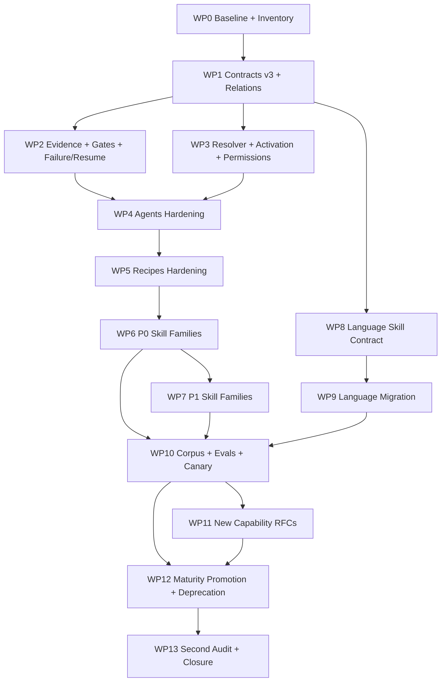

# 79.Q — Matriz Completa de Prioridade, Work Packages, Dependências e Sequenciamento

> Authority: canonical specification.
> Logical ID: 79 Q
> Source: Notion Living Book (3d89bb7d023f810192b1db43142af6f5)
> Status: Skill Package de referência para 79 Q — Matriz Completa de Prioridade, Work Package.

<aside>
🗺️

Esta é a **matriz operacional de implementação**. Ela transforma os findings detalhados nas outras páginas em work packages ordenados. Continua sendo documentação/planning: não autoriza alterações de código por si só.

</aside>

# Regra de sequencing

A ordem é dirigida por dependências, não por facilidade. **Não** começar reescrevendo dezenas de [SKILL.md](http://SKILL.md): primeiro estabilizar schemas, lint, evidence, handoff, failure semantics e eval harness.

# DAG dos work packages

# Matriz de work packages

| WP | Pri. | Dependências | Escopo | Entregas | Exit Gate |
| --- | --- | --- | --- | --- | --- |
| **WP0** | P0 | — | Baseline e inventory. | inventory, hashes, relations inicial, coverage/similarity/orphan/permission reports. | Snapshot determinística de 100% dos componentes. |
| **WP1** | P0 | WP0 | Skill/Agent/Recipe contracts + relationship graph. | Schemas, validators, versioning e migration scaffolding. | Referências, outputs e dependencies validados. |
| **WP2** | P0 | WP1 | Evidence/Gates/Failure/Handoff/Idempotency. | Evidence envelope, conditional gate contract, failure taxonomy, resume/compensation, handoff schema. | Gate não aceita evidence incompleta; deterministic failure não usa blind retry. |
| **WP3** | P0 | WP1 | Resolver/activation/permissions/context budget. | Dependency/conflict validation, activation reasons, least privilege, budget enforcement. | `explain` justifica selected/rejected components. |
| **WP4** | P0/P1 | WP2, WP3 | 26 agents. | Typed contracts, skill alignment, evidence, stop/handoff/failure e eval fixtures. | Zero Agent↔Skill drift conhecido. |
| **WP5** | P0/P1 | WP4 | 14 recipes. | Typed DAGs, conditional gates, role/skill checks, recovery/idempotency, recipe evals. | Dry-run e simulation válidos para todas. |
| **WP6** | P0 | WP5 | Security, A11y, Context/Agentic, Testing, Release, critical UI/design e critical languages. | Rewrites domain-specific + checks/examples/evals. | Nenhuma P0 stable é boilerplate. |
| **WP7** | P1 | WP6 | Remaining domain skills. | Specialization, ownership boundaries, freshness, examples/checks. | Coverage efetiva substitui coverage nominal. |
| **WP8** | P0/P1 | WP1 | Language Skill Contract. | Shared schema/template/checklist de linguagem. | Contrato aprovado por linguagens de paradigmas distintos. |
| **WP9** | P0/P1 | WP8 | Migração das `lang-*`. | Profiles, version/freshness, tooling/safety/tests, language evals. | 100% das language skills ativas cumprem mínimo. |
| **WP10** | P0 | WP6, WP7, WP9 | Corpus/evals/canary/dogfood. | Positive/negative/ambiguous/adversarial corpora, baselines e dashboards. | Thresholds aprovados para critical components. |
| **WP11** | P1/P2 | WP10 | Candidate-capability RFCs. | CREATE/EXTEND/COMPOSE/DEFER/REJECT decisions. | Nenhuma nova capacidade sem eval/ownership proof. |
| **WP12** | P0 | WP10, WP11 | Maturity/deprecation. | Promotions, aliases, migration notes, retired/deprecated handling. | Stable DoD aplicado uniformemente. |
| **WP13** | P0 | WP12 | Second audit. | Before/after report e remaining debt register. | Zero P0 aberto; regressions dentro dos thresholds. |

# P0 — lista consolidada

| Área | P0 obrigatório | Por quê |
| --- | --- | --- |
| Contracts | Relationship graph, Skill v3, Agent/Recipe contracts, Evidence, Handoff, Failure/Resume | Sem isso não há validação sistêmica. |
| Resolver | Agent↔Skill drift, Recipe↔Agent drift, activation precision, least privilege | Selecionar errado contamina toda execução. |
| Agents | tester, security-architect, security-reviewer, accessibility-reviewer | São verifiers/architects de risco crítico. |
| Recipes | feature-standard conditional gate planner | É caminho default; precisa escalar por risco. |
| Accessibility | accessibility, contrast, focus, keyboard, motion, screen-reader, zoom/reflow, ux-architecture | Existem lacunas de especialização e evidence. |
| Security | acp/api/auth/desktop/filesystem/mcp/network/plugin/process/secrets/web, secure-coding, security-review, supply-chain, threat-modeling, untrusted-project | Threat-specific procedures e adversarial evidence. |
| Agentic/Context | agentic-workflow-design, multi-agent orchestration, prompt-engineering, project-intelligence, lean-progressive-context, prumo-navigation | Controlam seleção, contexto e coordenação. |
| Quality | testing-quality, clean-code ownership contract | Testing precisa ser risk-driven; overlap deve ser removido. |
| Language | lang-cpp, lang-rust, lang-odin | Representam profundidade/absolute-rule gaps encontrados diretamente. |
| Compiler/Native | compiler-development, memory-management | Domínios de alto risco silencioso. |
| Frontend/Design | design-system, design-tokens, frontend-web, ui-implementation, visual-qa, visual-regression | Boilerplate/ownership/evidence gaps. |
| Ops | ci-cd, containers, release-engineering, observability | Build/release/runtime trust e recovery. |

# P1 — agrupamento

P1 inclui hardening de todos os demais agents/recipes; language profiles; API/database/caching/RPC; game/rendering/networking/physics/assets; docs/GitHub/tooling/research; performance; design/interaction; overlaps e freshness; idempotency/concurrency/observability do próprio workforce.

# P2 — regra

P2 não entra automaticamente no plano de implementação. Primeiro roda WP11. Reliability/incident response, data-migration recipe, performance-regression recipe e license compliance são exemplos de capacidades condicionais.

# Batches dentro de WP6/WP7

Para reduzir risco de changeset gigante:

1. **B1 — Security + permissions.**
2. **B2 — Testing/evidence + critical agents.**
3. **B3 — Accessibility/UX.**
4. **B4 — Context/orchestration/MCP.**
5. **B5 — CI/release/observability.**
6. **B6 — UI/design/frontend.**
7. **B7 — backend/data/API.**
8. **B8 — compiler/native/runtime.**
9. **B9 — GitHub/docs/research/tooling.**
10. **B10 — game/render/network/assets.**

Cada batch deve fechar seus evals e coverage delta antes do próximo, exceto trabalho paralelo sem shared-contract changes.

# Change policy

- changes em schemas/contracts requerem architecture review;
- mudanças em security/a11y/verifier roles exigem independent review;
- migration tooling precisa preservar packages antigos durante janela definida;
- não promover maturity no mesmo changeset que introduz eval sem baseline previamente capturado, salvo bootstrap explicitamente aprovado;
- qualquer regression de activation precision/context cost acima do threshold abre finding.

# Final acceptance

O sequencing está correto quando a equipe/code agent consegue executar cada WP sem precisar reinterpretar a intenção original desta conversa e cada pacote possui entrada, saída, dependência e gate claros.