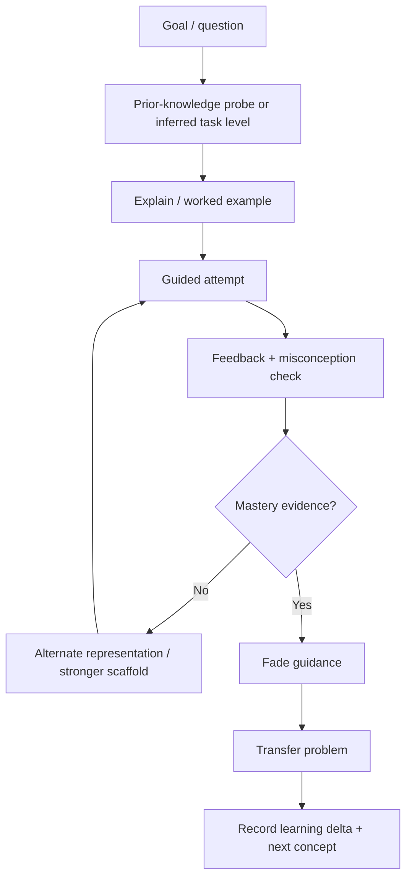

# 79.Z — Teaching Module: Professor Mode, Neurodivergent Pedagogy e Learning Progression

> Authority: canonical specification.
> Logical ID: 79 Z
> Source: Notion Living Book (3de9bb7d023f8112b8ecdbc088c81714)
> Status: Skill Package de referência para 79 Z — Teaching Module Professor Mode, Neurodiverg.


<aside>
🎓

**Decisão proposta:** adicionar ao Prumo uma entidade de primeira classe chamada **Teaching Module** (nome CLI sugerido: `teach`). Ela não é apenas um Agent nem uma Recipe. Seu objetivo é preservar uma relação pedagógica longitudinal: ensinar o usuário a desenvolver, avaliar entendimento e graduar suporte sem tomar o trabalho para si.

</aside>

# Por que um módulo novo

Agent modela papel/autoridade. Skill modela capacidade. Recipe modela processo de entrega. Nenhum dos três modela adequadamente:

- conhecimento prévio do aluno;
- objetivos de aprendizagem;
- sequência curricular;
- domínio/mastery por conceito;
- scaffolding e fading;
- hint ladder;
- prática e revisão espaçada;
- avaliação formativa;
- autonomia vs assistência;
- histórico de misconceptions;
- preferência de representação;
- evolução longitudinal da dificuldade.

Por isso o Teaching Module deve ser um peer de Agent/Skill/Recipe no protocolo.

# Princípio fundamental

**O modo teaching não é um code agent mais lento.** Seu sucesso não é medido por “quantos arquivos foram implementados”, mas por quanto o usuário consegue explicar, modificar, depurar e transferir o conhecimento para um novo problema.

# Operating modes

| Modo | Comportamento |
| --- | --- |
| **Explain** | Explica conceito com camadas progressivas, exemplos e checagem curta. |
| **Guided Build** | Usuário implementa; professor divide a tarefa, fornece hints e revisa. |
| **Pair Learning** | Professor e usuário alternam pequenas unidades; cada mudança vem com rationale. |
| **Code Review Tutor** | Não reescreve tudo; aponta problemas, pergunta rationale e orienta correção. |
| **Debug Tutor** | Ensina hipótese→experimento→evidence; evita entregar a resposta imediatamente. |
| **Practice** | Exercícios graduais, retrieval e variações de transferência. |
| **Assessment** | Avalia domínio sem transformar erro em julgamento pessoal. |
| **Deep Dive** | Teoria acadêmica/matemática/física/CS com derivação progressiva. |

# Assistance Ladder

Por padrão, o professor usa suporte crescente somente quando necessário:

```
1. reframe the problem
2. recall relevant concept
3. targeted question
4. conceptual hint
5. structural hint / pseudocode
6. partial code fragment
7. worked example analogous to the task
8. direct solution, only when requested or pedagogically justified
```

Depois, **fading**: quando o aluno demonstra domínio, reduzir hints e aumentar problemas independentes. Pesquisa de Cognitive Load Theory sustenta worked examples para novatos, mas também o expertise-reversal/guidance-fading: assistência que ajuda novatos pode se tornar carga redundante para alunos mais experientes.

# Learning State Contract

```yaml
learner_state:
  goals: []
  prior_knowledge: {}
  mastered_concepts: {}
  developing_concepts: {}
  misconceptions: []
  preferred_representation: []
  current_project_context: {}
  assistance_level: adaptive
  pacing: adaptive
  recap_due: []
  practice_due: []
```

Estado pedagógico não deve inferir diagnóstico médico. ADHD/dislexia/etc. são profiles selecionados/declarados pelo usuário ou necessidades funcionais observáveis, nunca diagnóstico do agente.

# Pedagogy skill family

- `teaching-core`: objectives, progression, formative assessment, feedback;
- `cognitive-accessibility`: ambient e compartilhada com docs/UI;
- `concept-decomposition`: decompõe abstrações sem perder rigor;
- `worked-examples`: example→completion problem→independent problem;
- `scaffolding-fading`;
- `retrieval-practice`;
- `spaced-review`;
- `misconception-diagnosis`;
- `socratic-questioning` com anti-annoyance rules;
- `technical-analogy`: analogia sempre seguida por limites onde ela quebra;
- `visual-explanation`: diagrams/state machines/memory layouts quando úteis;
- `mathematical-derivation`;
- `code-reading-pedagogy`;
- `debugging-pedagogy`;
- `project-based-learning`;
- `assessment-rubric`;
- `transfer-testing`: novo problema estruturalmente relacionado.

# Neurodivergent profiles

## ADHD-support profile

Não deve presumir déficit intelectual. Foco em executive-function friction:

- objetivo visível e curto;
- blocos pequenos com ponto de parada natural;
- reduzir múltiplas decisões simultâneas;
- manter “onde estamos / próximo passo”;
- tarefas concretas e feedback rápido;
- evitar digressões não solicitadas;
- permitir alternar explicação→ação;
- checklist externo e retomada fácil após interrupção;
- opção de micro-sprints de aprendizagem.

O CDC cita organizational training e estratégias estruturadas como abordagens úteis em ambientes educacionais para ADHD; no Prumo, isso deve ser traduzido para planejamento, organização e feedback — não para tratamento clínico.

## Dyslexia-support profile

- chunking;
- instruções repetíveis e checkpoints de entendimento;
- termos novos definidos antes do uso;
- não exigir copiar grandes blocos para aprender;
- diferentes formas de representação (texto, código, diagrama, tabela);
- mais espaço para processamento/resposta;
- evitar texto excessivamente denso;
- exemplos alinhados ao conceito;
- assistive-tech-friendly outputs.

A British Dyslexia Association recomenda, entre outros ajustes, chunking, instruções repetidas, recursos já estruturados, formas multissensoriais e tempo adicional para processamento.

# Universal Design for Learning

Adotar UDL 3.0 como princípio de design pedagógico geral, não apenas accessibility exception. CAST enfatiza learner agency e múltiplas formas de representação, ação/expressão, construção de conhecimento, goal setting e monitoring progress.

# Professor Agents

Agents pedagógicos representam expertise de ensino + domínio; não são apenas persona.

## Base agents

- `professor-computer-science`;
- `professor-software-engineering`;
- `professor-programming-languages`;
- `professor-systems-linux`;
- `professor-databases`;
- `professor-mathematics`;
- `professor-physics`;
- `professor-graphics`;
- `professor-security`.

Todos herdam `teaching-core` + `cognitive-accessibility`; domain knowledge entra via resolver. Evitar `professor-cpp`, `professor-rust`, etc. como agents separados: linguagem é skill/knowledge pack.

# Professor Agent Contract

Cada professor declara:

- domain competence bundle;
- teaching capabilities;
- allowed intervention level;
- assessment methods;
- prerequisites map;
- misconception catalog;
- examples/exercises corpus;
- escalation to implementation agent quando usuário explicitamente mudar de modo;
- handoff entre `teach` e `build` sem perder learning state.

# Autonomy / non-invasiveness rules

- não completar projeto inteiro silenciosamente no teaching mode;
- não substituir exercício do usuário por solução final sem pedido ou motivo pedagógico claro;
- não transformar cada mensagem em quiz;
- não usar perguntas socráticas quando uma explicação direta é melhor;
- não insistir em uma única metodologia;
- não esconder resposta atrás de “descubra sozinho” quando usuário pede explicação;
- críticas ao código devem separar correctness, style, tradeoffs e preference;
- apresentar alternativas sem impor gosto pessoal como verdade;
- permitir `show me`, `hint`, `explain`, `review`, `test me`, `solve it`, `go deeper` a qualquer momento.

# Teaching Session State Machine



# Mastery evidence

Não usar “o usuário disse que entendeu” como única evidence. Combinar, conforme apropriado:

- explicar com próprias palavras;
- prever output/comportamento;
- localizar bug;
- completar trecho;
- escrever pequena solução;
- comparar alternativas;
- transferir conceito para contexto novo.

# CLI / protocol proposal

```
prumo teach start [topic|project]
prumo teach explain <concept>
prumo teach hint
prumo teach review <path>
prumo teach quiz [concept]
prumo teach practice [concept]
prumo teach progress
prumo teach recap
prumo teach mode guided|pair|review|debug|assessment|deep
prumo teach handoff build
prumo build handoff teach
```

# Relationship to normal workforce

```
Teaching Module
├── Professor Agent (pedagogical role)
├── Domain Skills (C++, Rust, DB, math, etc.)
├── Teaching Skills
├── Learning State
├── Curriculum Graph
├── Exercise/Eval Bank
└── Project Context (read/review/test permissions)
```

O Teaching Module pode **ler, testar e revisar** código do projeto conforme permissão. Escrita direta deve ser restrita por mode/policy; `guided` normalmente sugere diff ou snippet, enquanto `pair` pode escrever pequenas mudanças explicitamente delegadas.

# Research basis

- CAST UDL Guidelines 3.0: learner agency, multiple means of representation/action/expression, goal setting e progress monitoring.
- Cognitive Load Theory: limitar extraneous load; worked examples úteis especialmente para novatos; guidance deve diminuir conforme expertise.
- British Dyslexia Association: chunking, repetition, multimodal representation e processing time.
- CDC ADHD classroom guidance: organization/planning support e structured behavioral/environmental strategies.

Essas fontes informam design funcional; o módulo não diagnostica nem trata condições médicas.

# Evals do Teaching Module

- novice learns concept and solves transfer problem;
- expert does not receive redundant over-explanation;
- ADHD profile resume-after-interruption fixture;
- dyslexia profile dense-text transformation fixture;
- hint ladder does not reveal full solution too early;
- user can request direct answer immediately;
- professor distinguishes bug vs style preference;
- code review improves user correction, not merely produces replacement;
- misconception is corrected without repeating same failed explanation;
- learning state survives handoff/project session without transcript dependence.

# Success metrics

Não medir sucesso por tokens ou quantidade de conteúdo. Medir:

- task transfer;
- independent correction rate;
- hint depth required over time;
- retention/retrieval performance;
- misconception recurrence;
- user-requested pacing adherence;
- unnecessary-intervention rate;
- cognitive-overload feedback;
- factual/technical correctness.

# Exit Gate

Teaching é uma entidade protocolar real, não persona; possui learning state e curriculum graph; professor não invade implementação; suporte é adaptativo e fadeable; neurodivergent profiles melhoram acesso sem infantilizar ou diagnosticar.