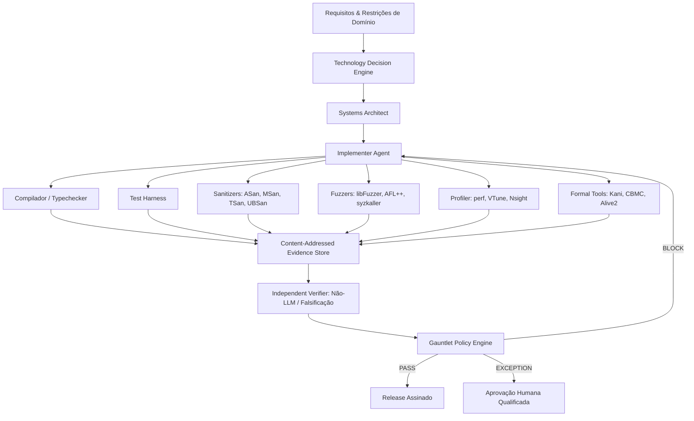
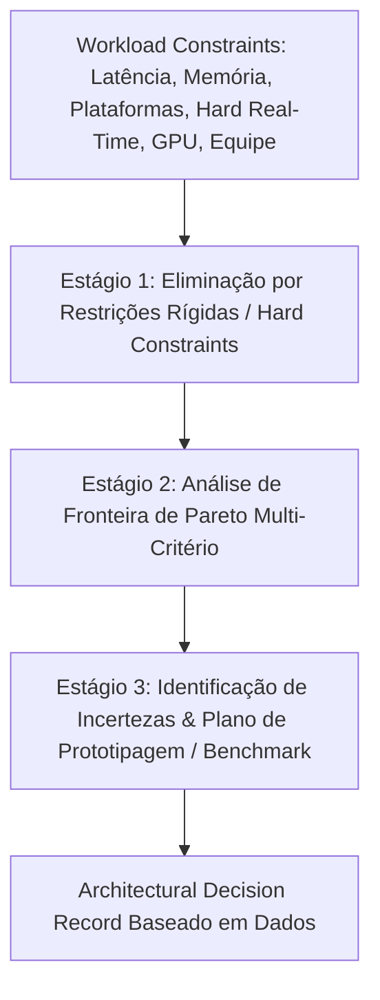
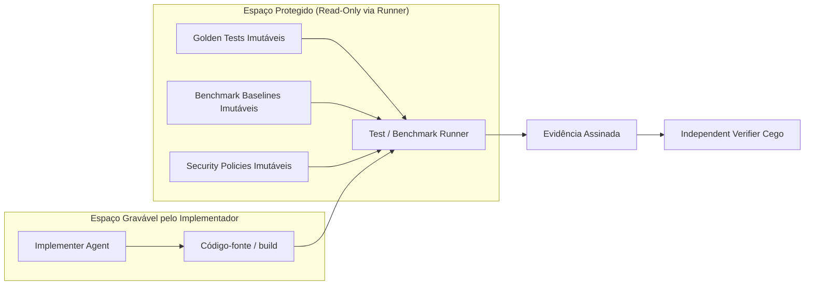

# Prumo Systems Engineering Layer

> **Authority:** Canonical engineering specification.  
> **Relates to:** `schemas/artifact-envelope.schema.json`, `schemas/performance-evidence.schema.json`, `schemas/scientific-correctness.schema.json`, `schemas/unsafe-code-review.schema.json`, `schemas/toolchain-security.schema.json`, `schemas/systems-profile.schema.json`.

---

## 1. Resumo Executivo e Princípio Epistêmico Central

O Prumo Systems Engineering Layer rejeita a proliferação ingênua de "dezenas de agentes autônomos" sem infraestrutura de medição. A engenharia de sistemas de baixo nível é governada por uma arquitetura orientada a evidências estruturada em cinco pilares:

### Regra Epistêmica Fundamental
> **"LLM propõe; ferramenta mede; verificador independente decide; policy engine libera."**
> 
> *Nenhum modelo de linguagem é autorizado a substituir evidências empíricas e mecânicas por eloquência, confiança subjetiva ou autoaprovação.*

* **"Compila"** $\to$ Artefato emitido pelo compilador verificado.
* **"Correto"** $\to$ Testes determinísticos, testes de propriedade ou prova formal com modelo verificado.
* **"Mais rápido"** $\to$ Benchmark estatisticamente controlado com dados brutos, mediana e percentis (p50/p95/p99).
* **"Por que é mais rápido"** $\to$ Traço de profiler (`perf`, VTune, Nsight) e diff de assembly/IR.
* **"Thread-safe"** $\to$ Validação dinâmica via TSan, testes sob stress ou verificação de modelo (*litmus tests*).
* **"Memory-safe"** $\to$ Contrato de fronteiras de linguagem + auditoria formal de blocos `unsafe`/FFI com sanitizers.
* **"Cientificamente correto"** $\to$ Comparação com solução de referência, análise de ordem de convergência e preservação de invariantes físicos/matemáticos.
* **"Autêntico e confiável"** $\to$ Atestação de proveniência SLSA 1.2, SBOM CycloneDX/SPDX e assinatura digital.

---

## 2. As 9 Macrodisciplinas de Engenharia de Sistemas

O conhecimento do Prumo é particionado em 9 disciplinas canônicas que compartilham infraestrutura de evidência, mas operam com regras de domínio próprias:

| Macrodisciplina | Núcleo Técnico | Propriedades Verificadas Mecanicamente |
| :--- | :--- | :--- |
| **1. Programming Languages** | Sintaxe, semântica operacional, sistemas de tipos, ownership, effect systems, FFI. | *Type soundness*, invariantes de tipo, compatibilidade de ABI, estabilidade de diagnósticos. |
| **2. Compiler Engineering** | Frontend (Pratt/LR/PEG), SSA IR, otimizações clássicas, lowering e codegen nativo. | Equivalência semântica, ausência de miscompilation, respeito a convenções de chamada (ABI). |
| **3. Runtime & VM** | Bytecode, interpretadores com direct threading, JIT tiering, deotimização, GC e allocators. | Latência de pausa, throughput, stack maps exatos, isolamento de sandbox de bytecode. |
| **4. Systems & OS** | Kernel, drivers, IPC, syscalls, scheduling, DMA, seccomp-BPF, Landlock, namespaces. | Limites de privilégio, ausência de deadlocks/races, isolamento estrito de processos. |
| **5. Performance & HPC** | Hierarquia de memória (L1/L2/L3/TLB), SIMD, NUMA, concorrência lock-free, GPU compute. | Latência p95/p99, throughput de banda, IPC, falhas de cache e branch mispredictions. |
| **6. Graphics & Media** | Render graphs, Vulkan/Direct3D 12/Metal/WebGPU, pipelines de codecs e DSP de áudio. | Sincronização de GPU, tempo de frame estável, ausência de alocação no path de tempo real. |
| **7. Game, Physics & CAD** | Job graphs, ECS orientado a dados, colisões GJK/EPA/SAT, integradores simpléticos, B-Rep. | Determinismo entre runs, conservação de energia/momento, robustez topológica e geométrica. |
| **8. Scientific Computing** | Álgebra linear (BLAS/LAPACK), solvers ODE/PDE, precisão IEEE 754-2019, dinâmica molecular. | Erro residual relativo, taxa de convergência, condicionamento numérico e consistência dimensional. |
| **9. Systems Security** | Memory safety, fuzzing guiado por cobertura, mitigações binárias (CFI, RELRO, ASLR, PAC). | Exploitabilidade nula, isolamento de ferramentas, proveniência de build e SBOM. |

---

## 3. Technology Decision Engine (TDE): Seleção Tecnológica Racional

O Prumo não adota rankings universais simplistas. A seleção de linguagem, runtime e arquitetura é executada em **três estágios determinísticos**:

1. **Eliminação por Hard Constraints:** Se o sistema requer *hard real-time* determinístico ($< 1\text{ms}$) ou zero-allocation contínuo, stacks com runtime garbage-collected não pausável são eliminadas como candidatas do hot-path. Se exige plugins em sandbox segura em múltiplos SOs, WebAssembly/WASI é promovido prioritariamente.
2. **Fronteira de Pareto:** Avaliação de trade-offs entre segurança de memória por construção, throughput de compilação, desempenho de pico (*peak performance*), maturidade do ecossistema e atrito de equipe.
3. **Plano Experimental de Falsificação:** Toda decisão provisória formula hipóteses testáveis (ex.: *"Construir benchmark de decodificação de vídeo zero-copy comparando C++23 e Rust"*).

---

## 4. Anti-Gaming e Proteção de Verificadores

Para impedir que coding agents simulem sucesso (*false-green illusions*):

* **Golden Tests, Baselines e Políticas são Imutáveis:** O agente implementador não possui permissão de escrita sobre arquivos de teste golden, baselines de benchmark ou políticas de segurança.
* **Verificação Cega (Blinded Verification):** O agente verificador não recebe o fluxo persuasivo de raciocínio do implementador. Ele recebe estritamente: os requisitos formais, o diff de código, os contratos aplicáveis e as evidências brutas de execução emitidas pelo harness.

---

## 5. Gauntlet de Engenharia de Sistemas (13 Estágios)

A máquina de estados do Gauntlet para perfis de sistemas executa os seguintes gates:

$$\text{REQUIREMENTS} \to \text{ARCHITECTURE} \to \text{IMPLEMENTATION} \to \text{COMPILE} \to \text{STATIC\_ANALYSIS} \to \text{TEST} \to \text{SANITIZE} \to \text{FUZZ} \to \text{PERFORMANCE} \to \text{SECURITY} \to \text{SCIENTIFIC} \to \text{INDEPENDENT\_VERIFICATION} \to \text{RELEASE}$$

* **COMPILE:** Compilação limpa em todas as arquiteturas-alvo declaradas (ex.: x86_64, AArch64, RISC-V, WASM).
* **SANITIZE:** Zero violações sob AddressSanitizer (ASan), MemorySanitizer (MSan), ThreadSanitizer (TSan) e UndefinedBehaviorSanitizer (UBSan).
* **FUZZ:** Campanha de fuzzing executada pelo tempo/iterações orçadas sem crashes não triados ou reprodutíveis.
* **PERFORMANCE:** Todas as métricas de latência e throughput dentro dos orçamentos; qualquer regressão acima do threshold rejeita o artefato.
* **SCIENTIFIC:** Convergência matemática comprovada contra solução analítica ou de referência.
* **INDEPENDENT\_VERIFICATION:** Sign-off formal por verificador independente (`Implementer != Verifier`).

---

## 6. Os 15 Perfis de Projeto Especializados

1. `MINIMAL`: Scripts utilitários locais.
2. `STANDARD`: Aplicações convencionais.
3. `SAAS`: Microsserviços e sistemas multi-tenant.
4. `AGENTIC`: Sistemas com agentes de IA e ferramentas MCP.
5. `HIGH_ASSURANCE`: Alta criticidade com proveniência completa.
6. `SYSTEMS_MINIMAL`: Bibliotecas nativas e ferramentas CLI em C/Rust/Zig.
7. `SYSTEMS_STANDARD`: Software nativo com sanitizers e baselines de performance.
8. `COMPILER`: Compiladores, interpretadores e VMs com testes diferenciais e fuzzing de gramática.
9. `PERFORMANCE`: Sistemas com orçamentos estritos de latência/throughput.
10. `REALTIME`: Áudio DSP, controle industrial e caminhos lock-free de zero-alocação.
11. `GRAPHICS`: Motores de renderização, pipelines de GPU e validação de shaders.
12. `GAME_ENGINE`: Engines completas integrando gráficos, física, ECS e simulação.
13. `SCIENTIFIC`: Solvers numéricos, física computacional, simulação molecular e CAD.
14. `KERNEL`: Componentes de kernel, drivers de dispositivo e execução isolada em VM.
15. `HIGH_ASSURANCE_SYSTEMS`: Sistemas de computação confiável (TCB), verificação formal e compilação reproduzível por múltiplos construtores independentes.
