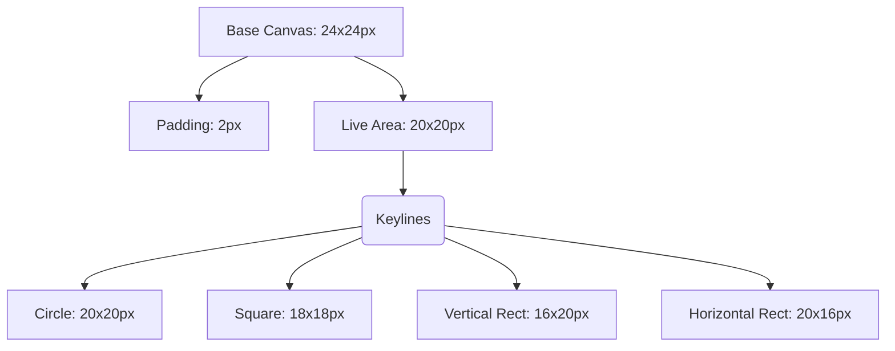

# Example: Icon Grid and Specs

## The 24px Icon Grid



## Example: `navigation/arrow-right`
- **Category:** Navigation
- **Grid Size:** 24x24
- **Stroke Width:** 2px
- **Accessibility:** Decorative (usually paired with text or used in UI controls with labels)
- **Code:**
```xml
<svg xmlns="http://www.w3.org/2000/svg" width="24" height="24" viewBox="0 0 24 24" fill="none" stroke="currentColor" stroke-width="2" stroke-linecap="round" stroke-linejoin="round" aria-hidden="true" class="icon icon-arrow-right">
  <path d="M5 12h14"></path>
  <path d="m12 5 7 7-7 7"></path>
</svg>
```

## Example: `status/warning-triangle`
*Note optical alignment: The triangle extends 1px beyond the 20x20 live area to maintain visual mass compared to a square or circle.*
- **Category:** Status
- **Grid Size:** 24x24
- **Code:**
```xml
<svg xmlns="http://www.w3.org/2000/svg" width="24" height="24" viewBox="0 0 24 24" fill="none" stroke="currentColor" stroke-width="2" stroke-linecap="round" stroke-linejoin="round" aria-hidden="true" class="icon icon-warning">
  <path d="m21.73 18-8-14a2 2 0 0 0-3.48 0l-8 14A2 2 0 0 0 4 21h16a2 2 0 0 0 1.73-3Z"></path>
  <path d="M12 9v4"></path>
  <path d="M12 17h.01"></path>
</svg>
```
