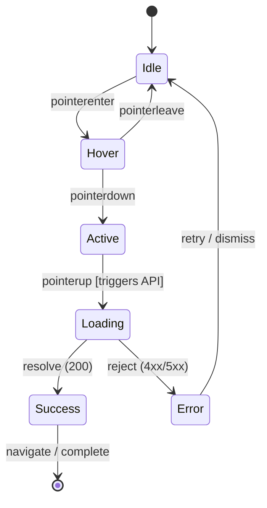

# Reference: Rapid Prototyping & Design Sprint Methodology

## 1. The Design Sprint Framework (AI-Augmented)

Originally formulated by Jake Knapp at Google Ventures, the Design Sprint compresses months of debate into rapid, evidence-based iterations:

```
┌──────────────┐   ┌──────────────┐   ┌──────────────┐   ┌──────────────┐   ┌──────────────┐
│    MAP &     │   │   SKETCH &   │   │   DECIDE &   │   │  PROTOTYPE   │   │    TEST &    │
│  UNDERSTAND  │──▶│   DIVERGE    │──▶│  STORYBOARD  │──▶│  (GOLDILOCKS)│──▶│   VALIDATE   │
│   (Day 1)    │   │   (Day 2)    │   │   (Day 3)    │   │   (Day 4)    │   │   (Day 5)    │
└──────────────┘   └──────────────┘   └──────────────┘   └──────────────┘   └──────────────┘
```

### 1.1 The "Goldilocks Quality" Principle
A prototype must have **just enough fidelity** to evoke honest reactions from users:
- **Too low fidelity:** Users evaluate the sketch, not the idea ("the drawing is rough").
- **Too high fidelity:** Team wastes days perfecting edge cases before knowing if the core premise holds value.
- **Goldilocks Sweet Spot:** Authentic visual polish in the critical path, mocked data on peripheral paths.

---

## 2. The Fidelity Continuum

| Dimension | Low-Fidelity (Lo-Fi) | Mid-Fidelity (Mid-Fi) | High-Fidelity (Hi-Fi) | Coded Interactive |
|---|---|---|---|---|
| **Medium** | Wireframe, sketch | Graybox, layout spec | Tokenized UI, mockups | HTML/CSS/JS, VitePress |
| **Purpose** | Information architecture, mental model | Spatial hierarchy, content chunking | Visual design, typography, brand coherence | Microinteractions, keyboard traps, a11y |
| **Pace** | Hours | 1 day | 2 days | 2–3 days |
| **Feedback Target** | Conceptual fit | Navigation flow | Emotional response | Real operational friction |

---

## 3. Finite State Machine (FSM) Modeling for UI

Every interactive prototype component must be formally specified as a state machine:



### Required States for Interactive Controls:
1. **`idle`**: Neutral unvisited state.
2. **`hover`**: Visual affordance of clickability (subtle elevation or background shift).
3. **`focus-visible`**: Explicit high-contrast keyboard ring (WCAG 2.4.7).
4. **`active / pressed`**: Downward scale or inset shadow simulating physical depression.
5. **`loading / busy`**: Indeterminate progress indicator with `aria-busy="true"`.
6. **`success`**: Transient affirmative feedback (color confirmation, checkmark).
7. **`error / invalid`**: Immediate explanatory error message associated via `aria-describedby`.
8. **`disabled`**: Dimmed opacity ($\ge 0.5$ for readability) with `aria-disabled="true"`.

---

## 4. The Cognitive Walkthrough Protocol

Originating from cognitive psychology (Wharton, Rieman, Lewis, Polson, 1994), this inspection method evaluates whether a first-time user can accomplish key goals without instruction:

For each user action in the flow, answer four canonical questions:
1. **Will the user try to achieve the right effect?** *(Does the user know what they need to do?)*
2. **Will the user notice that the correct action is available?** *(Is the button or control visible and distinct?)*
3. **Will the user associate the correct action with the effect?** *(Does the label/icon clearly indicate the outcome?)*
4. **If performed, will the user see that progress was made?** *(Is there immediate system feedback?)*

---

## 5. Nielsen's Five-User Usability Testing Rule

Research by Jakob Nielsen and Thomas Landauer demonstrates that testing with **5 users reveals ~85% of usability defects**:

$$N(1 - (1 - L)^n)$$

Where $L$ is the proportion of usability problems discovered by a single user (typically 31%), and $n$ is the number of users tested. Testing beyond 5 users yields diminishing returns for a single prototype iteration. Run smaller tests with 5 users, fix the findings, and iterate.
