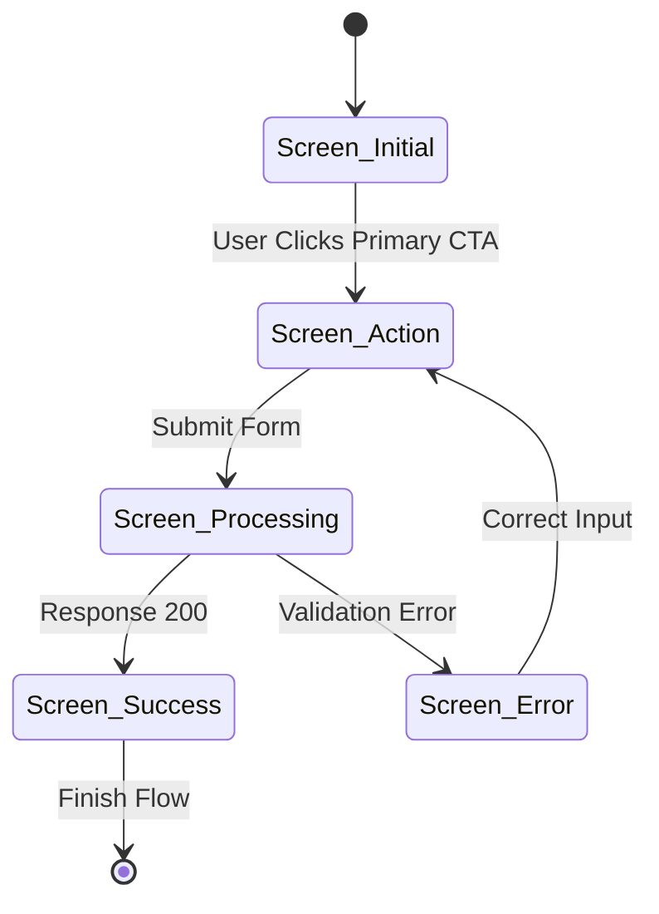

# Interactive Prototype Handoff Specification Template

## 1. Prototype Overview
- **Feature Name:** `[Feature / Screen Name]`
- **Target Platform:** `[Desktop Web | Responsive Mobile | TUI | Native]`
- **Prototype Fidelity:** `[Low-Fi Wireframe | Mid-Fi Functional | High-Fi Interactive]`
- **Repository Branch / Sandbox Link:** `[URL or file path]`
- **Design Tokens Baseline:** `[Token version / CSS custom property manifest]`

---

## 2. User Flow & State Machine Matrix

### Component State Specifications

| Component | State | Visual Treatment | Trigger Event | Accessible Announcement |
|---|---|---|---|---|
| `SubmitButton` | `idle` | `--vp-c-brand-1` background, white text | Initial render | None |
| `SubmitButton` | `hover` | Transform Y -1px, shadow 0 4px 12px | `pointerenter` | None |
| `SubmitButton` | `focus-visible` | 2px solid `--vp-c-brand-1`, offset 3px | `tab` | None |
| `SubmitButton` | `loading` | Spinner replaces label, opacity 0.8 | `click` | `aria-busy="true"` |
| `SubmitButton` | `error` | Red border `#ef4444`, shake animation | Request failed | Error text via `aria-live` |

---

## 3. Interaction & Motion Parameters

- **Entrance Animation:** `opacity 0 -> 1`, `transform: translateY(8px) -> translateY(0)`
- **Duration & Curve:** `250ms cubic-bezier(0.16, 1, 0.3, 1)`
- **Reduced Motion Fallback:** `opacity 0 -> 1` in `0.01ms`, zero transform.
- **Haptic / Auditory Cues:** None (unless explicitly required for native devices).

---

## 4. Usability Evaluation Scorecard

| User ID | Scenario | Task Completed? | Time Taken | Friction Points / Notes |
|---|---|---|---|---|
| U01 | Complete primary checkout | Yes / No | `0m 45s` | Looked for search before clicking navigation |
| U02 | Change profile password | Yes / No | `1m 12s` | Unclear password complexity indicator |
| U03 | Filter search results | Yes / No | `0m 28s` | Flow intuitive, immediate completion |
